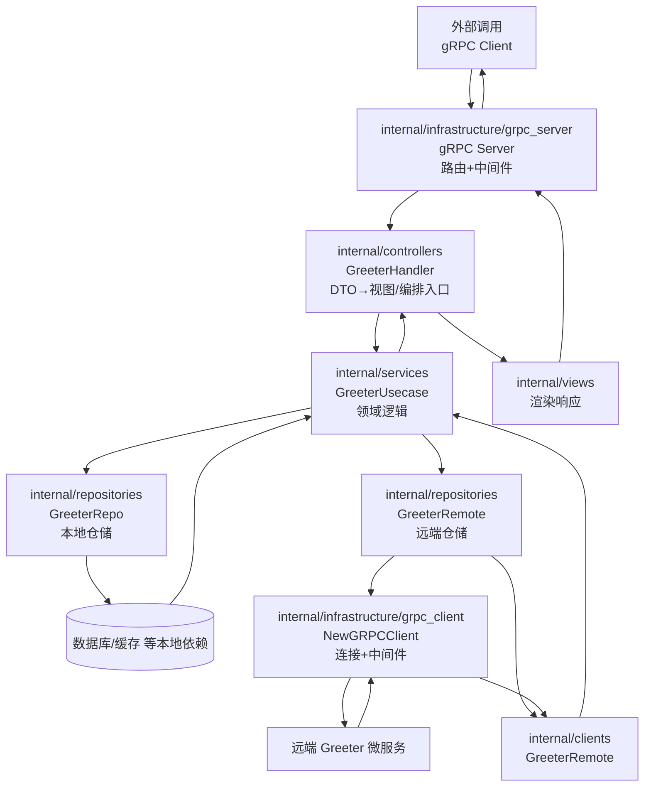

# Kratos Project Template 目录说明

本模板基于 go-kratos 官方骨架，可配合 `make api`（protoc）生成所需代码。以下对每个目录与核心文件逐一说明，便于在现有骨架上扩展真实业务。

## 根目录文件

- `README.md`：当前文档，概览整个模板结构与各层职责，可在接入真实业务前更新本说明。
- `LICENSE`：MIT 协议文本，继承上游 go-kratos 项目的授权条款。
- `Makefile`：集中管理常用任务。`make init` 安装开发所需工具（含 Buf/kratos/protoc 插件），`make api` 与 `make config` 通过 Buf 生成 gRPC/REST/OpenAPI/PGV 校验代码（即便当前服务仅暴露 gRPC 接口，仍保留 HTTP stub 以便后续拓展），`make build` 则输出二进制到 `bin/`。
- `buf.gen.yaml`：Buf 生成规则，配置 `go`、`go-grpc`、`go-http`、`validate`、`openapi` 五类插件，生成 Go 代码、Proto-Gen-Validate 校验逻辑及 OpenAPI 文档。
- `openapi.yaml`：通过 `protoc-gen-openapi` 生成的 REST 契约文件，便于前端或 API 测试工具使用。
- `generate.go`：Kratos 约定的生成入口，可在需要时增加 `//go:generate` 指令集中刷新代码。
- `go.mod` / `go.sum`：Go Module 与依赖锁定文件，模块名默认是 `github.com/bionicotaku/kratos-template`，落地业务时可按需修改。
- `Dockerfile`：多阶段构建镜像示例，Stage1 使用官方 Go 镜像编译，Stage2 基于 debian slim 运行产物并暴露 8000/9000 端口。

### 日志（gclog）

- 通过 `github.com/bionicotaku/lingo-utils/gclog` 输出结构化 JSON，字段与 Cloud Logging 模型保持一致（`timestamp`、`severity`、`serviceContext`、`labels`、`jsonPayload` 等）。
- `cmd/grpc/main.go` 根据 `APP_ENV` 设置 `environment`，并写入静态标签 `service.id=<hostname>`。若 `APP_ENV` 未设置则默认 `development`。
- gRPC Server 默认启用 `logging.Server(logger)` 中间件。配合 `gclog` 的字段映射，`kind/component/operation/args/code/reason/stack/latency` 会自动落在合适的位置，Trace/Span 由 OTel SpanContext 自动注入。
- 业务侧若需追加自定义标签或 payload，可使用 `gclog.WithLabels` / `gclog.WithAllowedLabelKeys` / `gclog.WithPayload` 等 helper。
- 单测可调用 `gclog.NewTestLogger` 拿到内存缓冲 logger 断言输出内容。
- 通过 `github.com/bionicotaku/lingo-utils/gclog` 的 ProviderSet，可在 Wire 中统一注入 trace-aware 的 Kratos logger，无需手动组装；`internal/infrastructure/config_loader` 会基于 `ServiceMetadata` 自动生成 gclog 所需配置。

### 可观测性（OpenTelemetry）

- 模板依赖 `github.com/bionicotaku/lingo-utils/observability`，通过 `github.com/bionicotaku/lingo-utils/observability` 暴露的 Wire Provider 初始化统一的 Tracer/Meter 组件，`wireApp` 返回的 cleanup 会在退出时自动刷新缓冲数据。
- `configs/config.yaml` 下提供 `observability` 节点，可独立控制 tracing / metrics 的启用、exporter（`stdout` 或 `otlp_grpc`）、endpoint、采样率、运行时指标等；默认配置使用 `stdout` exporter 与 `required=false`，方便无 Collector 的开发环境。
- gRPC Server/Client 中间件链包含 `observability/tracing.Server()` 与 `observability/tracing.Client()`，与 logging 中间件协同工作，自动补齐结构化日志中的 `trace_id`/`span_id` 字段；同时可选择性挂载 `otelgrpc` stats handler 以采集 RPC 指标，详见下文配置。
- 如果暂时没有 OTLP Collector，可保持 `stdout` exporter 或直接将 `enabled` 设为 `false`；接入云端（如 Cloud Trace、Tempo）时改为 `otlp_grpc` 并设置对应 `endpoint`、`headers` 即可，无需改动业务代码。
- 模板只负责安装全局 Provider，业务代码可按需通过 `otel.Tracer`、`otel.Meter` 打点自定义 Span/Metric；必要时可在服务层注入 Meter 统计业务指标。

> **离线/受限网络环境构建提示**  
> `make all` 默认会执行 `go generate`→`wire`，过程中需要从 `sum.golang.org` 校验 `golang.org/x/tools`。若网络无法访问该校验服务，可临时使用 `GOSUMDB=off make all` 绕过外部校验（或改用自建 sumdb 镜像），再配合私有 Proxy 分发依赖。

## API 层（`api/`）

- `api/helloworld/v1/*.proto`：示例 gRPC 契约，当前仅包含 `Greeter` 场景与错误枚举，展示如何声明 RPC 及 HTTP 注解。
- `api/helloworld/v1/*_pb.go` / `*_grpc.pb.go` / `*_http.pb.go`：运行 `protoc` 或 `make api` 后生成的 Go 代码，分别用于消息结构、gRPC 服务端接口与可选的 HTTP 适配层。
- `api/openapi.yaml`：由 `protoc-gen-openapi` 生成的 REST 契约文档，可被 Swagger UI 或工具链消费。

## 入口层（`cmd/`）

- `cmd/grpc/main.go`：服务启动入口，通过标准库 `flag` 注册 `-conf`，直接封装到 `Params` 交给 Wire，由 `Build` 在内部解析路径（优先 `-conf`，其次 `CONF_PATH`，否则回落到仓库根的 `configs/`），读取目录/文件并执行 PGV 校验，生成类型安全的 Bundle 后装配 Kratos 应用（HTTP 调试入口可在 `cmd/http` 按需创建）。
- `cmd/grpc/wire.go` / `wire_gen.go`：依赖注入配置与自动生成文件。`wire.go` 中通过 `config_loader.ProviderSet` 将 ServiceMetadata、Bootstrap 子段、日志与观测配置统一暴露给后续 Provider；修改依赖后执行 `wire` 重新生成 `wire_gen.go`。

## 配置（`configs/`）

- `configs/config.yaml`：本地样例配置，展示 gRPC 监听地址与数据源参数。`make run` 或二进制启动时可通过 `-conf` 指定目录。

## 内部实现（`internal/`）

该目录下的代码不会被外部模块引用，每一层各司其职，共同完成 DDD-lite 风格的服务拆分：

- `internal/infrastructure/config_loader/`  
  配置加载与 schema 所在目录：`defaults.go` 统一声明默认路径/环境常量；`loader.go` 提供 `ResolveConfPath`（兼容 Flag/环境变量 回退）与 `Build`（依据 `Params` 读取配置、扫描 YAML/TOML/JSON，随后触发 PGV `ValidateAll` 并推导 ServiceMetadata、观测与日志配置，最终返回 Bundle）；`provider.go` 将这些结果封装成 Wire ProviderSet，后续 Provider 可以直接注入 `*configpb.Server`、`*configpb.Data`、`obswire.ObservabilityConfig` 等类型；`pb/conf.proto` 描述配置结构，执行 `buf generate --path internal/infrastructure/config_loader/pb` 会在同目录产出 `conf.pb.go` 与 PGV 校验代码，确保配置访问具备类型安全与 IDE 补全。

- `internal/clients/`  
  业务级远端客户端封装：例如 `GreeterRemote` 基于仓储层注入的 gRPC 连接调用远端服务，负责处理幂等/日志等与业务强相关的逻辑，保持与底层连接实现解耦。

- `internal/infrastructure/`  
  底层设施统一入口：`config_loader` 负责解析配置并提供 Wire Provider，`grpc_client` 根据数据配置与观测指标构建对外 gRPC 连接（`NewGRPCClient`），`grpc_server` 读取 Server 配置装配入站 Server，`logger` 封装观测日志初始化。只要有初始化逻辑，就在子目录下提供 `init.go`，通过 Wire 注册 Provider。

- `internal/controllers/`  
  传输层 Handler / Controller 实现，由 proto 生成的接口起点（现阶段仍为 gRPC，后续会扩展 REST）。负责 DTO ↔ 视图对象转换与用例编排入口，并在互调场景下维护必要元数据（例如避免远端调用递归）。PGV 校验会在请求进入 handler 前自动执行，例如 `HelloRequest.name` 为空时直接返回 `InvalidArgument`。

- `internal/services/`  
  定义领域用例 (`GreeterUsecase`)，聚合仓储与外部服务接口，是复杂业务规则与日志的归属地，不触及底层技术细节。返回值统一使用 `internal/models/vo` 下的视图对象。

- `internal/repositories/`  
  领域仓储实现层，承接数据库、缓存或远端 gRPC 等外部依赖。示例中 `greeter.go` 展示本地仓储，`internal/clients/greeter_grpc.go` 展示远端访问封装；根据业务需要可自行引入持久化连接的初始化逻辑。

- `internal/models/`  
  `po`（persistent object）用于仓储与底层存储的实体表示；`vo`（view object）面向上层展示与跨服务返回值，避免直接暴露内部结构。

- `internal/views/`  
  负责将 usecase 返回的视图对象渲染为对外响应（Problem Details、分页、ETag 等），保持 Controller 的精简。

- `internal/tasks/`  
  预留 Outbox 扫描、定时任务与后台 Worker 的放置位置。需要注入调度器时，同样通过 `init.go` 声明 Provider。

> 单元测试示例存放在对应包的 `test/` 子目录（例如 `internal/controllers/test`）。测试包采用 `package xxx_test` 形式引用被测包，直接运行 `go test ./...` 即可一并覆盖。

### 请求/数据流转示意



> 读或写外部系统（包括远端 gRPC）都经过 `internal/repositories`，由 services 层统一编排；`internal/clients` 负责通信能力复用；controllers 与 `internal/infrastructure/grpc_server` 则各自处理协议层与传输层职责。

## 其它

- `third_party/`：存放 gRPC/HTTP 注解等常用的第三方 proto 定义（如 `google/api`、`validate`）。编译 proto 时通过 `--proto_path=third_party` 引入这些依赖。

```text
├── Dockerfile                // 多阶段构建示例
├── LICENSE                   // 模板沿用的 MIT 授权文本
├── Makefile                  // 常用构建/生成命令集合（init、api、config 等）
├── README.md                 // 本文件，记录结构与使用说明
├── api                       // Proto 契约与生成代码
│   └── helloworld/v1         // 示例服务命名空间 + 版本
│       ├── error_reason.proto
│       ├── error_reason.pb.go
│       ├── greeter.proto
│       ├── greeter.pb.go
│       ├── greeter_grpc.pb.go
│       └── greeter_http.pb.go
├── cmd/grpc                  // 强制 gRPC 入口
│   ├── main.go               // 程序入口：加载配置并运行 gRPC
│   ├── wire.go               // Wire 依赖注入定义
│   └── wire_gen.go           // Wire 自动生成装配实现（勿手动修改）
├── cmd/http (可选)          // 如需暴露 HTTP 调试入口，可在此新增
├── configs                   // 本地调试配置
│   ├── config.yaml
│   ├── config.instance-a.yaml
│   └── config.instance-b.yaml
├── generate.go               // 预留 go generate 钩子
├── go.mod / go.sum           // Go Module 元数据与依赖锁定
├── internal                  // 服务内部实现（对外不可见）
│   ├── clients               // 外部依赖客户端封装（gRPC/HTTP 等），需注入时在 init.go 注册 Wire Provider
│   ├── conf                  // 配置 schema 与生成代码
│   ├── controllers           // 传输层 handler（gRPC/HTTP），仅做参数校验与调用 Service
│   ├── infrastructure        // 底层设施（server、data、logger 等），统一在各子目录 init.go 暴露 Provider
│   ├── models                // 领域模型：`po`（持久化对象）与 `vo`（视图对象）
│   ├── repositories          // 数据访问层，实现 Service 所需的仓储接口
│   ├── services              // 业务用例层（MVC 中的 Service），组合仓储与客户端
│   ├── tasks                 // 异步任务、Outbox 扫描等后台 Worker
│   └── views                 // 响应包装（Problem Details、分页、ETag 等）
├── openapi.yaml              // REST OpenAPI 文档
├── third_party               // 第三方 proto 依赖（google/api、validate 等）
└── (bin/)                    // 执行 make build 后生成的二进制输出目录（默认忽略）
```

以上结构提供了一个最小可行的 Kratos 微服务骨架。开发真实业务时，可在此基础上扩展 proto 契约、补全 data 层与 Usecase，实现自定义领域逻辑与配套测试。*** End Patch​

## gRPC 指标开关

服务通过 `observability.metrics` 配置控制 gRPC 指标：

```yaml
observability:
  metrics:
    grpc_enabled: true
    grpc_include_health: false
```

- `grpc_enabled`：默认 `true`，决定是否挂载 `otelgrpc` stats handler。
- `grpc_include_health`：默认 `false`，可选地排除 `/grpc.health.v1.Health/Check` 的指标噪音。

模板的 gRPC server/client 会自动读取该配置；若未提供，仍保持指标开启并过滤健康检查。其它业务服务复用模板逻辑时，应在 Wire 中传入同一份 `observability.MetricsConfig` 以保持一致。


### Observability 依赖注入

- `github.com/bionicotaku/lingo-utils/observability` _ProviderSet_ 提供 `Component` Provider，Wire 会负责初始化 OpenTelemetry Tracer/Meter，并在 `cleanup` 中执行 `Shutdown`。
- 其它 Provider 只需依赖 `*observability.Component` 或 `ObservabilityConfig` / `MetricsConfig` 即可，共享同一套观测配置。

### 配置加载 Provider

- `internal/infrastructure/config_loader` 暴露 `ServiceMetadata`（服务名/版本/环境/实例 ID），以及 `ProvideLoggerConfig` / `ProvideObservabilityInfo`，用于将配置拆分给 gclog 与 observability Provider。
- `ServiceMetadata` 默认从命令行 `-conf`、编译期注入 `Name/Version` 和 `APP_ENV` 推导：缺省值分别为 `template`、`dev`、`development`，实例 ID 取自主机名。
- 有了这些 Provider，`wireApp` 只需传入根 context、Bootstrap 的 Server/Data 配置和 `ServiceMetadata`，即可统一完成日志与观测组件的初始化。

---

## ⚠️ 生产特性清单

本模板当前处于**早期骨架阶段**，以下列出已实现与待补充的生产级特性，供团队评估与规划使用。

### ✅ 已实现

- **分层架构** - MVC 三层分离（Controllers/Services/Repositories），依赖关系清晰
- **依赖注入** - Google Wire 全程管理，无运行时反射
- **可观测性** - OpenTelemetry 追踪/指标 + 结构化日志（gclog）
- **配置管理** - Proto Schema + PGV 校验，类型安全
- **中间件栈** - 追踪、恢复、限流、参数校验、日志完整覆盖
- **健康检查** - gRPC Health Check Protocol（通过 Kratos 内置）
- **优雅关闭** - Wire cleanup 机制保证资源释放顺序
- **错误处理** - 哨兵错误 + errors.Is/As 链式查询

### 🚧 待实现（生产必备）

#### 1. 幂等性支持（Idempotency）
**问题:** 当前写操作（如 `SayHello` 触发的 `CreateGreeting`）不支持幂等键，网络重试会导致重复数据。

**改进方向:**
- Controller 层拦截 `Idempotency-Key` header
- Service 层存储幂等记录（推荐用 Redis，TTL 24小时）
- 重复请求返回缓存的响应（状态码需保持 200/201）

**参考实现位置:** `internal/controllers` 添加幂等中间件

---

#### 2. 并发控制（Optimistic Locking）
**问题:** 读-修改-写场景无版本控制，并发更新会导致数据覆盖。

**改进方向:**
- 在 `po` 模型添加 `Version int64` 字段
- Repository 更新时校验版本号（`UPDATE ... WHERE id = ? AND version = ?`）
- 支持 HTTP `ETag` / `If-Match` header（gRPC 可用 metadata 传递）

**参考实现位置:** `internal/repositories` 的 `Update` 方法

---

#### 3. 分页限制
**问题:** `ListAll` 方法未限制返回量，大表查询可能导致 OOM。

**改进方向:**
- 移除 `ListAll`，改为 `List(cursor string, limit int32)`
- 使用游标分页（基于 `created_at` + `id` 复合排序）
- 响应包含 `next_cursor` 字段

**参考实现位置:** `internal/services` 的列表方法 + `internal/views` 分页包装

---

#### 4. 事务支持
**问题:** 跨 Repository 操作无事务保证（如同时写 `greetings` 和 `audit_logs`）。

**改进方向:**
- Service 层提供 `WithTx(ctx context.Context, fn func(txCtx context.Context) error)`
- Repository 从 context 获取事务连接（`pgx.Tx`）
- 注意事务边界不可跨服务调用

**参考实现位置:** `internal/infrastructure/database` 添加事务辅助函数

---

#### 5. 数据库实现
**当前状态:** Repository 层是 stub（直接返回输入，未实际读写数据库）。

**迁移计划:** 详见 `TODO.md`，计划接入 Supabase PostgreSQL (pgx/v5)。

**预计工作量:** 4-6 小时（包含连接池、迁移脚本、测试）

---

#### 6. 缓存层
**问题:** 所有查询直达数据库，高频读场景（如 `FindByID`）压力大。

**改进方向:**
- Repository 前置 Redis 缓存（TTL 可配置）
- 写操作后主动失效缓存（Cache-Aside 模式）
- 可选引入本地缓存（如 ristretto）作为 L1

**参考实现位置:** `internal/repositories` 包装缓存逻辑

---

#### 7. API 版本化策略
**问题:** Proto 包名是 `helloworld.v1`，但未定义 breaking change 处理流程。

**改进方向:**
- 使用 `buf breaking` 强制检查兼容性
- 新版本通过新包（如 `v2`）并行部署
- 在 `greeter.proto` 顶部注释说明废弃政策

**参考实现位置:** CI/CD 流程添加 `buf breaking --against .git#branch=main`

---

### 📚 补充建议

- **监控告警** - 接入 Prometheus + Grafana，配置 SLO/SLI 指标
- **压测验证** - 使用 ghz 或 k6 验证服务承载能力（目标 QPS > 1000）
- **安全加固** - 启用 gRPC TLS + mTLS，添加 Rate Limiting 配额
- **灰度发布** - 基于 `APP_ENV` 实现多环境配置切换（dev/staging/prod）

---

### 🔗 相关文档

- [TODO.md](./TODO.md) - Supabase 数据库对接详细计划
- [CLAUDE.md](../CLAUDE.md) - 项目整体架构规范与编码约定
- [Kratos 官方文档](https://go-kratos.dev/) - 框架使用指南
