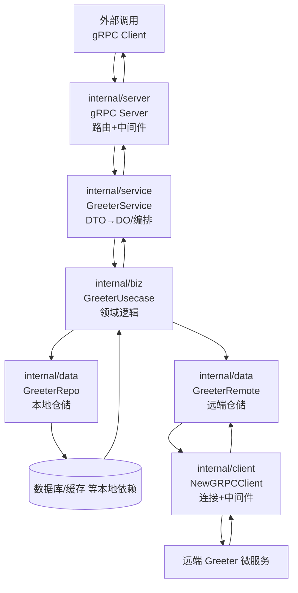

# Kratos Project Template 目录说明

本模板基于 go-kratos 官方骨架，可配合 `make api`（protoc）生成所需代码。以下对每个目录与核心文件逐一说明，便于在现有骨架上扩展真实业务。

## 根目录文件

- `README.md`：当前文档，概览整个模板结构与各层职责，可在接入真实业务前更新本说明。
- `LICENSE`：MIT 协议文本，继承上游 go-kratos 项目的授权条款。
- `Makefile`：集中管理常用任务。`make init` 安装开发所需工具（含 Buf/kratos/protoc 插件），`make api` 与 `make config` 通过 Buf 生成 gRPC/REST/OpenAPI/PGV 校验代码（即便当前服务仅暴露 gRPC 接口，仍保留 HTTP stub 以便后续拓展），`make build` 则输出二进制到 `bin/`。
- `buf.gen.yaml`：Buf 生成规则，配置 `go`、`go-grpc`、`go-http`、`validate`、`openapi` 五类插件，生成 Go 代码、Proto-Gen-Validate 校验逻辑及 OpenAPI 文档。
- `openapi.yaml`：通过 `protoc-gen-openapi` 生成的 REST 契约文件，便于前端或 API 测试工具使用。
- `generate.go`：Kratos 约定的生成入口，可在需要时增加 `//go:generate` 指令集中刷新代码。
- `go.mod` / `go.sum`：Go Module 与依赖锁定文件，模块名默认是 `github.com/bionicotaku/kratos-template`，落地业务时可按需修改。
- `Dockerfile`：多阶段构建镜像示例，Stage1 使用官方 Go 镜像编译，Stage2 基于 debian slim 运行产物并暴露 8000/9000 端口。

### 日志（gclog）

- 通过 `github.com/bionicotaku/lingo-utils/gclog` 输出结构化 JSON，字段与 Cloud Logging 模型保持一致（`timestamp`、`severity`、`serviceContext`、`labels`、`jsonPayload` 等）。
- `cmd/server/main.go` 根据 `APP_ENV` 设置 `environment`，并写入静态标签 `service.id=<hostname>`。若 `APP_ENV` 未设置则默认 `development`。
- gRPC Server 默认启用 `logging.Server(logger)` 中间件。配合 `gclog` 的字段映射，`kind/component/operation/args/code/reason/stack/latency` 会自动落在合适的位置，Trace/Span 由 OTel SpanContext 自动注入。
- 业务侧若需追加自定义标签或 payload，可使用 `gclog.WithLabels` / `gclog.WithAllowedLabelKeys` / `gclog.WithPayload` 等 helper。
- 单测可调用 `gclog.NewTestLogger` 拿到内存缓冲 logger 断言输出内容。

## API 层（`api/`）

- `api/helloworld/v1/*.proto`：示例 gRPC 契约，当前仅包含 `Greeter` 场景与错误枚举，展示如何声明 RPC 及 HTTP 注解。
- `api/helloworld/v1/*_pb.go` / `*_grpc.pb.go` / `*_http.pb.go`：运行 `protoc` 或 `make api` 后生成的 Go 代码，分别用于消息结构、gRPC 服务端接口与可选的 HTTP 适配层。
- `api/openapi.yaml`：由 `protoc-gen-openapi` 生成的 REST 契约文档，可被 Swagger UI 或工具链消费。

## 入口层（`cmd/`）

- `cmd/server/main.go`：服务启动入口，加载配置、初始化日志、执行 Wire 注入并启动 gRPC Server。
- `cmd/server/wire.go` / `wire_gen.go`：依赖注入配置与自动生成文件。开发时修改 `wire.go` 声明 ProviderSet，执行 `wire` 重新生成 `wire_gen.go`。

## 配置（`configs/`）

- `configs/config.yaml`：本地样例配置，展示 gRPC 监听地址与数据源参数。`make run` 或二进制启动时可通过 `-conf` 指定目录。

## 内部实现（`internal/`）

该目录下的代码不会被外部模块引用，每一层各司其职，共同完成 DDD-lite 风格的服务拆分：

- `internal/conf/`  
  采用 proto 描述配置 (`conf.proto`)，生成强类型结构体 (`conf.pb.go`)，再由 `config.Scan` 填充，确保配置访问安全统一。

- `internal/client/`  
  概念与 `internal/server` 对应：负责“客户端传输层装配”。当前的 `NewGRPCClient` 会根据配置建立 gRPC 连接，挂载 recovery/tracing/circuitbreaker 等通用中间件，并返回 `*grpc.ClientConn` 与清理函数，供数据层或其他客户端包装复用，完全不涉及业务语义。

- `internal/server/`  
  服务端传输层装配：根据配置创建 gRPC Server，集中挂载中间件、健康探针（基于 gRPC health 服务）等横切关注点，是所有外部调用进入应用的第一站。默认启用 recovery → metadata（传播 `x-template-` 前缀）→ rate limit（SRE 算法）→ validate（PGV 校验）→ logging 的中间件链；如需自定义限流策略，可通过 `ratelimit.Server(ratelimit.WithLimiter(...))` 替换。指标推荐通过 OTLP 上报，无需额外暴露 HTTP `/metrics` 端点。

- `internal/service/`  
  应用层实现，由 proto 生成的接口起点。负责 DTO ↔ DO 转换与用例编排，并在互调场景下维护必要元数据（例如避免远端调用递归）。PGV 校验会在请求进入 handler 前自动执行，例如 `HelloRequest.name` 为空时直接返回 `InvalidArgument`。

- `internal/biz/`  
  定义领域模型与用例 (`GreeterUsecase`)，聚合仓储与外部服务接口，是复杂业务规则与日志的归属地，不触及底层技术细节。

- `internal/data/`  
  领域仓储实现层，承接数据库、缓存或远端 gRPC 等外部依赖。`data.go` 管理公共资源生命周期；`greeter.go` 与 `greeter_remote.go` 分别示例本地与远端仓储实现，均满足 biz 层定义的接口。

### 请求/数据流转示意



> 读或写外部系统（包括远端 gRPC）都经过 `internal/data`，由 biz 层统一编排；`internal/client` 负责通信能力复用；service 与 server 则各自处理协议层与传输层职责。

## 其它

- `third_party/`：存放 gRPC/HTTP 注解等常用的第三方 proto 定义（如 `google/api`、`validate`）。编译 proto 时通过 `--proto_path=third_party` 引入这些依赖。

```text
├── Dockerfile                // 多阶段构建示例
├── LICENSE                   // 模板沿用的 MIT 授权文本
├── Makefile                  // 常用构建/生成命令集合（init、api、config 等）
├── README.md                 // 本文件，记录结构与使用说明
├── api                       // Proto 契约与生成代码
│   └── helloworld/v1         // 示例服务命名空间 + 版本
│       ├── error_reason.proto
│       ├── error_reason.pb.go
│       ├── greeter.proto
│       ├── greeter.pb.go
│       ├── greeter_grpc.pb.go
│       └── greeter_http.pb.go
├── cmd/server                // 应用入口
│   ├── main.go               // 程序入口：加载配置并运行 gRPC
│   ├── wire.go               // Wire 依赖注入定义
│   └── wire_gen.go           // Wire 自动生成装配实现（勿手动修改）
├── configs                   // 本地调试配置
│   ├── config.yaml
│   ├── config.instance-a.yaml
│   └── config.instance-b.yaml
├── generate.go               // 预留 go generate 钩子
├── go.mod / go.sum           // Go Module 元数据与依赖锁定
├── internal                  // 服务内部实现（对外不可见）
│   ├── biz                   // 领域用例层，定义接口与用例
│   ├── client                // 客户端传输层装配（如 gRPC 连接）
│   ├── conf                  // 配置 schema 与生成代码
│   ├── data                  // 数据访问层，仓储实现（含远端封装）
│   ├── server                // 服务端传输层装配（仅 gRPC）
│   └── service               // 应用服务层，实现 proto 定义的接口
├── openapi.yaml              // REST OpenAPI 文档
├── third_party               // 第三方 proto 依赖（google/api、validate 等）
└── (bin/)                    // 执行 make build 后生成的二进制输出目录（默认忽略）
```

以上结构提供了一个最小可行的 Kratos 微服务骨架。开发真实业务时，可在此基础上扩展 proto 契约、补全 data 层与 Usecase，实现自定义领域逻辑与配套测试。*** End Patch​
