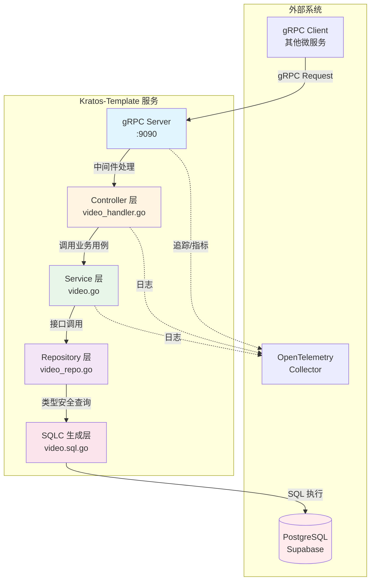
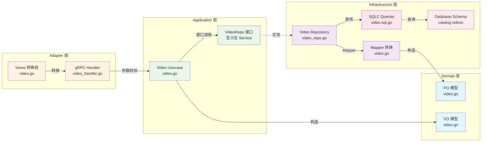
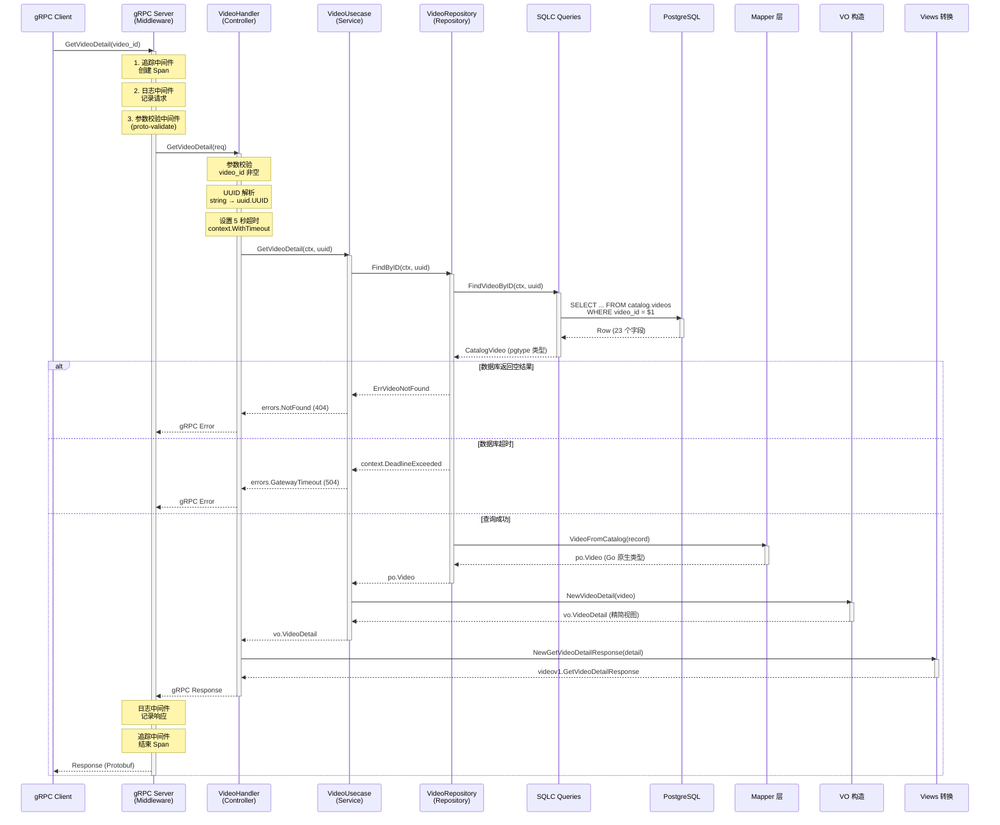
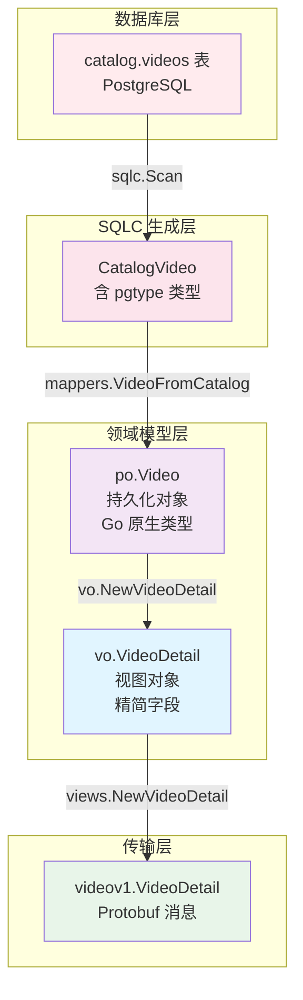
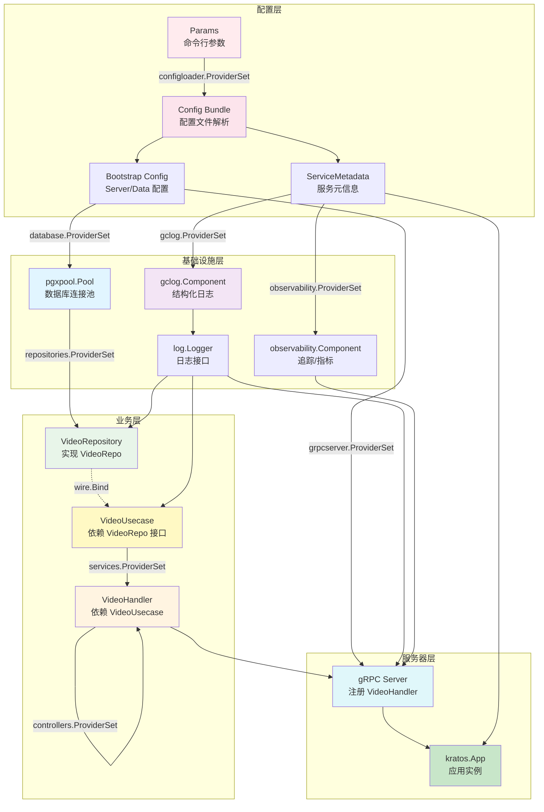
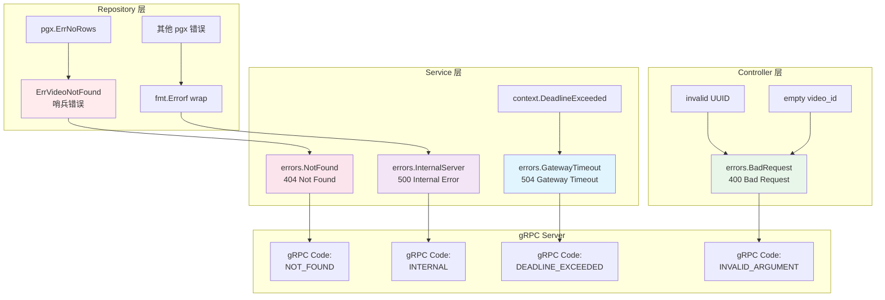
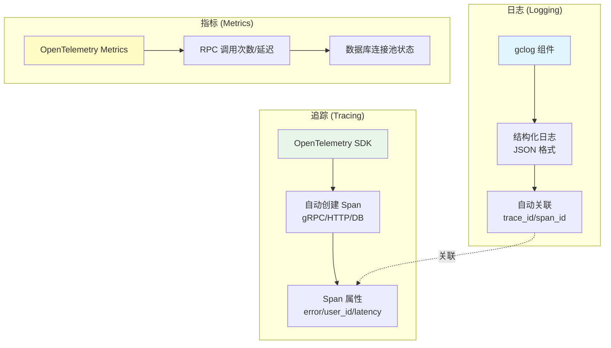
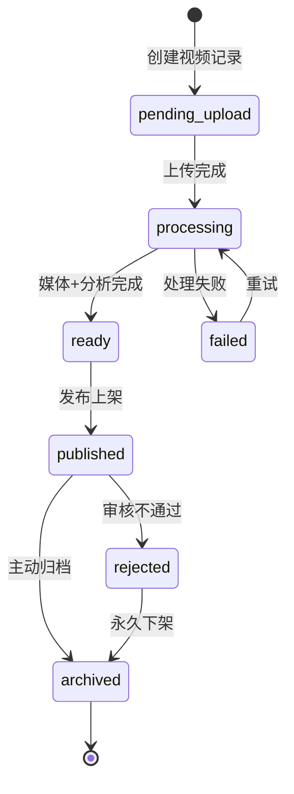

# Kratos-Template 架构设计文档

> **版本**: v1.0
> **更新日期**: 2025-10-23
> **作者**: Kratos-Template Team

---

## 目录

- [1. 项目概览](#1-项目概览)
- [2. 架构设计原则](#2-架构设计原则)
- [3. 整体架构图](#3-整体架构图)
- [4. 分层架构详解](#4-分层架构详解)
- [5. 完整请求处理流程](#5-完整请求处理流程)
- [6. 数据模型转换](#6-数据模型转换)
- [7. 依赖注入与组件装配](#7-依赖注入与组件装配)
- [8. 中间件栈](#8-中间件栈)
- [9. 错误处理策略](#9-错误处理策略)
- [10. 可观测性设计](#10-可观测性设计)
- [11. 数据库设计](#11-数据库设计)
- [12. 最佳实践与反模式](#12-最佳实践与反模式)

---

## 1. 项目概览

### 1.1 技术栈

```
- Go 1.22+                        # 编程语言
- Kratos v2                       # 微服务框架
- gRPC + Protocol Buffers         # 服务间通信
- PostgreSQL (Supabase)           # 数据库
- sqlc v1.30.0                    # 类型安全的 SQL 代码生成
- pgx v5                          # PostgreSQL 驱动
- Wire                            # 依赖注入
- OpenTelemetry                   # 分布式追踪与指标
- gclog                           # 结构化日志
```

### 1.2 项目目标

本项目是一个基于 **Kratos 框架 + DDD-lite** 的微服务模板，旨在提供：

- **清晰的分层架构**：Controller → Service → Repository
- **类型安全的数据访问**：使用 sqlc 生成 SQL 查询代码
- **依赖倒置原则**：Service 层定义接口，Repository 层实现
- **全链路可观测性**：追踪、日志、指标全覆盖
- **可测试性**：依赖注入 + 接口抽象便于单元测试

---

## 2. 架构设计原则

### 2.1 SOLID 原则

| 原则 | 在项目中的体现 |
|------|---------------|
| **单一职责** | Controller 仅做参数校验，Service 仅编排业务逻辑，Repository 仅数据访问 |
| **开闭原则** | 通过接口抽象，新增功能无需修改现有代码 |
| **里氏替换** | Repository 接口可替换为 Mock 实现用于测试 |
| **接口隔离** | VideoRepo 接口仅定义必要的方法（FindByID） |
| **依赖倒置** | Service 依赖 VideoRepo 接口，而非具体实现 |

### 2.2 DDD-lite 分层

```
┌──────────────────────────────────────────┐
│  Adapter 层 (Controllers + Views)         │  ← 对外接口适配
├──────────────────────────────────────────┤
│  Application 层 (Services)                │  ← 业务用例编排
├──────────────────────────────────────────┤
│  Domain 层 (Models: PO/VO)                │  ← 领域模型
├──────────────────────────────────────────┤
│  Infrastructure 层 (Repositories)         │  ← 基础设施
└──────────────────────────────────────────┘
```

### 2.3 依赖方向

```
Controllers  →  Services  →  Repositories  →  Database
     ↓              ↓              ↓
  (入参校验)    (业务逻辑)     (数据访问)
     ↓              ↓              ↓
  Views          VO/PO         sqlc/pgx
```

**严格规则**：
- ✅ 上层可依赖下层
- ❌ 下层**禁止**依赖上层
- ✅ Service 通过**接口**依赖 Repository（依赖倒置）

---

## 3. 整体架构图

### 3.1 系统上下文图



### 3.2 分层架构详细视图



---

## 4. 分层架构详解

### 4.1 Adapter 层（适配器层）

**职责**：处理外部请求，进行协议适配与数据转换。

#### 4.1.1 Controller (internal/controllers/video_handler.go)

```go
type VideoHandler struct {
    uc *services.VideoUsecase
}

func (h *VideoHandler) GetVideoDetail(
    ctx context.Context,
    req *videov1.GetVideoDetailRequest,
) (*videov1.GetVideoDetailResponse, error) {
    // 1. 参数校验
    if req.GetVideoId() == "" {
        return nil, errors.BadRequest(...)
    }

    // 2. 类型转换（string → UUID）
    videoID, err := uuid.Parse(req.GetVideoId())

    // 3. 设置超时上下文
    timeoutCtx, cancel := context.WithTimeout(ctx, 5*time.Second)
    defer cancel()

    // 4. 调用 Service 层
    detail, err := h.uc.GetVideoDetail(timeoutCtx, videoID)

    // 5. VO → Proto 转换
    return views.NewGetVideoDetailResponse(detail), nil
}
```

**关键点**：
- ✅ **仅做**参数校验与类型转换
- ✅ 设置超时上下文（防止慢查询）
- ❌ **禁止**包含业务逻辑

#### 4.1.2 Views (internal/views/video.go)

```go
func NewGetVideoDetailResponse(detail *vo.VideoDetail) *videov1.GetVideoDetailResponse {
    return &videov1.GetVideoDetailResponse{
        Detail: &videov1.VideoDetail{
            VideoId:     detail.VideoID.String(),
            Title:       detail.Title,
            CreatedAt:   formatTime(detail.CreatedAt),
            UpdatedAt:   formatTime(detail.UpdatedAt),
            Status:      detail.Status,
            MediaStatus: detail.MediaStatus,
        },
    }
}
```

**职责**：
- Go 类型 → Protobuf DTO 转换（string、RFC3339 时间串）
- 统一格式化时间与可选字段

---

### 4.2 Application 层（应用层）

**职责**：编排业务用例，协调多个领域对象或仓储。

#### 4.2.1 Service (internal/services/video.go)

```go
type VideoUsecase struct {
    repo VideoRepo      // 依赖接口（依赖倒置）
    log  *log.Helper
}

func (uc *VideoUsecase) GetVideoDetail(
    ctx context.Context,
    videoID uuid.UUID,
) (*vo.VideoDetail, error) {
    // 1. 调用 Repository 接口
    video, err := uc.repo.FindByID(ctx, videoID)
    if err != nil {
        // 2. 错误分类
        if errors.Is(err, repositories.ErrVideoNotFound) {
            return nil, ErrVideoNotFound  // 404
        }
        if errors.Is(err, context.DeadlineExceeded) {
            return nil, errors.GatewayTimeout(...)  // 504
        }
        return nil, errors.InternalServer(...)  // 500
    }

    // 3. PO → VO 转换
    return vo.NewVideoDetail(video), nil
}
```

**关键点**：
- ✅ 依赖 `VideoRepo` 接口（而非具体实现）
- ✅ 错误分类与映射（404/504/500）
- ✅ 构造 VO（View Object）返回上层

#### 4.2.2 Repository 接口定义

```go
// 接口定义在 Service 层（依赖倒置）
type VideoRepo interface {
    FindByID(ctx context.Context, videoID uuid.UUID) (*po.Video, error)
}
```

---

### 4.3 Domain 层（领域层）

**职责**：定义领域模型，不包含业务逻辑。

#### 4.3.1 PO (Persistent Object)

```go
// internal/models/po/video.go
type Video struct {
    VideoID           uuid.UUID
    UploadUserID      uuid.UUID
    CreatedAt         time.Time
    UpdatedAt         time.Time
    Title             string
    Description       *string
    Status            VideoStatus
    MediaStatus       StageStatus
    AnalysisStatus    StageStatus
    ThumbnailURL      *string
    HLSMasterPlaylist *string
    Difficulty        *string
    Summary           *string
    Tags              []string
    // ...
}
```

**特点**：
- 完整映射数据库表结构
- 包含所有字段（含内部字段）
- 使用 Go 原生类型（非 pgtype）

#### 4.3.2 VO (View Object)

```go
// internal/models/vo/video.go
type VideoDetail struct {
    VideoID           uuid.UUID
    Title             string
    Description       *string
    Status            string
    ThumbnailURL      *string
    HLSMasterPlaylist *string
    DurationMicros    *int64
    Difficulty        *string
    Summary           *string
    Tags              []string
    CreatedAt         time.Time
    UpdatedAt         time.Time
}
```

**特点**：
- 精简视图，仅包含必要字段
- 过滤内部字段（如 `RawFileReference`, `ErrorMessage`）
- 面向上层业务使用

---

### 4.4 Infrastructure 层（基础设施层）

**职责**：提供基础设施能力（数据库、外部服务、消息队列等）。

#### 4.4.1 Repository (internal/repositories/video_repo.go)

```go
type VideoRepository struct {
    db      *pgxpool.Pool
    queries *catalogsql.Queries  // sqlc 生成
    log     *log.Helper
}

func (r *VideoRepository) FindByID(
    ctx context.Context,
    videoID uuid.UUID,
) (*po.Video, error) {
    // 1. 调用 sqlc 生成的查询方法
    record, err := r.queries.FindVideoByID(ctx, videoID)
    if err != nil {
        if errors.Is(err, pgx.ErrNoRows) {
            return nil, ErrVideoNotFound
        }
        return nil, fmt.Errorf("find video by id: %w", err)
    }

    // 2. Mapper 转换（CatalogVideo → po.Video）
    return mappers.VideoFromCatalog(record), nil
}
```

**关键点**：
- ✅ 实现 Service 层定义的接口
- ✅ 隔离 sqlc 生成代码（不泄漏到上层）
- ✅ 处理数据库特定错误（`pgx.ErrNoRows`）

#### 4.4.2 SQLC 生成层

**SQL 源文件** (internal/repositories/sqlc/video.sql):

```sql
-- name: FindVideoByID :one
SELECT
    video_id, upload_user_id, created_at, updated_at,
    title, description, status, media_status,
    thumbnail_url, hls_master_playlist, difficulty,
    summary, tags, ...
FROM catalog.videos
WHERE video_id = $1;
```

**生成的 Go 代码** (internal/repositories/sqlc/video.sql.go):

```go
func (q *Queries) FindVideoByID(
    ctx context.Context,
    videoID uuid.UUID,
) (CatalogVideo, error) {
    row := q.db.QueryRow(ctx, findVideoByID, videoID)
    var i CatalogVideo
    err := row.Scan(&i.VideoID, &i.Title, ...)
    return i, err
}
```

**优势**：
- ✅ 编译时类型检查（避免 SQL 注入）
- ✅ 自动生成 `Scan` 代码（减少手写错误）
- ✅ 零反射（性能优秀）

---

## 5. 完整请求处理流程

### 5.1 请求流程时序图



### 5.2 数据流转阶段总结

| 阶段 | 输入 | 输出 | 转换位置 |
|------|------|------|---------|
| **1. 请求解析** | `videov1.GetVideoDetailRequest` | `uuid.UUID` | Controller |
| **2. 业务逻辑** | `uuid.UUID` | `*po.Video` | Service → Repository |
| **3. 数据库查询** | `uuid.UUID` | `CatalogVideo` (pgtype) | SQLC |
| **4. Mapper 转换** | `CatalogVideo` | `*po.Video` (Go 原生) | Mapper |
| **5. VO 构造** | `*po.Video` | `*vo.VideoDetail` | VO |
| **6. Proto 转换** | `*vo.VideoDetail` | `*videov1.VideoDetail` | Views |
| **7. 响应返回** | `*videov1.VideoDetail` | Protobuf 字节流 | gRPC Server |

---

## 6. 数据模型转换

### 6.1 数据模型层次关系



### 6.2 各层数据模型对比

| 模型类型 | 位置 | 特点 | 示例字段类型 |
|---------|------|------|-------------|
| **DB Schema** | `catalog.videos` | 数据库原生类型 | `uuid`, `timestamptz`, `text[]` |
| **CatalogVideo** | `sqlc/models.go` | pgtype 包装类型 | `uuid.UUID`, `pgtype.Timestamptz`, `pgtype.Text` |
| **po.Video** | `models/po/video.go` | Go 原生类型，完整字段 | `uuid.UUID`, `time.Time`, `*string` |
| **vo.VideoDetail** | `models/vo/video.go` | Go 原生类型，精简字段 | `uuid.UUID`, `time.Time`, `*string` |
| **videov1.VideoDetail** | `api/video/v1/*.pb.go` | Protobuf 类型 | `string`（含 RFC3339 时间串）、`optional string` |

### 6.3 Mapper 转换示例

```go
// mappers/video.go
func VideoFromCatalog(v catalogsql.CatalogVideo) *po.Video {
    return &po.Video{
        VideoID:           v.VideoID,                    // uuid.UUID → uuid.UUID
        CreatedAt:         mustTimestamp(v.CreatedAt),   // pgtype.Timestamptz → time.Time
        Title:             v.Title,                      // string → string
        Description:       textPtr(v.Description),       // pgtype.Text → *string
        Status:            po.VideoStatus(v.Status),     // string → VideoStatus (类型转换)
        Tags:              append([]string(nil), v.Tags...), // []string → []string (防御性拷贝)
        // ...
    }
}

// 辅助函数：pgtype.Timestamptz → time.Time
func mustTimestamp(ts pgtype.Timestamptz) time.Time {
    if !ts.Valid {
        return time.Time{}
    }
    return ts.Time
}

// 辅助函数：pgtype.Text → *string
func textPtr(t pgtype.Text) *string {
    if !t.Valid {
        return nil
    }
    return &t.String
}
```

**关键设计**：
- ✅ **隔离 pgtype 类型**：不泄漏到 Service/Controller 层
- ✅ **处理可选字段**：数据库 NULL → Go `nil`
- ✅ **防御性拷贝**：避免共享底层数组

---

## 7. 依赖注入与组件装配

### 7.1 Wire 依赖图



### 7.2 Wire 配置文件

```go
// cmd/grpc/wire.go
//go:build wireinject

func wireApp(context.Context, configloader.Params) (*kratos.App, func(), error) {
    panic(wire.Build(
        // 1. 配置加载
        configloader.ProviderSet,

        // 2. 可观测性组件
        gclog.ProviderSet,          // 日志
        obswire.ProviderSet,        // 追踪/指标

        // 3. 基础设施
        database.ProviderSet,       // pgxpool.Pool
        grpcserver.ProviderSet,     // gRPC Server

        // 4. 业务层（按依赖顺序）
        repositories.ProviderSet,   // Repository 实现
        wire.Bind(new(services.VideoRepo), new(*repositories.VideoRepository)), // 接口绑定
        services.ProviderSet,       // Service 层
        controllers.ProviderSet,    // Controller 层

        // 5. 应用组装
        newApp,
    ))
}
```

### 7.3 ProviderSet 定义

```go
// internal/repositories/init.go
var ProviderSet = wire.NewSet(
    NewVideoRepository,  // 构造函数
)

// internal/services/biz.go
var ProviderSet = wire.NewSet(
    NewVideoUsecase,
)

// internal/controllers/init.go
var ProviderSet = wire.NewSet(
    NewVideoHandler,
)
```

### 7.4 接口绑定（依赖倒置）

```go
// Service 层定义接口
type VideoRepo interface {
    FindByID(ctx context.Context, videoID uuid.UUID) (*po.Video, error)
}

// Repository 层实现接口
type VideoRepository struct { ... }
func (r *VideoRepository) FindByID(...) (*po.Video, error) { ... }

// Wire 绑定
wire.Bind(new(services.VideoRepo), new(*repositories.VideoRepository))
```

**关键点**：
- ✅ Service 层**依赖接口**（`VideoRepo`）
- ✅ Repository 层**实现接口**（`*VideoRepository`）
- ✅ Wire **自动注入**实现到接口

---

## 8. 中间件栈

### 8.1 gRPC 中间件执行顺序

```mermaid
graph LR
    A[gRPC Request] --> B1[obsTrace.Server<br/>追踪中间件]
    B1 --> B2[recovery.Recovery<br/>Panic 恢复]
    B2 --> B3[metadata.Server<br/>元数据传播]
    B3 --> B4[ratelimit.Server<br/>限流保护]
    B4 --> B5[validate.Validator<br/>参数校验]
    B5 --> B6[logging.Server<br/>日志记录]
    B6 --> C[Handler<br/>业务逻辑]
    C --> D[gRPC Response]

    style B1 fill:#e1f5ff
    style B2 fill:#ffebee
    style B3 fill:#f3e5f5
    style B4 fill:#fff9c4
    style B5 fill:#fce4ec
    style B6 fill:#e8f5e9
    style C fill:#fff4e1
```



### 8.2 中间件详解

| 中间件 | 功能 | 配置位置 | 执行时机 |
|--------|------|---------|---------|
| **obsTrace.Server()** | 创建 Span，注入 trace_id/span_id | `grpc_server.go:51` | 最外层 |
| **recovery.Recovery()** | 捕获 Panic，防止服务崩溃 | `grpc_server.go:52` | 第 2 层 |
| **metadata.Server()** | 传播 `x-template-*` 前缀的 header | `grpc_server.go:53` | 第 3 层 |
| **ratelimit.Server()** | 基于令牌桶的限流保护 | `grpc_server.go:56` | 第 4 层 |
| **validate.Validator()** | Proto-Gen-Validate 参数校验 | `grpc_server.go:57` | 第 5 层 |
| **logging.Server()** | 记录请求日志（含 trace_id） | `grpc_server.go:58` | 最内层 |

### 8.3 OpenTelemetry 指标采集

```go
// grpc_server.go:61-64
if metricsEnabled {
    handler := newServerHandler(includeHealth)
    opts = append(opts, grpc.Options(stdgrpc.StatsHandler(handler)))
}

// 指标配置
type MetricsConfig struct {
    GRPCEnabled       bool  // 是否启用 gRPC 指标
    GRPCIncludeHealth bool  // 是否采集健康检查指标
}
```

**采集指标**：
- RPC 调用次数（按方法/状态码）
- RPC 延迟分布（P50/P90/P99）
- 错误率（按错误类型）

---

## 9. 错误处理策略

### 9.1 错误分层传播



### 9.2 错误处理代码示例

#### Repository 层

```go
func (r *VideoRepository) FindByID(ctx context.Context, videoID uuid.UUID) (*po.Video, error) {
    record, err := r.queries.FindVideoByID(ctx, videoID)
    if err != nil {
        // 1. 处理数据库特定错误
        if errors.Is(err, pgx.ErrNoRows) {
            return nil, ErrVideoNotFound  // 哨兵错误
        }
        // 2. 包装其他错误（保留堆栈）
        return nil, fmt.Errorf("find video by id: %w", err)
    }
    return mappers.VideoFromCatalog(record), nil
}
```

#### Service 层

```go
func (uc *VideoUsecase) GetVideoDetail(ctx context.Context, videoID uuid.UUID) (*vo.VideoDetail, error) {
    video, err := uc.repo.FindByID(ctx, videoID)
    if err != nil {
        // 1. 转换哨兵错误 → gRPC 错误
        if errors.Is(err, repositories.ErrVideoNotFound) {
            return nil, ErrVideoNotFound  // 404
        }
        // 2. 检测超时错误
        if errors.Is(err, context.DeadlineExceeded) {
            uc.log.WithContext(ctx).Warnf("timeout: video_id=%s", videoID)
            return nil, errors.GatewayTimeout(...)  // 504
        }
        // 3. 其他错误 → 500
        uc.log.WithContext(ctx).Errorf("failed: video_id=%s err=%v", videoID, err)
        return nil, errors.InternalServer(...).WithCause(fmt.Errorf("find video: %w", err))
    }
    return vo.NewVideoDetail(video), nil
}
```

#### Controller 层

```go
func (h *VideoHandler) GetVideoDetail(ctx context.Context, req *videov1.GetVideoDetailRequest) (*videov1.GetVideoDetailResponse, error) {
    // 1. 参数校验
    if req.GetVideoId() == "" {
        return nil, errors.BadRequest(..., "video_id is required")
    }

    // 2. UUID 解析
    videoID, err := uuid.Parse(req.GetVideoId())
    if err != nil {
        return nil, errors.BadRequest(..., fmt.Sprintf("invalid video_id: %v", err))
    }

    // 3. 调用 Service（错误透传）
    detail, err := h.uc.GetVideoDetail(ctx, videoID)
    if err != nil {
        return nil, err  // Service 层已处理错误分类
    }

    return views.NewGetVideoDetailResponse(detail), nil
}
```

### 9.3 错误码映射表

| HTTP 状态 | gRPC Code | Kratos Error | 触发场景 |
|-----------|-----------|--------------|---------|
| **400** | `INVALID_ARGUMENT` | `errors.BadRequest` | 参数校验失败、UUID 解析失败 |
| **404** | `NOT_FOUND` | `errors.NotFound` | 视频不存在（`pgx.ErrNoRows`） |
| **500** | `INTERNAL` | `errors.InternalServer` | 数据库连接失败、未知错误 |
| **504** | `DEADLINE_EXCEEDED` | `errors.GatewayTimeout` | 查询超时（`context.DeadlineExceeded`） |

---

## 10. 可观测性设计

### 10.1 三大支柱



### 10.2 日志结构

```json
{
  "ts": "2025-10-23T12:34:56.789Z",
  "level": "INFO",
  "msg": "GetVideoDetail called",
  "trace_id": "3a5f8b2c9d1e4f6a7b8c9d0e1f2a3b4c",
  "span_id": "7b8c9d0e1f2a3b4c",
  "service": "kratos-template",
  "version": "v1.0.0",
  "environment": "production",
  "video_id": "550e8400-e29b-41d4-a716-446655440000",
  "latency_ms": 45
}
```

### 10.3 Span 属性

```go
// Service 层自动注入的 Span 属性
span.SetAttributes(
    attribute.String("video.id", videoID.String()),
    attribute.String("video.status", video.Status),
    attribute.Int64("latency_ms", elapsedMs),
)

// 错误时记录
span.SetAttributes(
    attribute.Bool("error", true),
    attribute.String("error.type", "NOT_FOUND"),
    attribute.String("error.message", err.Error()),
)
```

### 10.4 指标采集

| 指标名称 | 类型 | 说明 |
|---------|------|------|
| `rpc.server.duration` | Histogram | RPC 延迟分布 |
| `rpc.server.request.size` | Histogram | 请求大小分布 |
| `rpc.server.response.size` | Histogram | 响应大小分布 |
| `rpc.server.requests_per_rpc` | Histogram | 每个 RPC 的请求数 |
| `db.client.connections.usage` | Gauge | 数据库连接池使用率 |

---

## 11. 数据库设计

### 11.1 表结构

```sql
CREATE TABLE catalog.videos (
    -- 主键与时间戳
    video_id             UUID PRIMARY KEY DEFAULT gen_random_uuid(),
    upload_user_id       UUID NOT NULL,
    created_at           TIMESTAMPTZ NOT NULL DEFAULT now(),
    updated_at           TIMESTAMPTZ NOT NULL DEFAULT now(),

    -- 基本信息
    title                TEXT NOT NULL,
    description          TEXT,
    raw_file_reference   TEXT NOT NULL,

    -- 状态管理
    status               catalog.video_status NOT NULL DEFAULT 'pending_upload',
    media_status         catalog.stage_status NOT NULL DEFAULT 'pending',
    analysis_status      catalog.stage_status NOT NULL DEFAULT 'pending',

    -- 媒体属性
    raw_file_size        BIGINT CHECK (raw_file_size > 0),
    raw_resolution       TEXT,
    raw_bitrate          INTEGER,
    duration_micros      BIGINT,
    encoded_resolution   TEXT,
    encoded_bitrate      INTEGER,
    thumbnail_url        TEXT,
    hls_master_playlist  TEXT,

    -- AI 分析结果
    difficulty           TEXT,
    summary              TEXT,
    tags                 TEXT[],

    -- 其他
    raw_subtitle_url     TEXT,
    error_message        TEXT,

    -- 外键约束
    CONSTRAINT videos_upload_user_fkey
        FOREIGN KEY (upload_user_id)
        REFERENCES auth.users(id)
        ON UPDATE CASCADE
        ON DELETE RESTRICT
);
```

### 11.2 枚举类型

```sql
-- 视频总体状态
CREATE TYPE catalog.video_status AS ENUM (
    'pending_upload',  -- 记录已创建但上传未完成
    'processing',      -- 媒体或分析阶段仍在进行
    'ready',           -- 媒体与分析阶段均完成
    'published',       -- 已上架对外可见
    'failed',          -- 任一阶段失败
    'rejected',        -- 审核拒绝或强制下架
    'archived'         -- 主动归档或长期下架
);

-- 阶段状态
CREATE TYPE catalog.stage_status AS ENUM (
    'pending',         -- 尚未开始该阶段
    'processing',      -- 阶段执行中
    'ready',           -- 阶段完成
    'failed'           -- 阶段失败
);
```

### 11.3 索引设计

```sql
-- 状态过滤索引
CREATE INDEX videos_status_idx ON catalog.videos (status);
CREATE INDEX videos_media_status_idx ON catalog.videos (media_status);
CREATE INDEX videos_analysis_status_idx ON catalog.videos (analysis_status);

-- 标签搜索（GIN 索引）
CREATE INDEX videos_tags_gin_idx ON catalog.videos USING gin (tags);

-- 用户查询索引
CREATE INDEX videos_upload_user_idx ON catalog.videos (upload_user_id);

-- 时间排序索引
CREATE INDEX videos_created_at_idx ON catalog.videos (created_at);
```

### 11.4 状态流转图



---

## 12. 最佳实践与反模式

### 12.1 ✅ 推荐做法 (DO)

| 场景 | 推荐做法 | 原因 |
|------|---------|------|
| **参数校验** | 在 Controller 层完成 | 边界防护，避免非法数据进入业务层 |
| **业务逻辑** | 在 Service 层实现 | 单一职责，便于测试与复用 |
| **数据访问** | 在 Repository 层封装 | 隔离数据源，便于切换实现 |
| **错误处理** | 分层映射（Repository → Service → Controller） | 错误信息逐层丰富，便于定位问题 |
| **超时控制** | 在 Controller 设置 `context.WithTimeout` | 防止慢查询阻塞整个服务 |
| **数据模型** | 多层隔离（DB → PO → VO → Proto） | 避免数据库类型泄漏到业务层 |
| **依赖注入** | Service 依赖接口，Repository 实现接口 | 依赖倒置，便于 Mock 测试 |
| **日志记录** | 使用结构化日志，关联 trace_id | 便于日志聚合与问题追踪 |
| **事务管理** | 在 Service 层管理事务边界 | 确保业务一致性 |

### 12.2 ❌ 反模式 (DON'T)

| 反模式 | 为什么是错误的 | 正确做法 |
|--------|--------------|---------|
| **在 Controller 写业务逻辑** | 违反单一职责，难以复用 | 业务逻辑必须在 Service 层 |
| **Service 直接依赖具体 Repository** | 强耦合，难以测试 | Service 依赖接口，Wire 绑定实现 |
| **跨层直接返回数据库模型** | 泄漏实现细节，难以演化 | 使用 Mapper 转换为 PO/VO |
| **忽略错误分类** | 统一返回 500，难以定位问题 | 分层映射错误（404/504/500） |
| **不设置超时** | 慢查询可能阻塞整个服务 | 使用 `context.WithTimeout` |
| **在业务层处理 pgx 特定错误** | 泄漏基础设施细节 | Repository 层转换为哨兵错误 |
| **共享数据库模型** | 修改表结构影响多个服务 | 各服务独立 schema |
| **日志打印敏感数据** | 安全风险 | 脱敏处理（如密码、token） |

### 12.3 代码检查清单

**提交前必检项**：

```bash
# 1. 格式化
gofumpt -w . && goimports -w . && go mod tidy

# 2. 静态检查
staticcheck ./...
revive -config revive.toml ./...
go vet ./...

# 3. 契约检查
buf lint && buf breaking  # Proto 检查

# 4. 代码生成
sqlc generate  # 重新生成 SQL 代码

# 5. 测试
go test ./... -cover -race
```

---

## 附录

### A. 关键文件路径速查

| 层级 | 文件路径 | 职责 |
|------|---------|------|
| **Proto** | `api/video/v1/video.proto` | gRPC 接口定义 |
| **启动** | `cmd/grpc/main.go` | 应用入口 |
| **依赖注入** | `cmd/grpc/wire.go` | Wire 配置 |
| **Controller** | `internal/controllers/video_handler.go` | 请求处理 |
| **Service** | `internal/services/video.go` | 业务逻辑 |
| **Repository** | `internal/repositories/video_repo.go` | 数据访问 |
| **SQLC** | `internal/repositories/sqlc/video.sql.go` | 查询代码生成 |
| **Mapper** | `internal/repositories/mappers/video.go` | 数据模型转换 |
| **PO** | `internal/models/po/video.go` | 持久化对象 |
| **VO** | `internal/models/vo/video.go` | 视图对象 |
| **Views** | `internal/views/video.go` | Proto 转换 |
| **gRPC Server** | `internal/infrastructure/grpc_server/grpc_server.go` | Server 配置 |
| **Database** | `migrations/001_create_catalog_schema.sql` | 数据库 Schema |

### B. 参考资料

- [Kratos 官方文档](https://go-kratos.dev/)
- [sqlc 官方文档](https://docs.sqlc.dev/)
- [Wire 依赖注入指南](https://github.com/google/wire)
- [OpenTelemetry Go SDK](https://opentelemetry.io/docs/languages/go/)
- [pgx 文档](https://github.com/jackc/pgx)

### C. 变更历史

| 版本 | 日期 | 变更内容 |
|------|------|---------|
| v1.0 | 2025-10-23 | 初始版本，包含完整架构设计与 mermaid 图 |

---

**文档维护者**: Kratos-Template Team
**最后更新**: 2025-10-23
