# 架构模式分析文档

> **Architecture Patterns in kratos-template**
> 本文档详细分析 kratos-template 项目中应用的各种架构模式，包括 MVC、DDD、Repository Pattern 等，以可视化图表为主。

---

## 目录

- [一、MVC 架构模式](#一mvc-架构模式)
- [二、DDD 领域驱动设计](#二ddd-领域驱动设计)
- [三、分层架构模式](#三分层架构模式)
- [四、设计模式综合应用](#四设计模式综合应用)
- [五、模式对比与选择](#五模式对比与选择)

---

## 一、MVC 架构模式

### 1.1 传统 MVC vs 后端 MVC

#### 传统 MVC（前端/桌面应用）

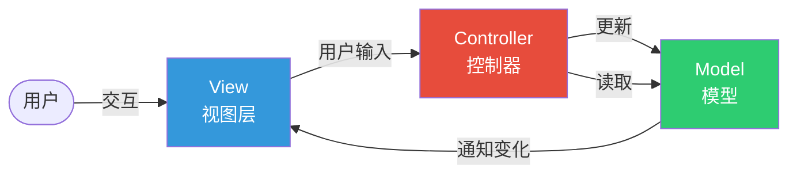

**特点**：
- Model 可以直接通知 View 更新（Observer 模式）
- View 通常包含 UI 渲染逻辑
- 适用于桌面应用、前端框架（Angular/Vue）

#### 后端 MVC（本项目）

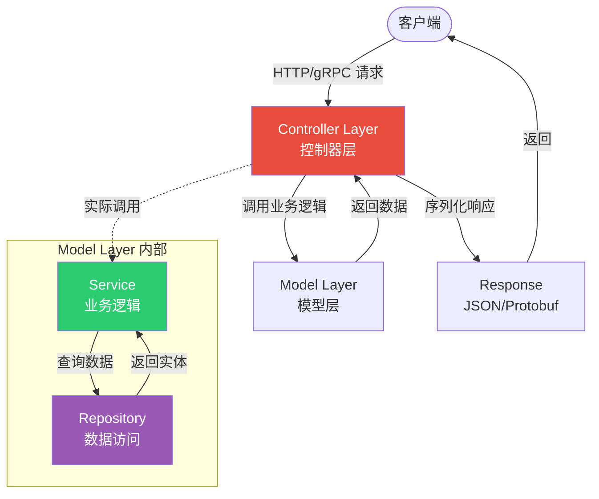

**特点**：
- 没有传统的 View（返回 JSON/Protobuf）
- Model 层拆分为 Service + Repository
- 单向数据流（Controller → Service → Repository）

---

### 1.2 项目中的 MVC 映射

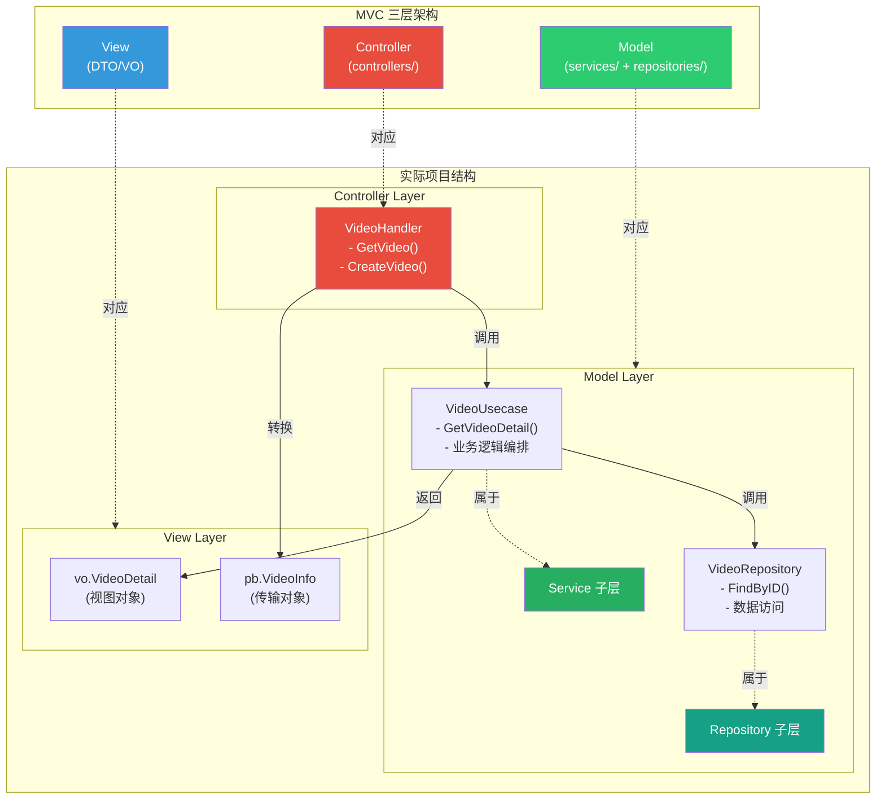

---

### 1.3 完整请求处理流程

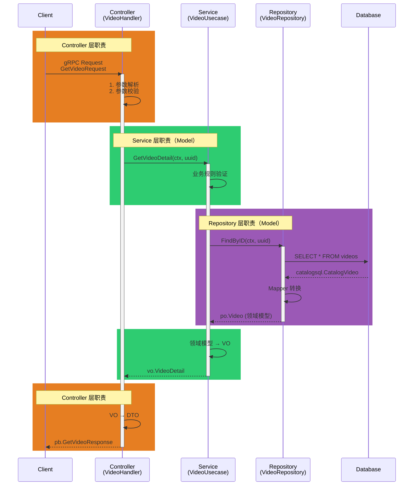

---

### 1.4 MVC 职责划分

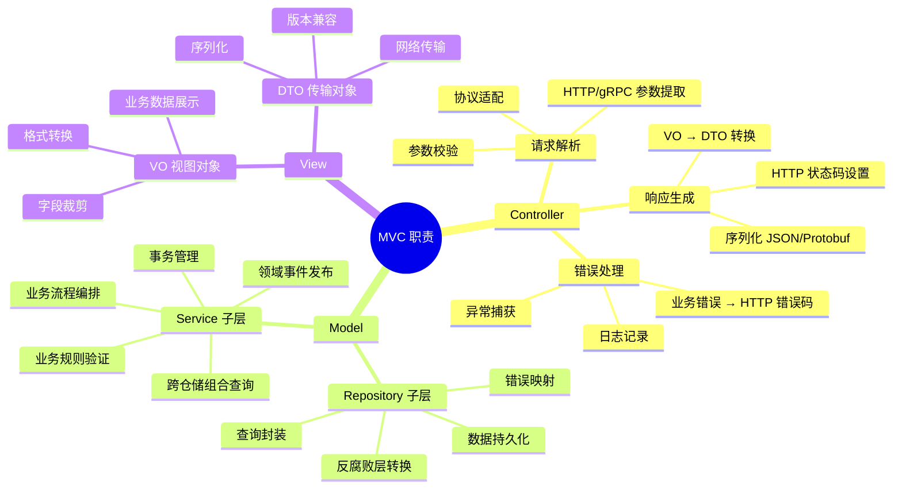

---

## 二、DDD 领域驱动设计

### 2.1 DDD 分层架构

```mermaid
graph TB
    subgraph UI["User Interface Layer<br/>用户接口层"]
        Handler["VideoHandler<br/>(gRPC/HTTP)"]
    end

    subgraph App["Application Layer<br/>应用层"]
        UseCase["VideoUsecase<br/>(用例编排)"]
        DTO1["DTO/VO<br/>(数据传输)"]
    end

    subgraph Domain["Domain Layer<br/>领域层"]
        Entity["Entity<br/>po.Video"]
        ValueObject["Value Object<br/>VideoStatus"]
        DomainService["Domain Service<br/>(领域服务)"]
        RepoInterface["Repository Interface<br/>(仓储接口)"]
    end

    subgraph Infra["Infrastructure Layer<br/>基础设施层"]
        RepoImpl["Repository Impl<br/>VideoRepository"]
        Mapper["Mapper<br/>(反腐败层)"]
        SQLC["sqlc.Queries<br/>(ORM)"]
        DB[(PostgreSQL)]
    end

    Handler -->|调用| UseCase
    UseCase -->|使用| Entity
    UseCase -->|依赖接口| RepoInterface
    RepoInterface <-.实现.-|依赖倒置| RepoImpl
    RepoImpl -->|转换| Mapper
    Mapper -->|调用| SQLC
    SQLC -->|查询| DB

    Entity -->|包含| ValueObject
    UseCase -->|返回| DTO1

    style UI fill:#e74c3c,color:#fff
    style App fill:#3498db,color:#fff
    style Domain fill:#2ecc71,color:#fff
    style Infra fill:#95a5a6,color:#fff
```

---

### 2.2 DDD 战术模式

#### 实体（Entity）

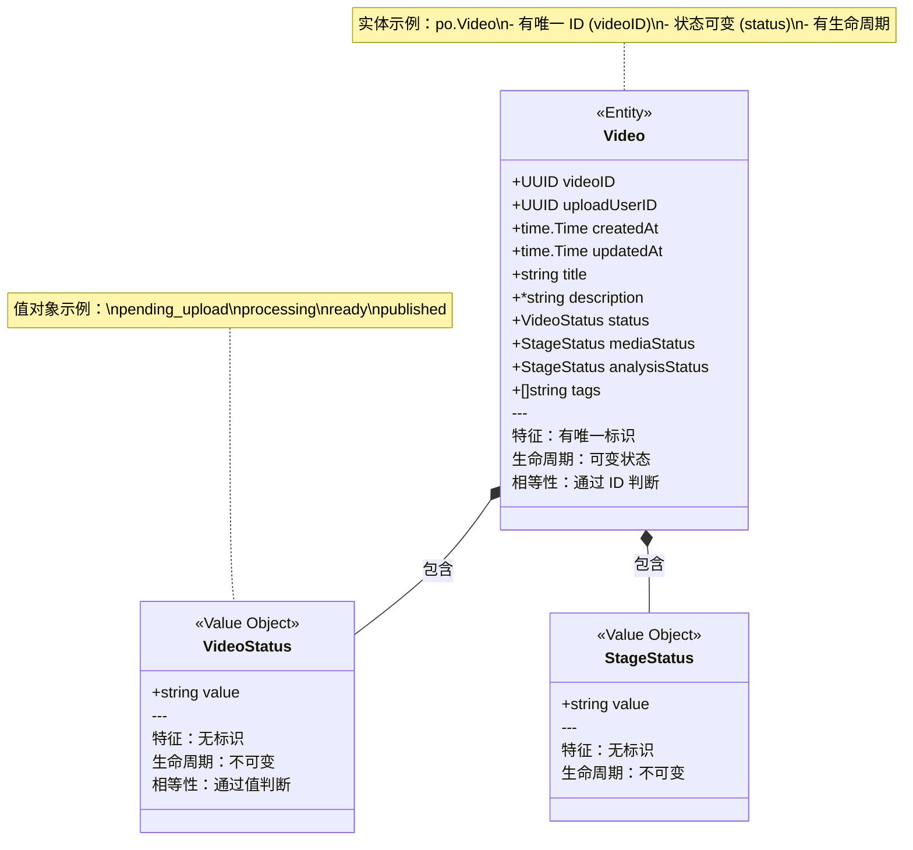

#### 聚合根（Aggregate Root）

```mermaid
graph TB
    subgraph Aggregate["Video 聚合"]
        Root["Video<br/>(聚合根)"]

        subgraph Entities["实体"]
            MediaFile["MediaFile<br/>(实体)"]
            Thumbnail["Thumbnail<br/>(实体)"]
        end

        subgraph ValueObjects["值对象"]
            Status["VideoStatus"]
            MediaStatus["StageStatus"]
            Tags["Tags[]"]
        end

        Root -->|拥有| MediaFile
        Root -->|拥有| Thumbnail
        Root -->|包含| Status
        Root -->|包含| MediaStatus
        Root -->|包含| Tags
    end

    External([外部系统]) -.->|只能通过聚合根访问| Root
    External -.x|不能直接访问| MediaFile
    External -.x|不能直接访问| Thumbnail

    style Root fill:#e74c3c,color:#fff,stroke:#c0392b,stroke-width:4px
    style MediaFile fill:#3498db,color:#fff
    style Thumbnail fill:#3498db,color:#fff
    style Status fill:#2ecc71,color:#fff
    style MediaStatus fill:#2ecc71,color:#fff
    style Tags fill:#2ecc71,color:#fff
```

**聚合规则**：
1. ✅ 外部只能引用聚合根（Video）
2. ✅ 内部实体通过聚合根访问
3. ✅ 聚合内部保证一致性
4. ✅ 跨聚合通过 ID 引用

---

### 2.3 DDD 仓储模式

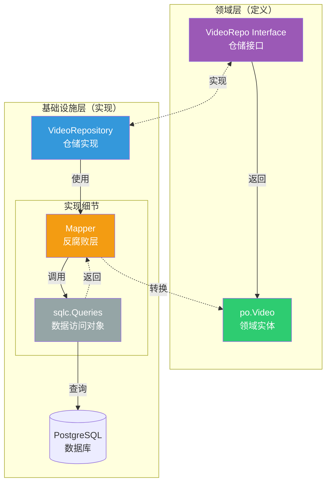

**仓储模式特征**：
- ✅ 接口在领域层定义
- ✅ 实现在基础设施层
- ✅ 返回领域对象（Entity）
- ✅ 隐藏持久化细节

---

### 2.4 DDD 领域服务

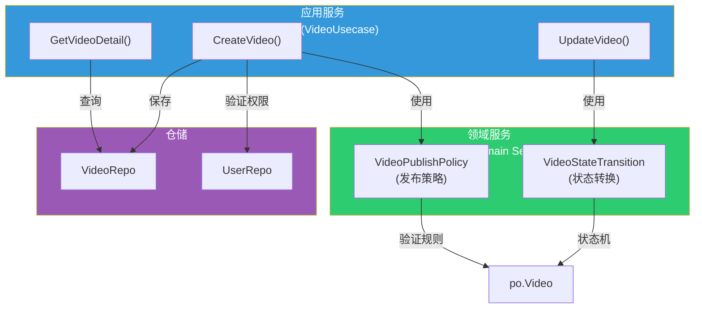

**领域服务 vs 应用服务**：

| 特征 | 应用服务 | 领域服务 |
|------|---------|---------|
| **位置** | Application Layer | Domain Layer |
| **职责** | 用例编排、事务管理 | 纯粹的业务逻辑 |
| **依赖** | 依赖仓储、领域服务 | 只依赖领域对象 |
| **示例** | `VideoUsecase` | `VideoPublishPolicy` |
| **状态** | 无状态（编排者） | 无状态（纯函数） |

---

### 2.5 完整 DDD 分层与对象类型

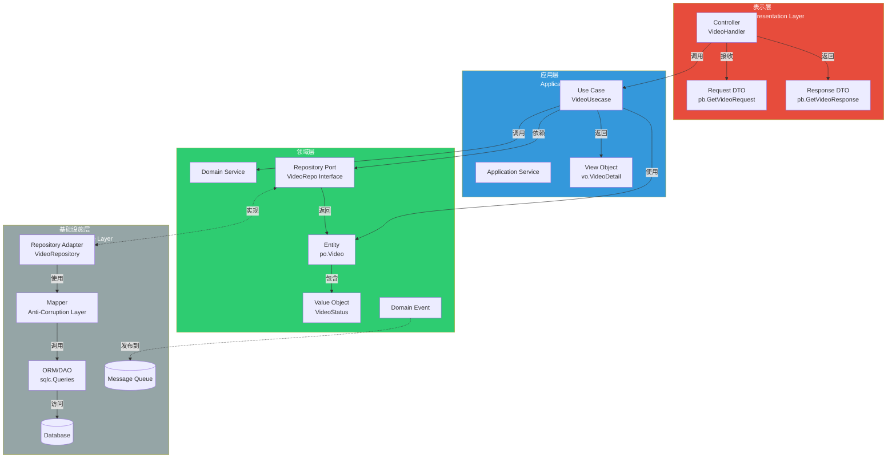

---

## 三、分层架构模式

### 3.1 严格分层 vs 松散分层

```mermaid
graph TB
    subgraph Strict["严格分层<br/>(Strict Layers)"]
        direction TB
        S_UI["UI Layer"] --> S_App["Application Layer"]
        S_App --> S_Domain["Domain Layer"]
        S_Domain --> S_Infra["Infrastructure Layer"]

        S_UI -.x|禁止跨层| S_Domain
        S_UI -.x|禁止跨层| S_Infra
    end

    subgraph Relaxed["松散分层<br/>(Relaxed Layers)"]
        direction TB
        R_UI["UI Layer"] --> R_App["Application Layer"]
        R_App --> R_Domain["Domain Layer"]
        R_Domain --> R_Infra["Infrastructure Layer"]

        R_UI -.->|允许跨层| R_Domain
        R_App -.->|允许跨层| R_Infra
    end

    style Strict fill:#e74c3c,color:#fff
    style Relaxed fill:#2ecc71,color:#fff
```

**本项目采用**：严格分层（除 DTO 外）

```mermaid
graph LR
    Controller["Controller"] -->|只能调用| Service["Service"]
    Service -->|只能调用| Repository["Repository"]
    Repository -->|只能调用| SQLC["sqlc"]

    Controller -.x|禁止直接访问| Repository
    Controller -.x|禁止直接访问| SQLC
    Service -.x|禁止直接访问| SQLC

    style Controller fill:#e74c3c,color:#fff
    style Service fill:#3498db,color:#fff
    style Repository fill:#2ecc71,color:#fff
    style SQLC fill:#95a5a6,color:#fff
```

---

### 3.2 依赖规则

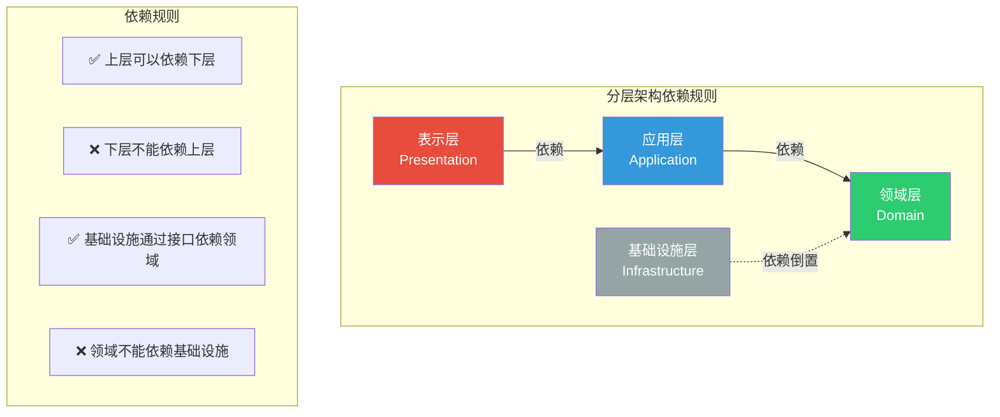

---

### 3.3 项目实际分层

```mermaid
graph TB
    subgraph ProjectLayers["kratos-template 分层"]
        direction TB

        subgraph Layer1["第 1 层：表示层"]
            Controllers["internal/controllers/<br/>- VideoHandler"]
        end

        subgraph Layer2["第 2 层：应用层"]
            Services["internal/services/<br/>- VideoUsecase"]
            VO["internal/models/vo/<br/>- VideoDetail"]
        end

        subgraph Layer3["第 3 层：领域层"]
            PO["internal/models/po/<br/>- Video (Entity)<br/>- VideoStatus (VO)"]
            Interfaces["Service 层定义的接口<br/>- VideoRepo"]
        end

        subgraph Layer4["第 4 层：基础设施层"]
            Repos["internal/repositories/<br/>- VideoRepository"]
            Mappers["internal/repositories/mappers/<br/>- VideoFromCatalog()"]
            SQLC["internal/repositories/sqlc/<br/>- Queries<br/>- Models"]
            Infra["internal/infrastructure/<br/>- Database<br/>- gRPC Server/Client"]
        end

        Controllers -->|调用| Services
        Services -->|返回| VO
        Services -->|使用| PO
        Services -->|依赖| Interfaces

        Interfaces <-.实现.- Repos
        Repos -->|使用| Mappers
        Mappers -->|调用| SQLC
        SQLC -->|使用| Infra
    end

    style Layer1 fill:#e74c3c,color:#fff
    style Layer2 fill:#3498db,color:#fff
    style Layer3 fill:#2ecc71,color:#fff
    style Layer4 fill:#95a5a6,color:#fff
```

---

## 四、设计模式综合应用

### 4.1 Repository 模式

```mermaid
graph TB
    subgraph Pattern["Repository 模式结构"]
        Client["客户端<br/>(VideoUsecase)"]

        subgraph RepositoryPattern["Repository 模式"]
            Interface["IRepository<br/>(VideoRepo 接口)"]
            Impl["Repository<br/>(VideoRepository)"]

            subgraph Strategy["策略模式"]
                PostgreSQL["PostgreSQLRepository"]
                MongoDB["MongoDBRepository"]
                Redis["RedisRepository"]
            end
        end

        Collection["领域对象集合<br/>(po.Video[])"]
        DB1[(PostgreSQL)]
        DB2[(MongoDB)]
        Cache[(Redis)]
    end

    Client -->|依赖| Interface
    Interface <-.实现.- Impl
    Interface <-.实现.- PostgreSQL
    Interface <-.实现.- MongoDB
    Interface <-.实现.- Redis

    Impl -.->|返回| Collection
    PostgreSQL -->|访问| DB1
    MongoDB -->|访问| DB2
    Redis -->|访问| Cache

    style Client fill:#3498db,color:#fff
    style Interface fill:#9b59b6,color:#fff
    style Impl fill:#2ecc71,color:#fff
    style PostgreSQL fill:#2ecc71,color:#fff
    style MongoDB fill:#2ecc71,color:#fff
    style Redis fill:#2ecc71,color:#fff
```

**Repository 模式职责**：
- ✅ 集合式访问（类似内存集合）
- ✅ 隐藏持久化细节
- ✅ 提供领域对象（不是数据库记录）
- ✅ 查询方法用业务语言命名

---

### 4.2 Service 模式（应用服务 + 领域服务）

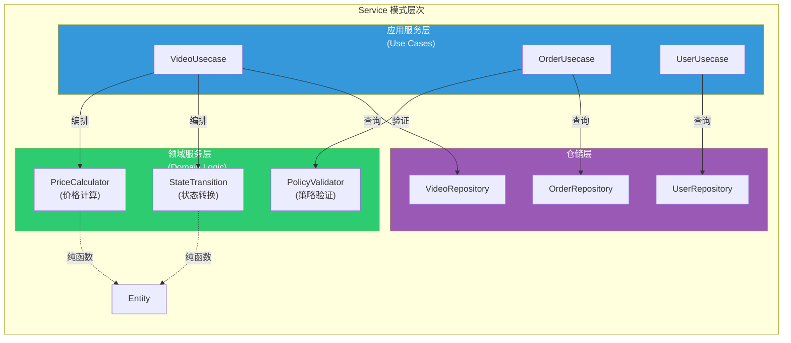

**Service 模式分类**：

| 类型 | 职责 | 状态 | 示例 |
|------|------|------|------|
| **Application Service** | 用例编排、事务管理 | 无状态 | `VideoUsecase` |
| **Domain Service** | 领域逻辑、业务规则 | 无状态（纯函数） | `PriceCalculator` |
| **Infrastructure Service** | 技术能力、外部集成 | 有状态（连接） | `EmailService` |

---

### 4.3 DTO/VO 模式

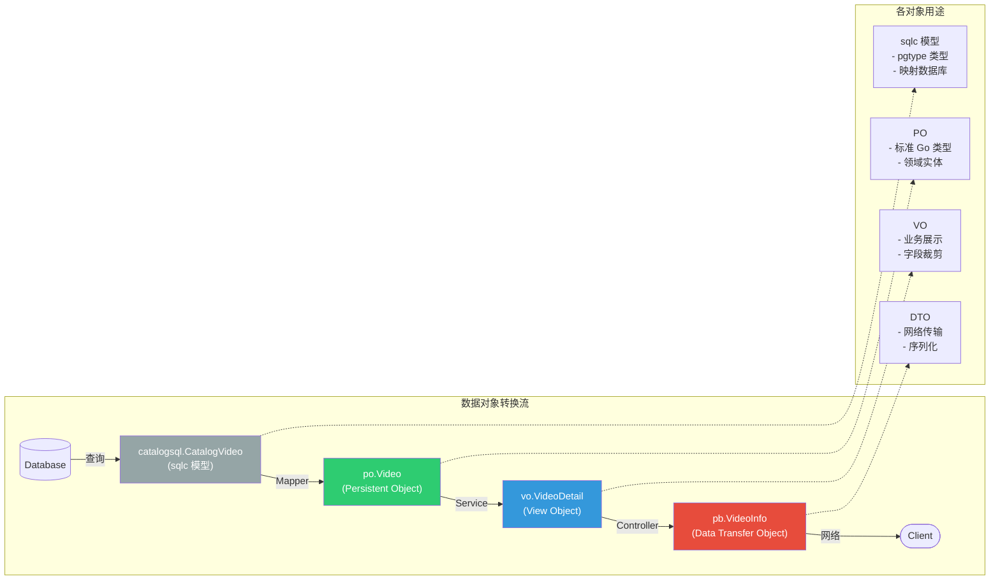

---

### 4.4 Mapper 模式（反腐败层）

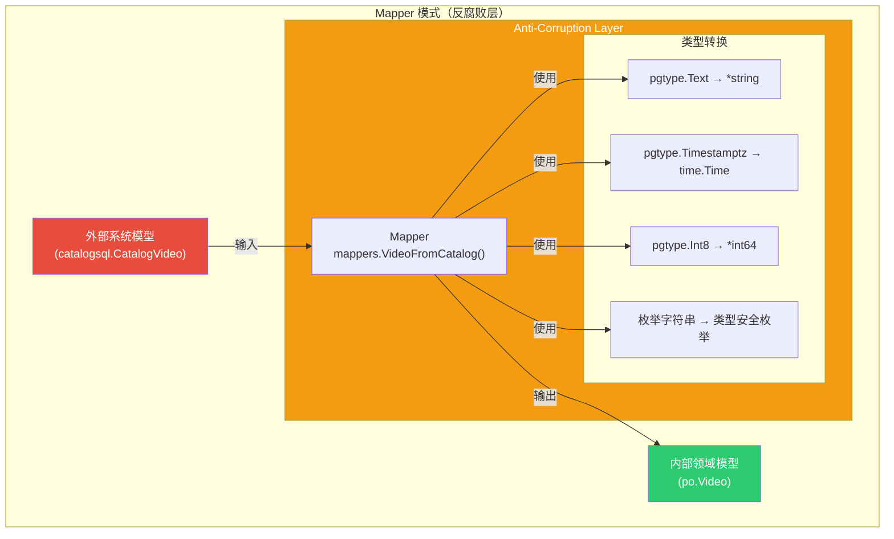

**Mapper 职责**：
- ✅ 隔离外部依赖（pgtype）
- ✅ 类型转换
- ✅ 数据防御（nil 检查、深拷贝）
- ✅ 保护领域模型纯洁性

---

### 4.5 Dependency Injection 模式

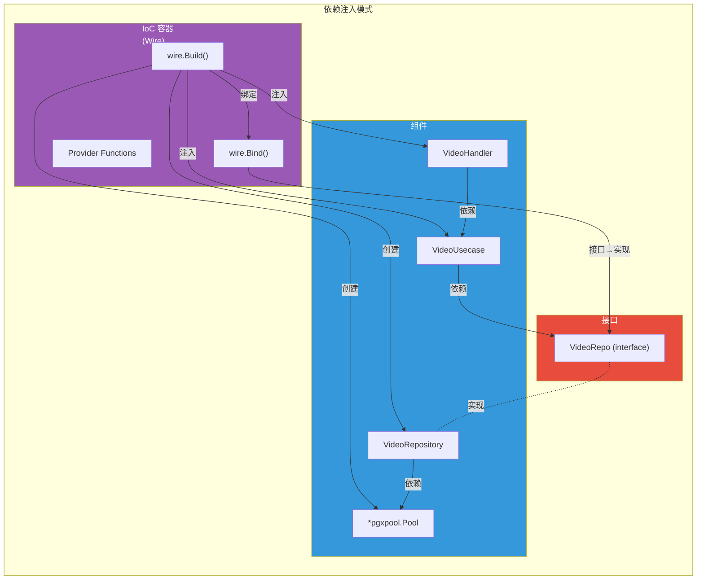

**依赖注入三种方式**：

```mermaid
graph LR
    subgraph DI_Types["依赖注入方式"]
        subgraph Constructor["构造器注入<br/>(推荐)"]
            C1["func NewVideoUsecase(<br/>  repo VideoRepo<br/>) *VideoUsecase"]
        end

        subgraph Setter["Setter 注入<br/>(不推荐)"]
            S1["func (uc *VideoUsecase)<br/>SetRepo(repo VideoRepo)"]
        end

        subgraph Interface_["接口注入<br/>(Go 不常用)"]
            I1["type Injectable interface {<br/>  Inject(deps...)"]
        end
    end

    style Constructor fill:#2ecc71,color:#fff
    style Setter fill:#e74c3c,color:#fff
    style Interface_ fill:#95a5a6,color:#fff
```

---

### 4.6 Factory 模式

```mermaid
graph TB
    subgraph FactoryPattern["工厂模式"]
        Client["客户端"]

        subgraph Factory["工厂"]
            NewFunc["NewVideoRepository(db, logger)"]
        end

        subgraph Products["产品"]
            Product1["VideoRepository"]
            Product2["CacheRepository"]
            Product3["MockRepository"]
        end

        subgraph Dependencies["依赖"]
            DB["*pgxpool.Pool"]
            Logger["log.Logger"]
            Redis["*redis.Client"]
        end

        Client -->|调用| NewFunc
        NewFunc -->|需要| DB
        NewFunc -->|需要| Logger
        NewFunc -->|创建| Product1

        Product1 -.-> DB
        Product2 -.-> Redis
        Product3 -.-> |Mock| DB
    end

    style Factory fill:#f39c12,color:#fff
    style Products fill:#2ecc71,color:#fff
    style Dependencies fill:#95a5a6,color:#fff
```

**工厂函数示例**：

```go
// Simple Factory
func NewVideoRepository(db *pgxpool.Pool, logger log.Logger) *VideoRepository {
    return &VideoRepository{
        db:      db,
        queries: catalogsql.New(db),
        log:     log.NewHelper(logger),
    }
}

// Factory Method (多种实现)
func NewPostgreSQLVideoRepository(...) VideoRepo { ... }
func NewMongoDBVideoRepository(...) VideoRepo { ... }
func NewRedisVideoRepository(...) VideoRepo { ... }
```

---

## 五、模式对比与选择

### 5.1 架构模式对比

```mermaid
graph TB
    subgraph Comparison["架构模式对比"]
        direction LR

        subgraph MVC_Pattern["MVC"]
            M1["特点：<br/>- 三层分离<br/>- 单向数据流<br/>- 适合 Web API"]
            M2["优势：<br/>- 简单直观<br/>- 易于理解<br/>- 快速开发"]
            M3["劣势：<br/>- Model 职责重<br/>- 业务逻辑可能分散"]
        end

        subgraph DDD_Pattern["DDD"]
            D1["特点：<br/>- 领域驱动<br/>- 四层架构<br/>- 战术战略模式"]
            D2["优势：<br/>- 业务逻辑清晰<br/>- 领域模型丰富<br/>- 适合复杂业务"]
            D3["劣势：<br/>- 学习曲线陡<br/>- 前期投入大<br/>- 过度设计风险"]
        end

        subgraph Hexagonal_Pattern["六边形架构"]
            H1["特点：<br/>- 端口与适配器<br/>- 依赖倒置<br/>- 核心与外部隔离"]
            H2["优势：<br/>- 可测试性强<br/>- 技术无关<br/>- 易于替换"]
            H3["劣势：<br/>- 抽象层多<br/>- 代码量增加"]
        end
    end

    style MVC_Pattern fill:#e74c3c,color:#fff
    style DDD_Pattern fill:#2ecc71,color:#fff
    style Hexagonal_Pattern fill:#3498db,color:#fff
```

---

### 5.2 本项目模式融合

```mermaid
mindmap
  root((kratos-template<br/>架构融合))
    MVC 架构
      Controller 表示层
      Service 业务层
      Repository 数据层
    DDD 战术模式
      Entity 实体
        po.Video
      Value Object 值对象
        VideoStatus
      Repository 仓储
        VideoRepo 接口
      Application Service
        VideoUsecase
    六边形架构
      Application Core
        VideoUsecase
        po.Video
      Inbound Port
        UseCase 公开方法
      Outbound Port
        VideoRepo 接口
      Primary Adapter
        VideoHandler
      Secondary Adapter
        VideoRepository
    其他模式
      Dependency Injection
        Wire
      Mapper Pattern
        反腐败层
      Factory Pattern
        New 函数
      Strategy Pattern
        多种 Repository 实现
```

---

### 5.3 模式应用场景

```mermaid
graph TB
    subgraph Scenarios["场景决策树"]
        Start([开始新项目])

        Q1{业务复杂度？}
        Q2{是否需要多端接入？}
        Q3{是否需要替换底层？}
        Q4{团队 DDD 经验？}

        Simple["简单 MVC"]
        MVC_Plus["MVC + Repository"]
        Hexagonal["六边形架构"]
        Full_DDD["完整 DDD"]

        Start --> Q1
        Q1 -->|简单| Q2
        Q1 -->|中等| Q3
        Q1 -->|复杂| Q4

        Q2 -->|否| Simple
        Q2 -->|是| MVC_Plus

        Q3 -->|否| MVC_Plus
        Q3 -->|是| Hexagonal

        Q4 -->|有| Full_DDD
        Q4 -->|无| Hexagonal

        Simple -.->|示例| Ex1["博客系统<br/>CRUD 应用"]
        MVC_Plus -.->|示例| Ex2["电商后台<br/>管理系统"]
        Hexagonal -.->|示例| Ex3["微服务<br/>多数据源"]
        Full_DDD -.->|示例| Ex4["金融系统<br/>复杂业务"]
    end

    style Simple fill:#95a5a6,color:#fff
    style MVC_Plus fill:#3498db,color:#fff
    style Hexagonal fill:#2ecc71,color:#fff
    style Full_DDD fill:#e74c3c,color:#fff
```

---

### 5.4 项目架构演进路径

```mermaid
graph LR
    subgraph Evolution["架构演进路径"]
        Phase1["阶段 1<br/>简单分层<br/>Controller-Service-DAO"]
        Phase2["阶段 2<br/>引入 Repository<br/>+ 领域模型"]
        Phase3["阶段 3<br/>依赖倒置<br/>+ 接口定义"]
        Phase4["阶段 4<br/>六边形架构<br/>+ 适配器模式"]
        Phase5["阶段 5<br/>完整 DDD<br/>+ 聚合 + 领域事件"]

        Phase1 -->|业务增长| Phase2
        Phase2 -->|可测试性需求| Phase3
        Phase3 -->|多数据源| Phase4
        Phase4 -->|复杂业务| Phase5

        Phase1 -.->|当前项目| Here["kratos-template<br/>处于阶段 3-4"]
    end

    style Phase1 fill:#95a5a6,color:#fff
    style Phase2 fill:#3498db,color:#fff
    style Phase3 fill:#2ecc71,color:#fff
    style Phase4 fill:#f39c12,color:#fff
    style Phase5 fill:#e74c3c,color:#fff
    style Here fill:#9b59b6,color:#fff,stroke:#8e44ad,stroke-width:4px
```

---

## 六、总结

### 6.1 项目架构模式总览

```mermaid
mindmap
  root((架构模式))
    宏观架构
      MVC 三层架构
      DDD 四层架构
      六边形架构
    设计模式
      Repository 模式
      Service 模式
      Mapper 模式
      Factory 模式
      Strategy 模式
    设计原则
      依赖倒置 DIP
      单一职责 SRP
      开闭原则 OCP
      接口隔离 ISP
      依赖注入 DI
    战术模式
      Entity 实体
      Value Object 值对象
      Aggregate 聚合
      Domain Service
      Application Service
```

---

### 6.2 关键设计决策

| 决策点 | 选择 | 理由 |
|--------|------|------|
| **分层模式** | MVC + DDD 混合 | 简单直观 + 领域清晰 |
| **依赖方向** | 依赖倒置（接口在高层） | 可测试 + 可替换 |
| **数据访问** | Repository 模式 | 隔离持久化 + 集合式访问 |
| **模型转换** | Mapper 反腐败层 | 隔离外部依赖（pgtype） |
| **依赖注入** | Wire 构造器注入 | 编译时检查 + 性能好 |
| **领域模型** | Entity + VO | 富领域模型 |
| **DTO 策略** | 多层转换（sqlc→PO→VO→DTO） | 关注点分离 |

---

### 6.3 架构优势

✅ **可测试性**
- Mock 接口即可测试核心逻辑
- 无需真实数据库/外部服务

✅ **可维护性**
- 职责清晰，易于定位问题
- 业务逻辑集中在 Service 层

✅ **可扩展性**
- 新增适配器无需修改核心
- 支持多种数据源/协议

✅ **技术无关性**
- 核心业务不依赖框架
- 可以替换数据库/消息队列

✅ **团队协作**
- 前后端可并行开发（先定义接口）
- 分层清晰，易于分工

---

### 6.4 最佳实践建议

1. **遵循分层规则**
   - 严格单向依赖
   - 不跨层调用

2. **接口设计**
   - 接口在高层定义
   - 使用业务语言命名

3. **避免贫血模型**
   - Entity 应包含业务方法
   - 不只是数据容器

4. **合理使用 DTO/VO**
   - 不同层使用不同模型
   - 避免直接暴露 Entity

5. **集中转换逻辑**
   - Mapper 专职类型转换
   - 避免转换代码分散

---

**参考资料**：
- [Domain-Driven Design - Eric Evans](https://www.domainlanguage.com/ddd/)
- [Clean Architecture - Robert C. Martin](https://blog.cleancoder.com/uncle-bob/2012/08/13/the-clean-architecture.html)
- [Patterns of Enterprise Application Architecture - Martin Fowler](https://martinfowler.com/books/eaa.html)
- [Implementing Domain-Driven Design - Vaughn Vernon](https://vaughnvernon.com/)
