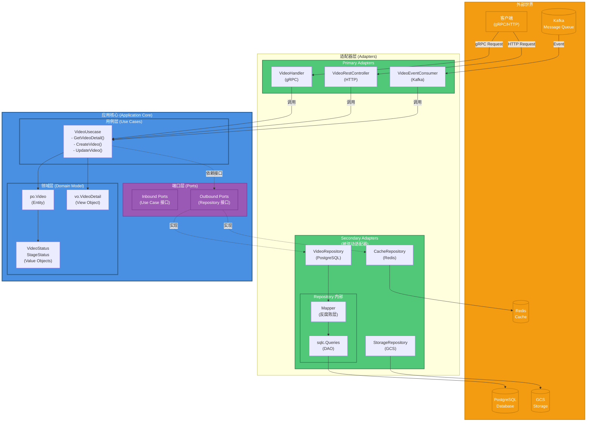
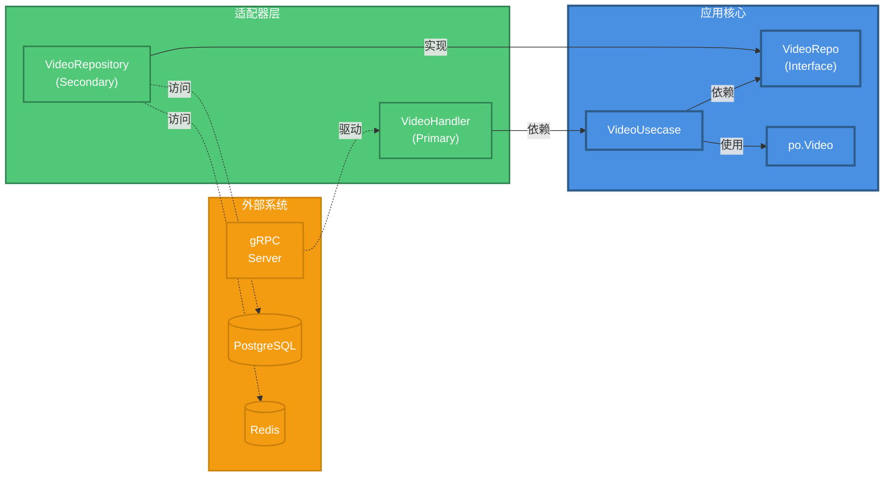
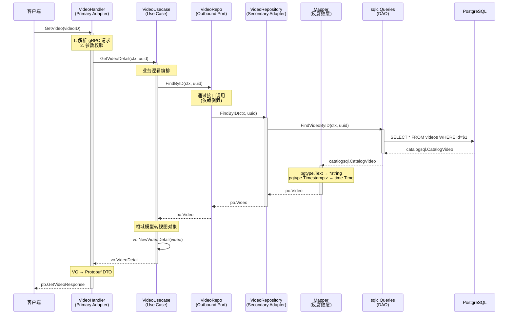
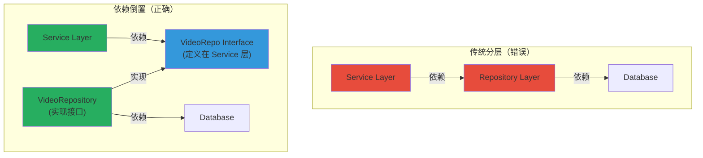

# 六边形架构设计文档

> **Hexagonal Architecture in kratos-template**
> 本文档详细解释 kratos-template 项目中的六边形架构（Ports and Adapters）设计，帮助开发者理解核心思想与实现细节。

---

## 目录

- [一、六边形架构概述](#一六边形架构概述)
- [二、核心概念](#二核心概念)
- [三、项目架构图](#三项目架构图)
- [四、实现细节](#四实现细节)
- [五、依赖倒置原则](#五依赖倒置原则)
- [六、测试策略](#六测试策略)
- [七、最佳实践](#七最佳实践)

---

## 一、六边形架构概述

### 1.1 什么是六边形架构？

**六边形架构**（Hexagonal Architecture），又称**端口与适配器模式**（Ports and Adapters），由 Alistair Cockburn 于 2005 年提出。

**核心思想**：
> 将业务逻辑（Application Core）与外部系统隔离，通过定义清晰的端口（Ports）和适配器（Adapters）实现解耦。

**目标**：
- ✅ **业务逻辑独立**：不依赖框架、数据库、UI
- ✅ **可测试性**：核心逻辑可独立测试
- ✅ **可替换性**：轻松替换外部依赖（数据库、第三方服务）
- ✅ **延迟决策**：推迟技术选型决策到最晚时刻

### 1.2 为什么叫"六边形"？

"六边形"只是视觉隐喻，强调：
- **核心在中央**（业务逻辑）
- **周围是端口**（可以有任意多个）
- **外层是适配器**（连接外部世界）

**六边形 ≠ 必须有 6 个边**，可以是任意多边形。

---

## 二、核心概念

### 2.1 应用核心（Application Core）

**组成**：
- **Domain Model**（领域模型）：`po.Video`, `VideoStatus`
- **Use Cases**（用例）：`VideoUsecase`
- **Ports**（端口接口）：`VideoRepo` 接口

**特点**：
- ✅ 纯粹的业务逻辑
- ✅ 不依赖外部框架
- ✅ 不知道数据来自哪里（PostgreSQL/Redis/MongoDB）
- ✅ 不知道请求来自哪里（HTTP/gRPC/消息队列）

### 2.2 端口（Ports）

**定义**：抽象接口，定义核心与外部交互的契约。

**分类**：

#### Inbound Port（输入端口/驱动端口）
- **定义者**：Application Core
- **调用方向**：外部 → 核心
- **示例**：`VideoUsecase` 的公开方法

```go
// Inbound Port：外部通过这些方法调用核心
type VideoUsecase struct { ... }

func (uc *VideoUsecase) GetVideoDetail(...) (*vo.VideoDetail, error)
func (uc *VideoUsecase) CreateVideo(...) (*vo.VideoRevision, error)
```

#### Outbound Port（输出端口/被驱动端口）
- **定义者**：Application Core
- **调用方向**：核心 → 外部
- **示例**：`VideoRepo` 接口

```go
// Outbound Port：核心通过这个接口调用外部
type VideoRepo interface {
    FindByID(ctx context.Context, videoID uuid.UUID) (*po.Video, error)
}
```

### 2.3 适配器（Adapters）

**定义**：实现端口接口，连接核心与外部系统。

**分类**：

#### Primary Adapter（主适配器/驱动适配器）
- **职责**：将外部请求转换为核心调用
- **示例**：gRPC Handler, HTTP Controller, CLI

#### Secondary Adapter（次适配器/被驱动适配器）
- **职责**：实现核心定义的端口，访问外部资源
- **示例**：Repository, gRPC Client, Redis Client

---

## 三、项目架构图

### 3.1 完整架构图



### 3.2 依赖方向图



### 3.3 数据流转图



---

## 四、实现细节

### 4.1 应用核心（Application Core）

#### 领域模型（Domain Model）

**位置**：`internal/models/po/video.go`

```go
// Entity（实体）：有唯一标识，可变状态
type Video struct {
    VideoID           uuid.UUID   // 唯一标识
    UploadUserID      uuid.UUID
    CreatedAt         time.Time
    UpdatedAt         time.Time
    Title             string
    Description       *string
    Status            VideoStatus // 值对象
    MediaStatus       StageStatus // 值对象
    Tags              []string
    // ...
}

// Value Object（值对象）：不可变，无 ID
type VideoStatus string

const (
    VideoStatusPendingUpload VideoStatus = "pending_upload"
    VideoStatusProcessing    VideoStatus = "processing"
    VideoStatusReady         VideoStatus = "ready"
    VideoStatusPublished     VideoStatus = "published"
)
```

**特点**：
- ✅ 使用标准 Go 类型（不依赖 `pgtype`）
- ✅ 业务语义清晰
- ✅ 与存储无关

#### 用例层（Use Cases）

**位置**：`internal/services/video.go`

```go
type VideoUsecase struct {
    repo VideoRepo   // ← Outbound Port（依赖接口）
    log  *log.Helper
}

// Inbound Port 方法（供外部调用）
func (uc *VideoUsecase) GetVideoDetail(ctx context.Context, videoID uuid.UUID) (*vo.VideoDetail, error) {
    // === 业务逻辑 ===

    // 1. 通过端口获取数据
    video, err := uc.repo.FindByID(ctx, videoID)
    if err != nil {
        if errors.Is(err, repositories.ErrVideoNotFound) {
            return nil, ErrVideoNotFound
        }
        return nil, errors.InternalServer("QUERY_VIDEO_FAILED", "failed to query video")
    }

    // 2. 业务规则校验（此处省略）

    // 3. 领域模型 → 视图对象
    return vo.NewVideoDetail(video), nil
}
```

**职责**：
- ✅ 业务流程编排
- ✅ 事务管理
- ✅ 业务规则验证
- ✅ 领域事件发布

#### 输出端口（Outbound Port）

**位置**：`internal/services/video.go`（与 UseCase 同包）

```go
// VideoRepo 是输出端口（Outbound Port）
// 由应用核心定义，Repository 层实现
type VideoRepo interface {
    FindByID(ctx context.Context, videoID uuid.UUID) (*po.Video, error)
    // 未来可扩展：
    // Create(ctx context.Context, video *po.Video) error
    // Update(ctx context.Context, video *po.Video) error
}
```

**关键设计**：
- ✅ **接口在核心定义**（依赖倒置）
- ✅ **面向业务语义**（FindByID，不是 SelectSQL）
- ✅ **返回领域模型**（`*po.Video`，不是数据库模型）

---

### 4.2 适配器层（Adapters）

#### Primary Adapter（驱动适配器）

**位置**：`internal/controllers/video_handler.go`

```go
type VideoHandler struct {
    videoUsecase *services.VideoUsecase // ← 依赖核心
}

func (h *VideoHandler) GetVideo(ctx context.Context, req *pb.GetVideoRequest) (*pb.GetVideoResponse, error) {
    // === 适配器职责 ===

    // 1. 协议适配（Protobuf → 业务参数）
    videoID, err := uuid.Parse(req.VideoId)
    if err != nil {
        return nil, status.Error(codes.InvalidArgument, "invalid video_id")
    }

    // 2. 调用核心业务
    videoVO, err := h.videoUsecase.GetVideoDetail(ctx, videoID)
    if err != nil {
        // 错误映射（业务错误 → gRPC 错误码）
        if errors.Is(err, services.ErrVideoNotFound) {
            return nil, status.Error(codes.NotFound, "video not found")
        }
        return nil, status.Error(codes.Internal, "internal error")
    }

    // 3. 响应适配（VO → Protobuf）
    return &pb.GetVideoResponse{
        Video: &pb.VideoInfo{
            VideoId:     videoVO.VideoID.String(),
            Title:       videoVO.Title,
            Description: getStringValue(videoVO.Description),
            Status:      videoVO.Status,
            Tags:        videoVO.Tags,
            CreatedAt:   timestamppb.New(videoVO.CreatedAt),
        },
    }, nil
}
```

**职责**：
- ✅ 请求协议转换（HTTP/gRPC → 业务参数）
- ✅ 响应格式转换（VO → DTO）
- ✅ 错误码映射
- ✅ 参数校验

#### Secondary Adapter（被驱动适配器）

**位置**：`internal/repositories/video_repo.go`

```go
type VideoRepository struct {
    db      *pgxpool.Pool
    queries *catalogsql.Queries
    log     *log.Helper
}

// 实现 Outbound Port
func (r *VideoRepository) FindByID(ctx context.Context, videoID uuid.UUID) (*po.Video, error) {
    // === 适配器职责 ===

    // 1. 调用基础设施层（sqlc）
    record, err := r.queries.FindVideoByID(ctx, videoID)
    if err != nil {
        // 2. 错误适配（pgx → 业务错误）
        if errors.Is(err, pgx.ErrNoRows) {
            return nil, ErrVideoNotFound
        }
        r.log.Errorf("find video by id failed: %v", err)
        return nil, fmt.Errorf("find video by id: %w", err)
    }

    // 3. 数据适配（sqlc 模型 → 领域模型）
    return mappers.VideoFromCatalog(record), nil
}
```

**内部分层**：

```
VideoRepository（外观）
    ↓
Mapper（反腐败层）
    ↓
sqlc.Queries（DAO）
    ↓
PostgreSQL
```

#### 反腐败层（Mapper）

**位置**：`internal/repositories/mappers/video.go`

```go
// VideoFromCatalog 将 sqlc 生成的模型转换为领域模型
// 这是反腐败层（Anti-Corruption Layer）
func VideoFromCatalog(v catalogsql.CatalogVideo) *po.Video {
    return &po.Video{
        VideoID:      v.VideoID,
        Title:        v.Title,
        Description:  textPtr(v.Description),        // pgtype.Text → *string
        CreatedAt:    mustTimestamp(v.CreatedAt),    // pgtype.Timestamptz → time.Time
        Status:       po.VideoStatus(v.Status),      // 类型转换
        Tags:         append([]string(nil), v.Tags...), // 深拷贝
        // ...
    }
}

// 辅助函数：pgtype.Text → *string
func textPtr(t pgtype.Text) *string {
    if !t.Valid {
        return nil
    }
    return &t.String
}
```

**职责**：
- ✅ 隔离 `pgtype` 依赖
- ✅ 类型转换（pgtype → Go 标准类型）
- ✅ 数据防御（深拷贝、nil 检查）

---

### 4.3 依赖注入（Wire）

**位置**：`cmd/grpc/wire.go`

```go
func wireApp(...) (*kratos.App, func(), error) {
    panic(wire.Build(
        // 基础设施
        database.ProviderSet,      // 提供 *pgxpool.Pool

        // 适配器层
        repositories.ProviderSet,  // 提供 *VideoRepository

        // === 关键：绑定端口到适配器 ===
        wire.Bind(
            new(services.VideoRepo),           // ← 端口接口
            new(*repositories.VideoRepository), // ← 适配器实现
        ),

        // 核心层
        services.ProviderSet,      // 提供 *VideoUsecase

        // 表示层
        controllers.ProviderSet,   // 提供 *VideoHandler

        newApp,
    ))
}
```

**wire.Bind 的作用**：
```go
// 告诉 Wire：当构造 VideoUsecase 时需要 VideoRepo 接口，
// 请注入 *VideoRepository 实例
```

**运行时对象图**：

```
┌─────────────────────────────────────┐
│ VideoHandler                        │
│ - videoUsecase: *VideoUsecase       │
└──────────────┬──────────────────────┘
               │ 引用
               ↓
┌─────────────────────────────────────┐
│ VideoUsecase                        │
│ - repo: VideoRepo (接口类型)        │ ← 只知道接口！
└──────────────┬──────────────────────┘
               │ 实际指向
               ↓
┌─────────────────────────────────────┐
│ VideoRepository (实现了 VideoRepo)  │
│ - queries: *catalogsql.Queries      │
└─────────────────────────────────────┘
```

---

## 五、依赖倒置原则

### 5.1 传统依赖 vs 依赖倒置

#### ❌ 传统依赖（高层依赖低层）

```go
// services/video.go
type VideoUsecase struct {
    repo *repositories.VideoRepository // ← 直接依赖具体实现（紧耦合）
}

func (uc *VideoUsecase) GetVideoDetail(...) {
    video := uc.repo.FindByID(...)  // ← 难以替换、难以测试
}
```

**问题**：
- ❌ Service 知道 Repository 的具体实现
- ❌ 切换数据库需要修改 Service
- ❌ 测试需要真实数据库
- ❌ 依赖方向：Service → Repository → Database

#### ✅ 依赖倒置（都依赖抽象）

```go
// services/video.go（高层模块）
type VideoRepo interface {  // ← 高层定义接口
    FindByID(ctx context.Context, videoID uuid.UUID) (*po.Video, error)
}

type VideoUsecase struct {
    repo VideoRepo  // ← 依赖接口（松耦合）
}

// repositories/video_repo.go（低层模块）
type VideoRepository struct { ... }

func (r *VideoRepository) FindByID(...) (*po.Video, error) {
    // 实现接口
}
```

**优势**：
- ✅ Service 只知道接口，不知道实现
- ✅ 切换实现无需修改 Service
- ✅ 测试可以 Mock 接口
- ✅ 依赖方向：Service ← Interface ← Repository

### 5.2 依赖方向图解



**关键点**：
1. 接口在**高层定义**（Service 层）
2. 实现在**低层提供**（Repository 层）
3. 依赖方向：Repository → Interface ← Service

---

## 六、测试策略

### 6.1 核心业务逻辑测试

**位置**：`internal/services/test/video_test.go`

```go
package services_test

import (
    "context"
    "testing"

    "github.com/bionicotaku/kratos-template/internal/models/po"
    "github.com/bionicotaku/kratos-template/internal/services"
    "github.com/google/uuid"
    "github.com/stretchr/testify/assert"
    "github.com/stretchr/testify/mock"
)

// === Mock Adapter ===
type MockVideoRepo struct {
    mock.Mock
}

func (m *MockVideoRepo) FindByID(ctx context.Context, videoID uuid.UUID) (*po.Video, error) {
    args := m.Called(ctx, videoID)
    if args.Get(0) == nil {
        return nil, args.Error(1)
    }
    return args.Get(0).(*po.Video), args.Error(1)
}

// === 测试用例 ===
func TestGetVideoDetail_Success(t *testing.T) {
    // 1. 准备 Mock
    mockRepo := new(MockVideoRepo)
    videoID := uuid.New()

    expectedVideo := &po.Video{
        VideoID: videoID,
        Title:   "Test Video",
        Status:  po.VideoStatusReady,
    }

    mockRepo.On("FindByID", mock.Anything, videoID).Return(expectedVideo, nil)

    // 2. 创建 UseCase（注入 Mock）
    logger := log.NewStdLogger(os.Stdout)
    usecase := services.NewVideoUsecase(mockRepo, logger)

    // 3. 执行测试
    result, err := usecase.GetVideoDetail(context.Background(), videoID)

    // 4. 断言
    assert.NoError(t, err)
    assert.NotNil(t, result)
    assert.Equal(t, "Test Video", result.Title)
    assert.Equal(t, "ready", result.Status)

    // 5. 验证 Mock 调用
    mockRepo.AssertExpectations(t)
}

func TestGetVideoDetail_NotFound(t *testing.T) {
    mockRepo := new(MockVideoRepo)
    videoID := uuid.New()

    // Mock 返回 NotFound 错误
    mockRepo.On("FindByID", mock.Anything, videoID).Return(nil, repositories.ErrVideoNotFound)

    logger := log.NewStdLogger(os.Stdout)
    usecase := services.NewVideoUsecase(mockRepo, logger)

    result, err := usecase.GetVideoDetail(context.Background(), videoID)

    assert.Error(t, err)
    assert.Nil(t, result)
    assert.True(t, errors.Is(err, services.ErrVideoNotFound))

    mockRepo.AssertExpectations(t)
}
```

**优势**：
- ✅ **无需真实数据库**（快速）
- ✅ **隔离测试**（只测试业务逻辑）
- ✅ **易于模拟各种场景**（成功、失败、边界条件）

### 6.2 适配器集成测试

**位置**：`internal/repositories/test/video_repo_test.go`

```go
package repositories_test

import (
    "context"
    "testing"

    "github.com/bionicotaku/kratos-template/internal/repositories"
    "github.com/stretchr/testify/assert"
    "github.com/testcontainers/testcontainers-go/modules/postgres"
)

func TestVideoRepository_FindByID_Integration(t *testing.T) {
    // 使用 Testcontainers 启动真实 PostgreSQL
    ctx := context.Background()

    pgContainer, err := postgres.RunContainer(ctx, ...)
    require.NoError(t, err)
    defer pgContainer.Terminate(ctx)

    // 连接数据库
    connStr, _ := pgContainer.ConnectionString(ctx)
    pool, err := pgxpool.New(ctx, connStr)
    require.NoError(t, err)

    // 运行迁移
    runMigrations(t, pool)

    // 插入测试数据
    videoID := uuid.New()
    _, err = pool.Exec(ctx, `
        INSERT INTO catalog.videos (video_id, upload_user_id, title, status, ...)
        VALUES ($1, $2, $3, $4, ...)
    `, videoID, uuid.New(), "Integration Test", "ready", ...)
    require.NoError(t, err)

    // 创建 Repository
    logger := log.NewStdLogger(os.Stdout)
    repo := repositories.NewVideoRepository(pool, logger)

    // 执行测试
    video, err := repo.FindByID(ctx, videoID)

    // 断言
    assert.NoError(t, err)
    assert.NotNil(t, video)
    assert.Equal(t, "Integration Test", video.Title)
    assert.Equal(t, po.VideoStatusReady, video.Status)
}
```

### 6.3 端到端测试

**位置**：`test/e2e/video_api_test.go`

```go
package e2e_test

func TestGetVideo_E2E(t *testing.T) {
    // 1. 启动完整应用（包括 gRPC Server）
    app := startTestApp(t)
    defer app.Stop()

    // 2. 创建 gRPC Client
    conn, err := grpc.Dial("localhost:9000", grpc.WithInsecure())
    require.NoError(t, err)
    defer conn.Close()

    client := pb.NewVideoServiceClient(conn)

    // 3. 准备测试数据
    videoID := createTestVideo(t)

    // 4. 发送请求
    resp, err := client.GetVideo(context.Background(), &pb.GetVideoRequest{
        VideoId: videoID.String(),
    })

    // 5. 断言
    assert.NoError(t, err)
    assert.Equal(t, videoID.String(), resp.Video.VideoId)
}
```

---

## 七、最佳实践

### 7.1 端口设计原则

#### ✅ 好的端口设计

```go
// 面向业务语义，返回领域模型
type VideoRepo interface {
    FindByID(ctx context.Context, id uuid.UUID) (*po.Video, error)
    FindByStatus(ctx context.Context, status po.VideoStatus, limit int) ([]*po.Video, error)
}
```

#### ❌ 坏的端口设计

```go
// 暴露数据库实现细节
type VideoRepo interface {
    SelectByID(ctx context.Context, sql string, id uuid.UUID) (*sqlc.Video, error) // ← 暴露 SQL
    QueryAll(ctx context.Context) (pgx.Rows, error) // ← 暴露数据库驱动
}
```

**原则**：
1. ✅ 使用业务语言（Find/Create/Update）
2. ✅ 返回领域模型（`po.Video`）
3. ✅ 隐藏技术细节（不暴露 SQL/数据库）

### 7.2 适配器职责分离

#### ✅ 单一职责

```go
// VideoRepository：数据访问适配器
type VideoRepository struct {
    queries *catalogsql.Queries
}

func (r *VideoRepository) FindByID(...) (*po.Video, error) {
    record, err := r.queries.FindVideoByID(...)
    if err != nil {
        return nil, err
    }
    return mappers.VideoFromCatalog(record), nil
}

// CacheRepository：缓存适配器（独立）
type CacheRepository struct {
    redis *redis.Client
}

func (r *CacheRepository) Get(...) (*po.Video, error) { ... }
```

#### ❌ 职责混乱

```go
// 不要在 Repository 中混合多种职责
type VideoRepository struct {
    db    *pgxpool.Pool
    redis *redis.Client  // ← 职责混乱
    kafka *kafka.Client  // ← 职责混乱
}

func (r *VideoRepository) FindByID(...) (*po.Video, error) {
    // 先查 Redis
    cached := r.redis.Get(...)
    if cached != nil {
        // 发送 Kafka 消息？？？
        r.kafka.Send(...)  // ← 职责混乱
        return cached, nil
    }
    // 查数据库
    return r.db.Query(...)
}
```

**原则**：
- ✅ 一个适配器只对接一个外部系统
- ✅ 缓存、消息队列应该是独立的适配器
- ✅ UseCase 层组合多个适配器

### 7.3 反腐败层使用

#### ✅ 集中转换

```go
// mappers/video.go：集中管理所有转换逻辑
func VideoFromCatalog(v catalogsql.CatalogVideo) *po.Video { ... }
func VideoToCatalog(v *po.Video) catalogsql.CreateVideoParams { ... }
```

#### ❌ 分散转换

```go
// 不要在多个地方重复转换逻辑
func (r *VideoRepository) FindByID(...) (*po.Video, error) {
    record, _ := r.queries.FindVideoByID(...)
    // 转换逻辑直接写在这里（不好）
    return &po.Video{
        Title:       record.Title,
        Description: toStringPtr(record.Description),
        // ...
    }, nil
}

func (r *VideoRepository) List(...) ([]*po.Video, error) {
    records, _ := r.queries.ListVideos(...)
    // 重复的转换逻辑（违反 DRY）
    for _, record := range records {
        videos = append(videos, &po.Video{
            Title:       record.Title,
            Description: toStringPtr(record.Description), // ← 重复！
            // ...
        })
    }
}
```

**原则**：
- ✅ 转换逻辑集中在 `mappers/` 包
- ✅ Repository 只调用 Mapper
- ✅ 遵循 DRY 原则

### 7.4 依赖注入最佳实践

#### ✅ 通过接口注入

```go
// NewVideoUsecase 接受接口参数
func NewVideoUsecase(repo VideoRepo, logger log.Logger) *VideoUsecase {
    return &VideoUsecase{
        repo: repo,  // ← 接口类型
        log:  log.NewHelper(logger),
    }
}
```

#### ❌ 直接注入实现

```go
// 不要直接依赖具体实现
func NewVideoUsecase(repo *repositories.VideoRepository, logger log.Logger) *VideoUsecase {
    return &VideoUsecase{
        repo: repo,  // ← 具体类型（紧耦合）
        log:  log.NewHelper(logger),
    }
}
```

**原则**：
- ✅ 构造函数接受接口参数
- ✅ Wire 负责绑定接口到实现
- ✅ 核心代码只知道接口

---

## 八、常见问题

### Q1: 是否所有依赖都需要定义接口？

**A**: 不需要。遵循 YAGNI 原则：

✅ **需要接口的场景**：
- 有多种实现（PostgreSQL/Redis/MongoDB）
- 需要 Mock 测试
- 外部系统依赖（数据库、第三方 API）

❌ **不需要接口的场景**：
- 标准库（`time`, `uuid`）
- 框架组件（`log.Logger`）
- 值对象（`VideoStatus`）

### Q2: VO 和 DTO 有什么区别？

**A**:
- **VO**（View Object）：Service 层返回，面向业务展示
- **DTO**（Data Transfer Object）：跨进程传输，面向网络协议

```
po.Video (Entity) → vo.VideoDetail (VO) → pb.VideoInfo (DTO)
```

### Q3: 为什么接口要定义在 Service 层而不是 Repository 层？

**A**: 这是**依赖倒置原则**的体现：

- ✅ Service 层定义需求（"我需要什么能力"）
- ✅ Repository 层实现需求（"我提供这些能力"）
- ✅ 依赖方向：Repository → Interface ← Service

传统做法（接口在 Repository 层）会导致 Service 依赖 Repository，违反依赖倒置。

### Q4: Mapper 是必需的吗？

**A**: 对于使用 ORM/sqlc 的项目，强烈推荐：

✅ **使用 Mapper 的好处**：
- 隔离数据库特定类型（`pgtype.*`）
- 集中转换逻辑
- 易于切换数据库

❌ **不使用 Mapper 的问题**：
- Service 层被 `pgtype` 污染
- 转换逻辑分散
- 难以替换数据库

---

## 九、总结

### 核心要点

1. **业务逻辑与外部系统隔离**
   - 核心不依赖框架、数据库、UI
   - 通过端口（接口）交互

2. **依赖方向指向核心**
   - 接口在核心定义
   - 适配器实现接口
   - Repository 依赖 Service 定义的接口

3. **可测试、可替换**
   - Mock 接口即可测试核心
   - 替换适配器无需修改核心

4. **反腐败层隔离外部复杂性**
   - Mapper 转换外部模型到领域模型
   - 核心只使用标准 Go 类型

### 架构收益

| 收益 | 说明 |
|------|------|
| **可测试性** | 核心逻辑可独立测试，无需真实数据库 |
| **可维护性** | 业务逻辑集中，不分散在各层 |
| **可扩展性** | 新增适配器不影响核心 |
| **技术灵活性** | 延迟技术选型，轻松替换数据库/框架 |
| **团队协作** | 前后端可并行开发（先定义端口） |

### 下一步

- 阅读 `internal/services/video.go` 理解核心业务逻辑
- 阅读 `internal/repositories/video_repo.go` 理解适配器实现
- 阅读 `internal/repositories/mappers/video.go` 理解反腐败层
- 编写单元测试实践 Mock 接口

---

**参考资料**：
- [Hexagonal Architecture - Alistair Cockburn](https://alistair.cockburn.us/hexagonal-architecture/)
- [The Clean Architecture - Robert C. Martin](https://blog.cleancoder.com/uncle-bob/2012/08/13/the-clean-architecture.html)
- [Domain-Driven Design - Eric Evans](https://www.domainlanguage.com/ddd/)
