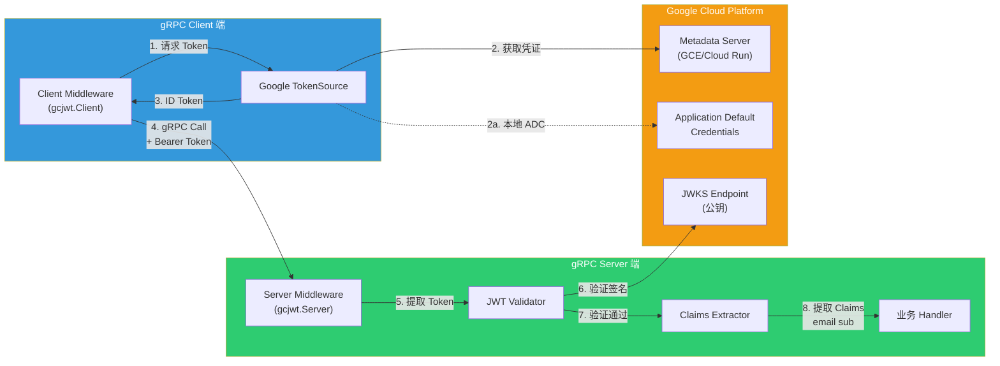
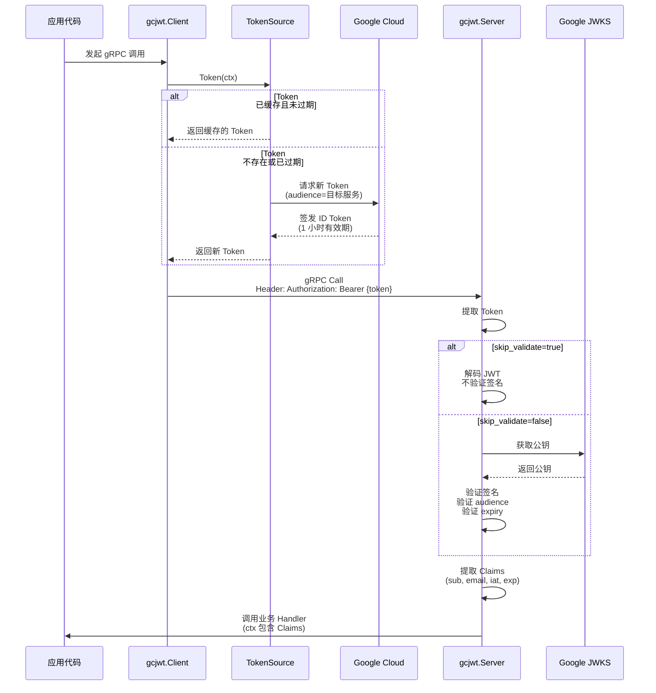
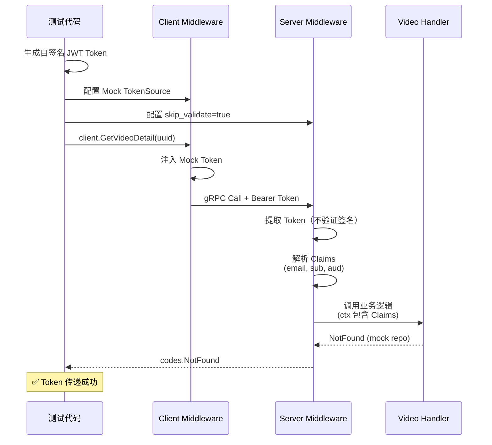
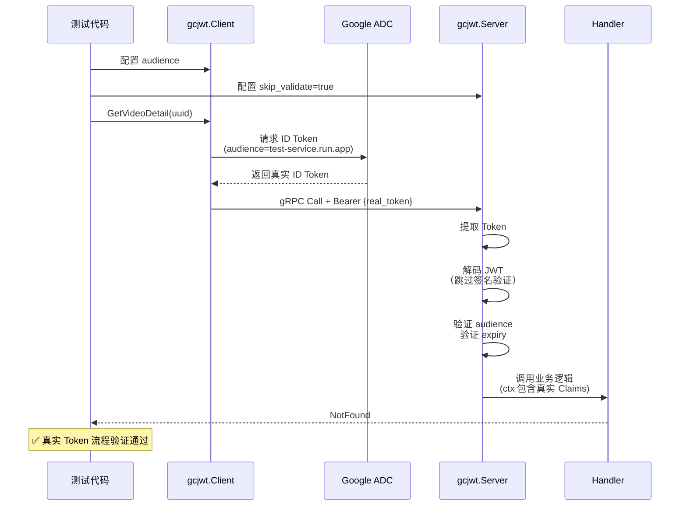
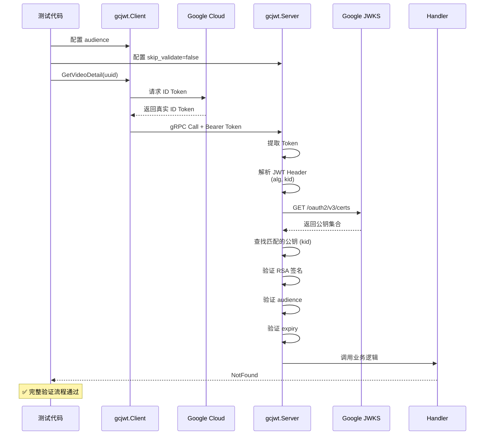
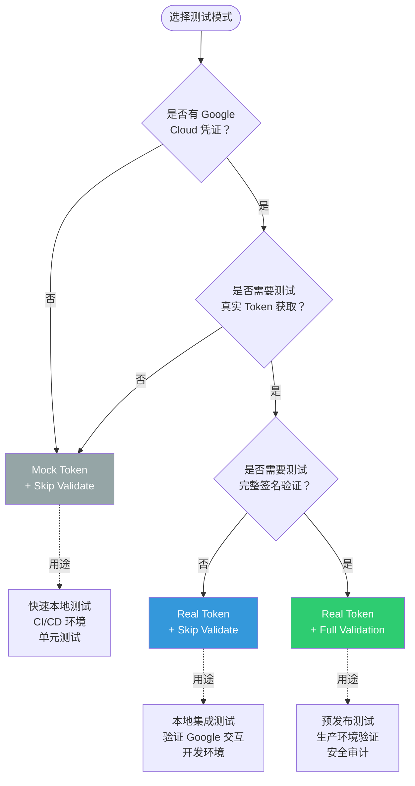
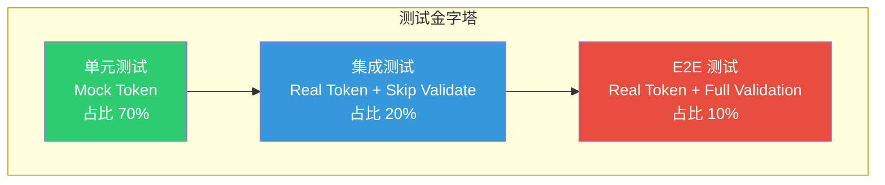

# JWT 真实环境端到端测试指南

> **kratos-template 项目的 Google Cloud Run ID Token 集成测试完整指南**
>
> 本文档详细说明如何在本地环境配置真实的 Google Cloud ID Token，以及如何进行端到端测试。

---

## 目录

- [一、JWT 认证架构概览](#一jwt-认证架构概览)
- [二、本地配置真实 Google Token](#二本地配置真实-google-token)
- [三、端到端测试详解](#三端到端测试详解)
- [四、测试模式对比](#四测试模式对比)
- [五、常见问题与排查](#五常见问题与排查)
- [六、最佳实践](#六最佳实践)

---

## 一、JWT 认证架构概览

### 1.1 整体数据流



**关键组件**：

1. **Client TokenSource**：自动从 Google Cloud 获取 ID Token
   - 云上环境：从 Metadata Server 获取
   - 本地环境：从 Application Default Credentials (ADC) 获取

2. **Server Middleware**：验证 Token 并提取 Claims
   - 完整验证模式：验证签名、audience、expiry
   - 快速验证模式（skip_validate）：仅提取 Claims，跳过签名验证

3. **Google JWKS Endpoint**：提供 JWT 签名公钥
   - URL: `https://www.googleapis.com/oauth2/v3/certs`

---

### 1.2 Token 生命周期



**Token 特征**：
- **签发者 (issuer)**：`https://accounts.google.com`
- **有效期**：1 小时（Google 默认）
- **签名算法**：RS256（RSA + SHA256）
- **Claims 包含**：`sub`（用户标识）、`email`（邮箱）、`aud`（目标服务）、`iat`/`exp`（时间戳）

---

## 二、本地配置真实 Google Token

### 2.1 配置 Application Default Credentials (ADC)

#### 方式 1：使用 gcloud CLI（推荐用于本地开发）

```bash
# 1. 安装 gcloud CLI
# macOS:
brew install google-cloud-sdk

# 2. 初始化并登录
gcloud auth application-default login

# 这会打开浏览器，完成 OAuth 授权后，凭证会保存到：
# macOS/Linux: ~/.config/gcloud/application_default_credentials.json
# Windows: %APPDATA%/gcloud/application_default_credentials.json
```

**验证**：
```bash
# 测试能否获取 ID Token
gcloud auth print-identity-token --audiences="https://test-service.run.app/"

# 如果成功，会输出类似：
# eyJhbGciOiJSUzI1NiIsImtpZCI6IjE2N2VlOGI4MjU3ODRmZjlmMTA3...
```

---

#### 方式 2：使用 Service Account Key（用于 CI/CD）

```bash
# 1. 在 Google Cloud Console 创建 Service Account
# IAM & Admin > Service Accounts > Create Service Account

# 2. 下载 JSON Key 文件（例如：sa-key.json）

# 3. 设置环境变量
export GOOGLE_APPLICATION_CREDENTIALS="/path/to/sa-key.json"

# 4. 验证
gcloud auth print-identity-token \
  --impersonate-service-account=YOUR_SA@PROJECT.iam.gserviceaccount.com \
  --audiences="https://test-service.run.app/"
```

---

### 2.2 检查凭证是否配置成功

使用以下 Go 代码检查：

```go
package main

import (
    "context"
    "fmt"
    "log"
    "time"

    "google.golang.org/api/idtoken"
)

func main() {
    ctx, cancel := context.WithTimeout(context.Background(), 10*time.Second)
    defer cancel()

    // 测试 Audience（可以是任意 URL）
    audience := "https://test-service.run.app/"

    // 尝试创建 TokenSource
    ts, err := idtoken.NewTokenSource(ctx, audience)
    if err != nil {
        log.Fatalf("❌ 创建 TokenSource 失败: %v\n"+
            "请运行: gcloud auth application-default login", err)
    }

    // 获取 Token
    token, err := ts.Token()
    if err != nil {
        log.Fatalf("❌ 获取 Token 失败: %v", err)
    }

    fmt.Printf("✅ Token 获取成功！\n")
    fmt.Printf("Token 长度: %d 字符\n", len(token.AccessToken))
    fmt.Printf("过期时间: %s\n", token.Expiry.Format(time.RFC3339))

    // 可选：解码 Token 查看 Claims
    payload, err := idtoken.Validate(ctx, token.AccessToken, audience)
    if err != nil {
        log.Fatalf("❌ Token 验证失败: %v", err)
    }

    fmt.Printf("\nClaims:\n")
    fmt.Printf("  Subject: %s\n", payload.Subject)
    fmt.Printf("  Audience: %s\n", payload.Audience)
    fmt.Printf("  Issuer: %s\n", payload.Issuer)
    if email, ok := payload.Claims["email"].(string); ok {
        fmt.Printf("  Email: %s\n", email)
    }
}
```

保存为 `check_token.go`，运行：
```bash
go run check_token.go
```

---

## 三、端到端测试详解

### 3.1 测试场景分类

| 测试场景 | 目的 | Token 来源 | Server 验证 | 适用环境 |
|---------|------|-----------|------------|---------|
| **Mock Token + Skip Validate** | 测试 Token 传递流程 | 自签名 Mock Token | `skip_validate=true` | 本地开发、单元测试 |
| **Real Token + Skip Validate** | 测试真实 Token 获取 | Google ADC | `skip_validate=true` | 本地集成测试 |
| **Real Token + Full Validation** | 测试完整验证流程 | Google ADC | `skip_validate=false` | CI/CD、预发布环境 |

---

### 3.2 测试 1：Mock Token + Skip Validate

**文件**：`test/e2e/jwt_e2e_mock_test.go`

**特点**：
- ✅ 不需要 Google Cloud 凭证
- ✅ 快速执行（无网络请求）
- ✅ 适合 CI/CD 环境
- ⚠️ 不验证真实 Token 格式

**运行**：
```bash
cd /Users/evan/Code/learning-app/back-end/kratos-template

# 运行 Mock 测试（不需要 Google 凭证）
go test -v ./test/e2e -run TestE2E_JWT_MockToken
```

**测试流程**：


**关键代码**：
```go
// 生成符合 Cloud Run 格式的 Mock Token
testEmail := "test-service@test-project.iam.gserviceaccount.com"
mockToken := GenerateValidCloudRunToken(t, testAudience, testEmail)

// 注入 Mock TokenSource（覆盖 Google 的真实 TokenSource）
gcjwt.SetTokenSourceFactory(func(ctx context.Context, audience string) (oauth2.TokenSource, error) {
    return oauth2.StaticTokenSource(&oauth2.Token{AccessToken: mockToken}), nil
})
defer gcjwt.SetTokenSourceFactory(nil)  // 恢复默认行为
```

---

### 3.3 测试 2：Real Token + Skip Validate

**文件**：`test/e2e/jwt_e2e_real_test.go` → `TestE2E_JWT_Real_SkipValidate`

**特点**：
- ✅ 测试真实 Token 获取流程
- ✅ 验证与 Google Metadata Server 交互
- ⚠️ 需要 Google Cloud 凭证
- ⚠️ 不验证 Token 签名（快速测试）

**前置条件**：
```bash
# 配置 ADC
gcloud auth application-default login

# 验证
gcloud auth print-identity-token --audiences="https://test-service.run.app/"
```

**运行**：
```bash
# 运行真实 Token 测试（需要 Google 凭证）
go test -v ./test/e2e -run TestE2E_JWT_Real_SkipValidate

# 跳过（使用 -short 标志）
go test -v ./test/e2e -short  # 会跳过所有真实 Token 测试
```

**测试流程**：


**关键代码**：
```go
// Client 配置：使用真实 Google ID Token
clientJWTCfg := gcjwt.Config{
    Client: &gcjwt.ClientConfig{
        Audience: testAudience,  // "https://test-service.run.app/"
        Disabled: false,
    },
}
clientJWTComp, clientCleanup, err := gcjwt.NewComponent(clientJWTCfg, logger)
// gcjwt 内部会自动调用 idtoken.NewTokenSource(ctx, audience)
// 它会按以下顺序查找凭证：
// 1. GOOGLE_APPLICATION_CREDENTIALS 环境变量
// 2. gcloud auth application-default credentials
// 3. GCE/Cloud Run Metadata Server

// Server 配置：跳过签名验证
serverJWTCfg := gcjwt.Config{
    Server: &gcjwt.ServerConfig{
        ExpectedAudience: testAudience,
        SkipValidate:     true,  // ← 关键：跳过 Google 公钥验证
        Required:         true,
    },
}
```

---

### 3.4 测试 3：Real Token + Full Validation

**文件**：`test/e2e/jwt_e2e_real_test.go` → `TestE2E_JWT_Real_FullValidation`

**特点**：
- ✅ 完整验证流程（生产环境模拟）
- ✅ 验证 Token 签名、audience、expiry
- ⚠️ 需要网络访问 Google JWKS endpoint
- ⚠️ 需要 Google Cloud 凭证

**运行**：
```bash
# 完整验证测试
go test -v ./test/e2e -run TestE2E_JWT_Real_FullValidation
```

**测试流程**：


**关键配置差异**：
```go
// Server 配置：完整验证
serverJWTCfg := gcjwt.Config{
    Server: &gcjwt.ServerConfig{
        ExpectedAudience: testAudience,
        SkipValidate:     false,  // ← 关键：启用完整验证
        Required:         true,
    },
}
```

**验证失败场景**：
```go
// 预期结果：
// - Token 有效 → codes.NotFound（业务错误）
// - Token 无效 → codes.Unauthenticated（认证失败）

code := status.Code(err)
if code != codes.NotFound && code != codes.Unauthenticated {
    t.Fatalf("expected NotFound or Unauthenticated, got %v", code)
}
```

---

## 四、测试模式对比

### 4.1 功能对比表

| 特性 | Mock Token | Real Token + Skip | Real Token + Full |
|------|-----------|-------------------|-------------------|
| **需要 Google 凭证** | ❌ | ✅ | ✅ |
| **需要网络访问** | ❌ | ✅ | ✅（额外需要 JWKS） |
| **验证签名** | ❌ | ❌ | ✅ |
| **验证 audience** | ✅ | ✅ | ✅ |
| **验证 expiry** | ✅ | ✅ | ✅ |
| **测试 Token 传递** | ✅ | ✅ | ✅ |
| **测试 Google 集成** | ❌ | ✅ | ✅ |
| **执行速度** | 快 | 中 | 慢 |
| **适用环境** | 本地、CI/CD | 本地、CI/CD（有凭证） | 预发布、生产 |

---

### 4.2 选择决策树



---

## 五、常见问题与排查

### 5.1 问题 1：无法获取 Token

**症状**：
```
❌ failed to get id token: google: could not find default credentials
```

**排查步骤**：

```bash
# 1. 检查环境变量
echo $GOOGLE_APPLICATION_CREDENTIALS
# 应该输出 JSON key 文件路径，或为空（使用 gcloud ADC）

# 2. 检查 gcloud ADC
gcloud auth application-default print-access-token
# 如果失败，说明未登录

# 3. 重新登录
gcloud auth application-default login

# 4. 验证
gcloud auth print-identity-token --audiences="https://test.example.com"
```

**解决方案**：
- 本地开发：运行 `gcloud auth application-default login`
- CI/CD：设置 `GOOGLE_APPLICATION_CREDENTIALS` 环境变量

---

### 5.2 问题 2：Token 验证失败

**症状**：
```
❌ codes.Unauthenticated: jwt verification failed
```

**可能原因**：

1. **Audience 不匹配**
   ```go
   // Client 发送的 audience
   audience := "https://service-a.run.app/"
   
   // Server 期望的 audience
   expectedAudience := "https://service-b.run.app/"  // ← 不一致！
   ```

   **解决**：确保 Client 和 Server 的 `audience` 完全一致。

2. **Token 已过期**
   ```bash
   # 查看 Token 过期时间
   gcloud auth print-identity-token --audiences="https://test.example.com" | \
     cut -d. -f2 | base64 -d | jq '.exp'
   
   # 输出时间戳，例如：1735689600
   # 转换为人类可读：
   date -r 1735689600
   ```

3. **网络无法访问 JWKS endpoint**
   ```bash
   # 测试网络访问
   curl https://www.googleapis.com/oauth2/v3/certs
   
   # 应该返回 JSON 格式的公钥列表
   ```

---

### 5.3 问题 3：测试被跳过

**症状**：
```
=== RUN   TestE2E_JWT_Real_SkipValidate
    jwt_e2e_real_test.go:54: skipping real GCP token test in short mode
--- SKIP: TestE2E_JWT_Real_SkipValidate (0.00s)
```

**原因**：
- 使用了 `-short` 标志
- 代码中有 `if testing.Short() { t.Skip(...) }`

**解决**：
```bash
# 不使用 -short
go test -v ./test/e2e -run TestE2E_JWT_Real

# 或者指定完整测试名称
go test -v ./test/e2e -run TestE2E_JWT_Real_SkipValidate
```

---

### 5.4 问题 4：本地开发时 Token 获取慢

**症状**：
- 每次测试都需要 2-3 秒获取 Token

**原因**：
- `idtoken.NewTokenSource` 每次都请求新 Token
- Google ADC 需要网络交互

**优化方案**：

使用 `skip_validate=true` 进行本地开发：

```yaml
# configs/config.yaml（本地开发配置）
server:
  jwt:
    expected_audience: ""
    skip_validate: true      # ← 跳过验证，加速测试
    required: false          # ← 允许无 Token 请求
```

---

## 六、最佳实践

### 6.1 测试策略

**分层测试金字塔**：



**推荐分配**：
- **单元测试（70%）**：使用 Mock Token，快速验证业务逻辑
- **集成测试（20%）**：使用 Real Token + Skip Validate，验证 Google 集成
- **E2E 测试（10%）**：使用 Real Token + Full Validation，验证生产环境配置

---

### 6.2 配置管理

**多环境配置策略**：

```bash
kratos-template/
├── configs/
│   ├── config.yaml              # 默认配置（本地开发）
│   ├── config.dev.yaml          # 开发环境
│   ├── config.staging.yaml      # 预发布环境
│   └── config.prod.yaml         # 生产环境
```

**各环境配置示例**：

```yaml
# config.yaml（本地开发）
server:
  jwt:
    expected_audience: ""
    skip_validate: true      # 跳过验证
    required: false          # 允许无 Token

# config.staging.yaml（预发布）
server:
  jwt:
    expected_audience: "https://api-staging.example.com/"
    skip_validate: false     # 启用验证
    required: true           # 强制 Token

# config.prod.yaml（生产）
server:
  jwt:
    expected_audience: "https://api.example.com/"
    skip_validate: false     # 启用验证
    required: true           # 强制 Token
```

---

### 6.3 CI/CD 集成

**GitHub Actions 示例**：

```yaml
# .github/workflows/test.yml
name: Test

on: [push, pull_request]

jobs:
  test:
    runs-on: ubuntu-latest

    steps:
      - uses: actions/checkout@v3

      - name: Setup Go
        uses: actions/setup-go@v4
        with:
          go-version: '1.22'

      # 单元测试（使用 Mock Token）
      - name: Run Unit Tests
        run: go test -v ./test/e2e -run TestE2E_JWT_MockToken

      # 如果配置了 Service Account，运行集成测试
      - name: Setup Google Cloud Auth
        if: env.GCP_SA_KEY != ''
        uses: google-github-actions/auth@v1
        with:
          credentials_json: ${{ secrets.GCP_SA_KEY }}

      - name: Run Integration Tests
        if: env.GCP_SA_KEY != ''
        run: go test -v ./test/e2e -run TestE2E_JWT_Real_SkipValidate

      - name: Run E2E Tests
        if: env.GCP_SA_KEY != ''
        run: go test -v ./test/e2e -run TestE2E_JWT_Real_FullValidation
```

---

### 6.4 本地调试技巧

#### 技巧 1：查看 Token 内容

```bash
# 获取 Token
TOKEN=$(gcloud auth print-identity-token --audiences="https://test.example.com")

# 解码 JWT Payload（无需验证签名）
echo $TOKEN | cut -d. -f2 | base64 -d | jq .

# 输出示例：
# {
#   "aud": "https://test.example.com",
#   "azp": "123456789@cloudservices.gserviceaccount.com",
#   "email": "user@example.com",
#   "exp": 1735689600,
#   "iat": 1735686000,
#   "iss": "https://accounts.google.com",
#   "sub": "123456789012345678901"
# }
```

#### 技巧 2：手动测试 gRPC 调用

```bash
# 使用 grpcurl 测试
TOKEN=$(gcloud auth print-identity-token --audiences="https://test.example.com")

grpcurl -plaintext \
  -H "authorization: Bearer $TOKEN" \
  -d '{"video_id":"00000000-0000-0000-0000-000000000000"}' \
  localhost:9000 \
  video.v1.VideoQueryService/GetVideoDetail
```

#### 技巧 3：查看 Server 日志

```go
// 在 Server Middleware 中启用调试日志
serverJWTCfg := gcjwt.Config{
    Server: &gcjwt.ServerConfig{
        ExpectedAudience: testAudience,
        SkipValidate:     true,
        Required:         true,
    },
}
serverJWTComp, cleanup, err := gcjwt.NewComponent(serverJWTCfg, logger)

// logger 使用 StdLogger 输出到控制台
logger := log.NewStdLogger(os.Stdout)
```

---

## 七、总结

### 7.1 快速参考

**本地开发启动清单**：

- [ ] 安装 gcloud CLI
- [ ] 运行 `gcloud auth application-default login`
- [ ] 验证：`gcloud auth print-identity-token --audiences="https://test.example.com"`
- [ ] 配置 `configs/config.yaml`：
  - `server.jwt.skip_validate: true`
  - `server.jwt.required: false`
- [ ] 运行测试：`go test -v ./test/e2e`

---

**生产环境部署清单**：

- [ ] 配置真实 `expected_audience`（Cloud Run URL）
- [ ] 设置 `skip_validate: false`
- [ ] 设置 `required: true`
- [ ] 配置 Service Account 权限
- [ ] 验证网络可访问 Google JWKS endpoint
- [ ] 运行 E2E 测试：`go test -v ./test/e2e -run TestE2E_JWT_Real_FullValidation`

---

### 7.2 关键命令速查

```bash
# === 本地开发 ===
# 登录 Google Cloud
gcloud auth application-default login

# 获取 ID Token
gcloud auth print-identity-token --audiences="https://your-service.run.app/"

# 查看 Token 内容
gcloud auth print-identity-token --audiences="https://test.com" | \
  cut -d. -f2 | base64 -d | jq .

# === 测试执行 ===
# 快速测试（Mock Token）
go test -v ./test/e2e -run TestE2E_JWT_MockToken

# 集成测试（需要 Google 凭证）
go test -v ./test/e2e -run TestE2E_JWT_Real_SkipValidate

# 完整 E2E 测试
go test -v ./test/e2e -run TestE2E_JWT_Real_FullValidation

# 跳过真实 Token 测试
go test -v ./test/e2e -short

# === 调试 ===
# 手动测试 gRPC
grpcurl -plaintext \
  -H "authorization: Bearer $(gcloud auth print-identity-token --audiences=https://test.com)" \
  -d '{"video_id":"test"}' \
  localhost:9000 \
  video.v1.VideoQueryService/GetVideoDetail

# 检查凭证状态
gcloud auth application-default print-access-token

# 清除缓存的凭证
gcloud auth application-default revoke
```

---

**相关文档**：
- [gcjwt 库设计文档](../../lingo-utils/gcjwt/README.md)
- [gcjwt 集成清单](./gcjwt-integration-todo.md)
- [Google Cloud ID Token 文档](https://cloud.google.com/run/docs/securing/service-identity)
- [Application Default Credentials](https://cloud.google.com/docs/authentication/application-default-credentials)
