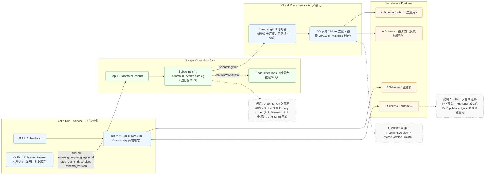

基于 **Go + Cloud Run + Supabase(Postgres) + Pub/Sub** 的\*\* **Outbox Publisher 与 StreamingPull 消费者微服务框架方案文档**。

覆盖两条链路：**(1) 写入主权数据 + Outbox，服务自身发布到 Pub/Sub（不使用 CDC）**；**(2) 服务以 StreamingPull 建立持久连接，事件驱动更新本地副本表**。

---

## **0. 目标与原则**

- **数据主权**（database-per-service）：每个微服务只写自己的库与读模型；跨域数据通过事件副本解决，避免分布式 JOIN。
- **可靠发布**：用 **Transactional Outbox** 规避“双写问题（写库 + 发消息）”不一致；发布失败可重试，最终一定上总线。
- **事件驱动消费**：订阅端走 **StreamingPull（gRPC 长连接）**，**非轮询**、高吞吐、低延迟；客户端自动续租 ack 期限。
- **幂等 + 有序**：以 **event_id / version** 做幂等，**ordering key** 确保同聚合内顺序。
- **可回放/重建**：通过 Pub/Sub **Seek**、保留/回放策略对读模型重建。
- **运行环境**：Cloud Run 支持 gRPC（HTTP/2）；StreamingPull 属后台任务，建议 **实例计费（CPU 始终分配）** + 按需最小实例数。

---

## **1. 架构总览**



- **写入链（B）**：业务表与 **Outbox** 同事务提交；随后 **Publisher** 扫描 Outbox 并发布到 Pub/Sub。
- **消费链（A）**：以 **StreamingPull** 收到消息 → 事件驱动回调中执行业务事务（幂等 UPSERT）→ 成功后 **Ack**。客户端在处理期间会自动**续租** ack 期限，避免超时重投。

---

## **2. 事件契约与主题规划**

### **2.1 主题与订阅命名**

- 主题：<bounded-context>.events（如：video.events）。
- 订阅：<topic>.<consumer-service>（如：video.events.catalog）。
- **一个消费者服务 = 一条订阅**，便于独立扩缩容、滞后监控与专属 DLQ。

### **2.2 Ordering key（强烈建议）**

- 将同一聚合（如 video_id 或 user_id）的事件使用 **相同 ordering key** 发布，可保证**同键内有序**投递。

### **2.3 Schema（推荐 Protobuf/Avro）**

- 使用 **Pub/Sub Schema** 约束消息体（Avro/Protobuf），形成发布/订阅契约与向后兼容演进。

---

## **3. 方案一：服务写 Outbox，自行发布至 Pub/Sub（不使用 CDC）**

### **3.1 事务边界（应用层）**

- 在一次数据库事务中：**先写业务表 → 再写 outbox** 一行，**一起提交**。这消除了“写库成功但消息未发”的一致性漏洞。

**Outbox 表 DDL（示例）**

表本身的结构是固定的，所有微服务通用的，每个微服务无论自己的主权多少张表也维护同一张outbox表即可。必要时在**单个服务内**按需再拆多张同结构表（用于分区/留存/吞吐）

```sql
CREATE TABLE app_outbox (
  id               uuid PRIMARY KEY,
  aggregate_type   text        NOT NULL,   -- e.g. "video"
  aggregate_id     text        NOT NULL,   -- e.g. "v_123"
  event_type       text        NOT NULL,   -- e.g. "VideoPublished"
  version          bigint      NOT NULL,   -- 单聚合内递增
  schema_version   int         NOT NULL DEFAULT 1,
  payload          bytea       NOT NULL,   -- protobuf bytes 或 jsonb
  occurred_at      timestamptz NOT NULL DEFAULT now(),
  published_at     timestamptz,            -- 成功发布后打点
  publish_attempts int         NOT NULL DEFAULT 0,
  next_retry_at    timestamptz,
  lock_token       text,                   -- 发布"租约"标记
  locked_at        timestamptz
);
CREATE INDEX ON app_outbox (published_at) WHERE published_at IS NULL;
CREATE INDEX ON app_outbox (next_retry_at) WHERE published_at IS NULL;
```

**写请求中的事务伪代码（Go/pgx）**

```go
tx, _ := db.Begin(ctx)
defer tx.Rollback(ctx)

// 1) 写业务表...
// 2) 写 outbox
_, _ = tx.Exec(ctx, `
  INSERT INTO app_outbox (id, aggregate_type, aggregate_id, event_type, version, payload)
  VALUES ($1,$2,$3,$4,$5,$6)
`, eventID, "video", videoID, "VideoPublished", version, payload)

_ = tx.Commit(ctx)
```

### **3.2 Outbox Publisher（服务内后台 worker 或独立 Cloud Run Job）**

**职责**：周期性“认领”未发布的 outbox 行 → 发布到 Pub/Sub → 标记 published_at。

**并发安全**：用 FOR UPDATE SKIP LOCKED 做**行级抢占**，避免多实例重复处理。

**认领 + 发布（示例 SQL + Go 伪代码）**

```sql
-- 一次认领 N 条可发布记录（跳过别的实例已锁定的行）
WITH cte AS (
  SELECT id FROM app_outbox
   WHERE published_at IS NULL
     AND (next_retry_at IS NULL OR next_retry_at <= now())
   ORDER BY occurred_at
   LIMIT 200
   FOR UPDATE SKIP LOCKED
)
UPDATE app_outbox o
   SET lock_token = $1, locked_at = now()
  FROM cte
 WHERE o.id = cte.id
RETURNING o.*;
```

> SKIP LOCKED 允许在高并发下高效分配工作而不互相阻塞。

```go
// 对每条被认领的 outbox 记录：
res := topic.Publish(ctx, &pubsub.Message{
    Data: payloadBytes,
    OrderingKey: aggregateID, // 与读侧查询维度一致
    Attributes: map[string]string{
        "event_id": eventID.String(),
        "event_type": "VideoPublished",
        "aggregate_id": aggregateID,
        "version": strconv.FormatInt(version,10),
        "schema_version": "1",
        "occurred_at": occurredAt.Format(time.RFC3339Nano),
    },
})
// 建议启用发布端的有序支持（见官方示例）
msgID, err := res.Get(ctx) // 等待服务器确认后再标记 published
```

> 发布端支持 ordering key；官方示例展示了如何启用与使用。

**成功/失败标记（示例）**

```sql
-- 成功
UPDATE app_outbox
   SET published_at = now(), lock_token = NULL, locked_at = NULL
 WHERE id = $1 AND lock_token = $2;

-- 失败：回退租约并设置退避
UPDATE app_outbox
   SET publish_attempts = publish_attempts + 1,
       next_retry_at = now() + (publish_attempts || ' minutes')::interval,
       lock_token = NULL, locked_at = NULL
 WHERE id = $1 AND lock_token = $2;
```

> **为何不用“直接发 Pub/Sub”替代 Outbox？**

> 为避免“双写问题”，需要把“写库 + 记录事件”绑定在同一事务（Outbox），再异步可靠发布。

### **3.3 IAM 与最小权限**

- 该服务的 **Service Account** 赋予目标 Topic 的 roles/pubsub.publisher 即可。
- 数据库凭证只授予本服务 schema。

---

## **4. 方案二：服务以 StreamingPull 持久连接，更新本地副本表**

### **4.1 订阅侧（Go 高阶客户端）**

- 使用 sub.Receive(ctx, handler) 建立 **StreamingPull**；库会**自动续租 ack**，直到你 Ack/Nack 或达到 MaxExtension。这是**事件驱动回调**，非轮询。

- 可选开启 **Exactly-once delivery（EOD）**（仅 Pull/StreamingPull 支持），以确保“成功 ack 后不再重投”。

- 如果你有**多个微服务实例（subscriber 客户端）都连接到 *同一个订阅（subscription）*** 并使用 Pull 或 StreamingPull，那么系统内部确实会做一种“负载分配”机制，把订阅中的消息分发给这些实例中的 *一个* 来处理。我们不需要也不能精确控制，但需要确保所有订阅的消费者都是幂等的（idempotent）——因为负载分配不保证精确，你可能因为重试、ack deadline 过期等情形，某些消息被重新分配或重复。官方说明：“虽然通常一条消息只会交付给订阅内一个客户端，但在ack deadline过期或网络断等情况下，可能会重新投递给同一个或不同客户端。”

  

**订阅端骨架（Go）**

```go
client, _ := pubsub.NewClient(ctx, projectID)
sub := client.Subscription(subID)
sub.ReceiveSettings.NumGoroutines = 1
sub.ReceiveSettings.MaxOutstandingMessages = 1024
sub.ReceiveSettings.MaxOutstandingBytes = 64 << 20 // 64MiB

err := sub.Receive(ctx, func(ctx context.Context, m *pubsub.Message) {
    evt, err := decode(m.Data)             // 反序列化 Protobuf/JSON + 校验
    if err != nil { m.Nack(); return }

    tx, _ := db.Begin(ctx)
    // 1) inbox 幂等去重（消费者侧邮箱）
    if _, err := tx.Exec(ctx, `
      INSERT INTO inbox(event_id, received_at) VALUES ($1, now())
      ON CONFLICT (event_id) DO NOTHING
    `, evt.Id); err != nil { tx.Rollback(ctx); m.Nack(); return }

    // 2) 投影幂等 UPSERT（仅在 incoming.version > stored.version 时覆盖）
    if _, err := tx.Exec(ctx, `
      INSERT INTO catalog_read.video_projection(video_id, title, version, updated_at)
      VALUES ($1,$2,$3,now())
      ON CONFLICT (video_id) DO UPDATE
      SET title=EXCLUDED.title, version=EXCLUDED.version, updated_at=now()
      WHERE catalog_read.video_projection.version < EXCLUDED.version
    `, evt.VideoId, evt.Title, evt.Version); err != nil {
        tx.Rollback(ctx); m.Nack(); return
    }
    if err := tx.Commit(ctx); err != nil { m.Nack(); return }
    m.Ack() // 只有在事务成功后才 Ack，保证状态与事件一致
})
```

> Go 客户端的 **Receive** 会在消息到达时先发送 ack 期限延长，并在处理期间自动续租；这使得**长事务**也能安全处理。

### **4.2 投影/副本表 DDL（示例）**

```sql
CREATE TABLE catalog_read.video_projection (
  video_id   uuid PRIMARY KEY,
  title      text,
  version    bigint      NOT NULL,
  updated_at timestamptz NOT NULL
);

-- 消费者侧 inbox：用于去重/审计
CREATE TABLE catalog_read.inbox (
  event_id    uuid PRIMARY KEY,
  received_at timestamptz NOT NULL
);
```

### **4.3 失败与重试**

- **DB 临时失败**：Nack 或不 Ack，消息**至少一次**重投；可设置 **Dead-letter topic** 在达到最大尝试后转入 DLQ。
- **顺序/并发控制**：通过 **ordering key** 与 ReceiveSettings.\* 做流控；同 key 单线程语义由 Pub/Sub 保证。
- **EOD（可选）**：启用后用 AckWithResult/NackWithResult 检查确认，代价是略增延迟。

### **4.4 Cloud Run 运行形态**

- 订阅消费者是**后台任务**；在 Cloud Run 上建议使用 **实例计费（CPU 始终分配）**，必要时设 **min instances ≥ 1** 以维持连接与稳定延迟。

---

## **5. 消息格式与演进**

### **5.1 Protobuf（建议）/JSON**

- 建议使用 **Protobuf + Pub/Sub Schema**，体积小、强类型；消费者以 schema 版本号做兼容处理（新增字段向后兼容）。

**示例（proto）**

```protobuf
message VideoPublished {
  string event_id       = 1;  // uuid
  string video_id       = 2;
  string title          = 3;
  int64  version        = 4;  // 单聚合内递增
  int64  occurred_at_ms = 5;
}
```

发布端附带 attributes：

```text
event_id, event_type, aggregate_id, version, schema_version, occurred_at
```

---

## **6. 监控、告警与可观测**

- **订阅滞后**：Dashboard/告警关注 num_unacked_messages、oldest_unacked_message_age、**delivery latency health score**。

- **回放能力**：启用保留已确认消息并使用 **Seek**（timestamp/snapshot）回放重建投影。

- **应用指标**：

  - 发布器：publish_attempts、失败率、平均重试间隔、Outbox 积压。
  - 消费者：处理时长 P50/P95、Nack 比例、投影版本滞后（事件 version - 表 version）。

- **日志追踪**：统一打印 event_id / messageId / ordering_key 便于端到端排障。

---

## **7. 安全与 IAM**

- **发布者 SA**：仅授 roles/pubsub.publisher（到指定 Topic）。
- **订阅者 SA**：仅授 roles/pubsub.subscriber（到指定 Subscription）。
- **数据库**：每服务独立 DB 用户、仅本 schema 最小权限；Outbox/投影表不做跨库外键。

---

## **8. 回填与冷启动**

- **历史全量**：由 B 生成“全量快照事件”或单独导出现有状态，A 在**停止对外前**先构建投影表，再切流。
- **增量追尾**：投影完成后，再开启对 \*.events 的 StreamingPull，按 offset 追平。
- **重建**：使用 **Seek** 将订阅回拨到指定时间点重放（需启用 retain-acked-messages）。

---

## **9. 代码骨架（汇总）**

### **9.1 事务写 Outbox（片段）**

```go
// tx 写业务 + outbox
type OutboxRow struct {
  ID            uuid.UUID
  AggregateType string
  AggregateID   string
  EventType     string
  Version       int64
  Payload       []byte
}
```

（见 §3.1 事务示例）

### **9.2 Outbox Publisher（任务循环）**

```go
for {
  rows := claimOutboxRows(ctx, token, 200) // 用 SKIP LOCKED 认领
  if len(rows) == 0 { time.Sleep(time.Second); continue }

  for _, r := range rows {
    res := topic.Publish(ctx, &pubsub.Message{
      Data: r.Payload, OrderingKey: r.AggregateID,
      Attributes: map[string]string{ "event_id": r.ID.String(), /* ... */ },
    })
    if _, err := res.Get(ctx); err != nil {
      markFail(ctx, r.ID, token)   // attempts++, next_retry_at
      continue
    }
    markSuccess(ctx, r.ID, token)  // published_at = now()
  }
}
```

> FOR UPDATE SKIP LOCKED：多实例并行认领而不互相阻塞。

### **9.3 StreamingPull 消费者（见 §4.1）**

---

## **10. Cloud Run 部署要点**

- **gRPC/API 服务** + **StreamingPull 消费者**可**同进程**共存；如仅做消费者，也可独立成一个“consumer”服务。
- 若要同时提供 gRPC 与 HTTP（诊断/健康检查），在同一端口启用 HTTP/2 并在应用内做多路复用；Cloud Run 支持端到端 HTTP/2。
- **实例计费**：后台工作负载（StreamingPull）推荐启用 **CPU 始终分配**；若需 24×7 常连，配置 **最小实例数**。

---

## **11. 风险与对策**

| **风险**                        | **对策**                                                                              |
| ------------------------------- | ------------------------------------------------------------------------------------- |
| 发布器宕机/抖动导致 Outbox 积压 | Outbox 认领 + 重试退避、水平扩容发布器实例；监控积压阈值告警                          |
| 重复发布/重复消费               | **发布端**允许重复（以消费端幂等兜底）；**消费端**使用 inbox(event_id) + version 比较 |
| 顺序要求                        | 使用 **ordering key**；单键内顺序由 Pub/Sub 保证（同区域）。                          |
| 长事务处理超时                  | Go 客户端自动续租 ack 期限；或拆小事务。                                              |
| 毒消息反复重试                  | 订阅开启 **Dead-letter topic** + 告警与人工干预。                                     |
| 回放/重建需要                   | 启用消息保留并用 **Seek** 回拨至时间或快照。                                          |

---

## **12. 验收清单（Checklist）**

- 业务写路径已将 **Outbox 插入**纳入同一事务。
- 发布器使用 FOR UPDATE SKIP LOCKED 认领、published_at 标记与退避重试。
- Pub/Sub 主题/订阅创建完毕，**订阅启用 DLQ**，必要时启用 **EOD**。
- 发布端设置 **ordering key**；协议 Schema 已注册（Avro/Protobuf）。
- 订阅端使用 **StreamingPull**，处理成功后再 Ack；失败 Nack/不 Ack。
- 投影表与 **inbox(event_id)** 已部署，UPSERT 使用 WHERE version < incoming.version。
- Cloud Run 采用 **实例计费**（后台任务），按需设置 **min instances**。
- 观测面：订阅滞后、Outbox 积压、DLQ 告警、端到端 trace。）
- 事务 Outbox 模式与动机。
- Pub/Sub StreamingPull 与高阶客户端的租约/续租。
- Push 订阅基于 HTTPS（本文方案未使用 Push，仅作为对比）。
- Exactly-once delivery（仅 Pull/StreamingPull）。
- Ordering key 语义与发布示例。
- Pub/Sub Schema（Avro/Protobuf）。
- Cloud Run HTTP/2/gRPC、实例计费与最小实例。
- Postgres FOR UPDATE SKIP LOCKED。

结论：**每个微服务在“自己的数据库/Schema”里维护一张通用的 outbox 表即可**（与业务表同库、同事务）；**表结构建议在全公司层面统一一个“规范化最小集合”**，但并不是标准强制——可按需要增加少量字段。不要做所有服务共用的一张全局表。

# **OUTBOX配置**

为什么是一“服务一张表”（且结构尽量统一）：

- **同库同事务**：outbox 必须与业务写入在同一事务提交，避免“双写不一致”；这要求 outbox 就在**该服务自己的库**里。
- **结构统一利于工程化**：像 Debezium 的 **Outbox Event Router** 默认就假设 outbox 含 id/aggregatetype/aggregateid/type/payload 等通用列，并允许自定义/扩展；如果一个连接器要抓取多张 outbox 表，**要求这些表结构一致**。这也说明“规范化结构可通用到所有服务”。
- **每个微服务各自维护一张通用 outbox 表（同库同事务）**；公司层面统一列名/语义，便于复用工具链。
- **结构不是“硬性固定”，而是“统一的最小规范 + 可增补字段”**；aggregatetype/aggregateid/type/payload 是 outbox 的通用“语义最小集”；Debezium 文档把它作为**默认结构**并支持定制/扩展字段。如果未来切换到 **CDC**（Debezium/Datastream），**官方建议 outbox 是“仅插入（append-only）”**；此时可把 published*\* / lock*\* 等派发状态移到另一张“派发表”，保持 outbox 本身不做 UPDATE。
- 一个服务是否只要“一张”outbox：默认一张足够，同一服务里不管你有多少业务表，事件都落在这张通用 outbox；用 aggregatetype/aggregateid 区分来源聚合即可。极端高吞吐需要分区/不同保存策略时，可以在**同一服务内**按事件族拆成多张“结构一致”的 outbox 表；像 Debezium 也允许一个连接器抓取**多张结构相同**的 outbox 表。
- 派发器与并发认领（自发布场景）：后台 Publisher 用 SELECT … FOR UPDATE SKIP LOCKED 批量“认领”未发布行 → 发布到 Pub/Sub（等待服务器确认）→ 成功后标记 published_at；失败退避重试。这样多实例并发也不会重复处理同一行。

**推荐的"公司统一"最小结构**

```sql
CREATE TABLE app_outbox (
  id               uuid        PRIMARY KEY,     -- 事件唯一ID（幂等用）
  aggregatetype    text        NOT NULL,        -- 聚合类型（如 "video"）
  aggregateid      text        NOT NULL,        -- 聚合ID（ordering key）
  event_type       text        NOT NULL,        -- 事件类型（如 "VideoPublished"）
  version          bigint      NOT NULL,        -- 聚合内单调递增版本
  payload          jsonb       NOT NULL,        -- 事件载荷（或存 protobuf bytes）
  occurred_at      timestamptz NOT NULL DEFAULT now(),

  -- 仅"自发布"需要的派发状态列（CDC 模式下可移除或放到单独表）
  published_at     timestamptz,
  publish_attempts int         NOT NULL DEFAULT 0,
  next_retry_at    timestamptz,
  lock_token       text,
  locked_at        timestamptz
);
```
