# Wire 依赖注入详解

> **Wire Dependency Injection in kratos-template**
> 本文档详细解释 Google Wire 在 kratos-template 项目中的应用，包括核心概念、工作原理、使用模式和最佳实践。

---

## 目录

- [一、Wire 简介](#一wire-简介)
- [二、Wire 核心概念](#二wire-核心概念)
- [三、项目中的 Wire 配置](#三项目中的-wire-配置)
- [四、依赖注入流程](#四依赖注入流程)
- [五、高级用法](#五高级用法)
- [六、最佳实践](#六最佳实践)

---

## 一、Wire 简介

### 1.1 什么是 Wire？

**Wire** 是 Google 开发的**编译时依赖注入**工具，用于自动生成 Go 代码来初始化和连接组件。

**官方定义**：
> Wire is a code generation tool that automates connecting components using dependency injection.

### 1.2 为什么需要依赖注入？

#### ❌ 没有 DI 的问题

```go
// main.go
func main() {
    // 手动创建所有依赖（噩梦！）
    db := connectDatabase()
    logger := createLogger()

    videoRepo := repositories.NewVideoRepository(db, logger)
    userRepo := repositories.NewUserRepository(db, logger)
    cacheRepo := repositories.NewCacheRepository(redis, logger)

    videoUsecase := services.NewVideoUsecase(videoRepo, userRepo, cacheRepo, logger)
    userUsecase := services.NewUserUsecase(userRepo, logger)

    videoHandler := controllers.NewVideoHandler(videoUsecase, userUsecase, logger)
    userHandler := controllers.NewUserHandler(userUsecase, logger)

    server := grpc.NewServer(videoHandler, userHandler, logger)
    server.Run()
}
```

**问题**：
- ❌ 依赖关系复杂时，手动创建极其繁琐
- ❌ 依赖顺序必须正确（videoRepo 必须在 videoUsecase 之前）
- ❌ 新增依赖需要修改多处
- ❌ 容易遗漏依赖或传错参数

#### ✅ 使用 Wire

```go
// wire.go
func wireApp(...) (*kratos.App, func(), error) {
    wire.Build(
        database.ProviderSet,
        repositories.ProviderSet,
        services.ProviderSet,
        controllers.ProviderSet,
        newApp,
    )
    return nil, nil, nil
}

// main.go
func main() {
    app, cleanup, err := wireApp(...)
    if err != nil {
        panic(err)
    }
    defer cleanup()

    app.Run()
}
```

**优势**：
- ✅ 自动解析依赖关系
- ✅ 编译时检查（类型安全）
- ✅ 自动排序（拓扑排序）
- ✅ 集中管理依赖

---

### 1.3 Wire vs 其他 DI 框架

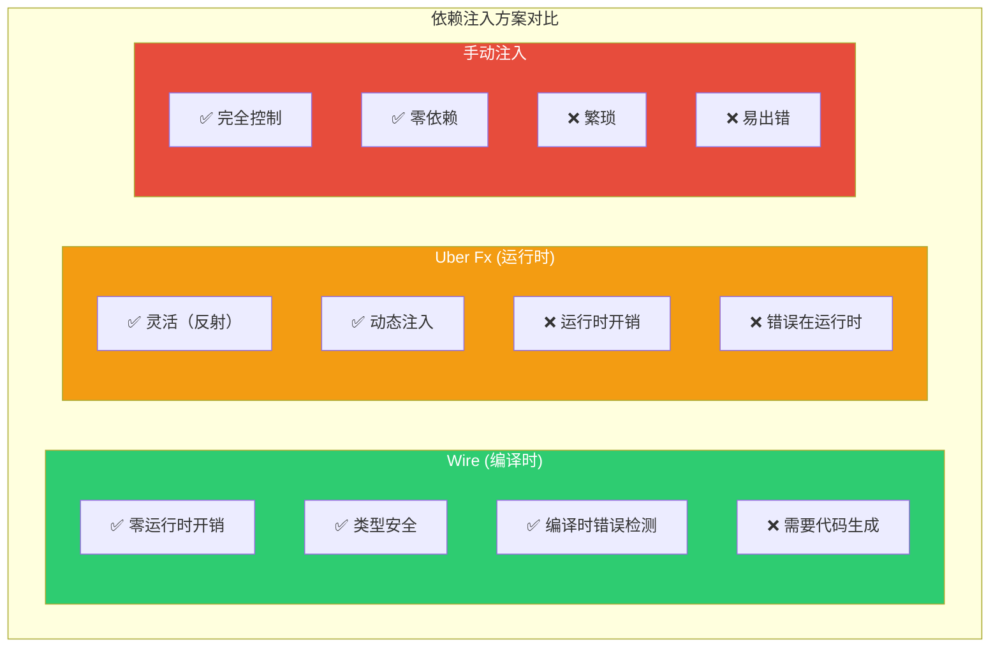

**Wire 的特点**：
- **编译时生成**：`wire gen` 生成 `wire_gen.go`
- **零运行时开销**：生成的代码就是你手写的代码
- **类型安全**：编译器检查类型匹配
- **显式依赖**：可以看到完整的依赖图

---

## 二、Wire 核心概念

### 2.1 Provider（提供者）

**Provider** 是一个返回类型实例的函数。

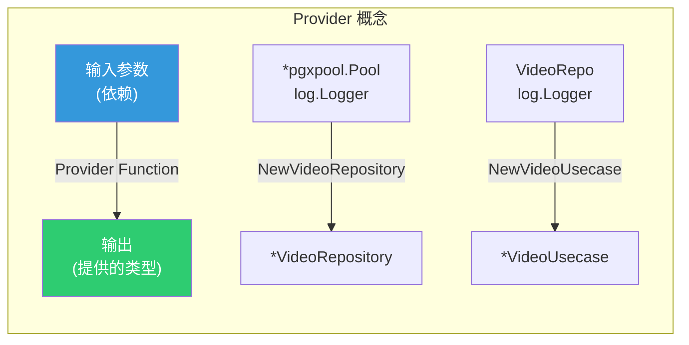

**示例**：

```go
// repositories/video_repo.go
// Provider: 提供 *VideoRepository
func NewVideoRepository(db *pgxpool.Pool, logger log.Logger) *VideoRepository {
    return &VideoRepository{
        db:      db,
        queries: catalogsql.New(db),
        log:     log.NewHelper(logger),
    }
}

// services/video.go
// Provider: 提供 *VideoUsecase
func NewVideoUsecase(repo VideoRepo, logger log.Logger) *VideoUsecase {
    return &VideoUsecase{
        repo: repo,
        log:  log.NewHelper(logger),
    }
}
```

**Provider 类型**：

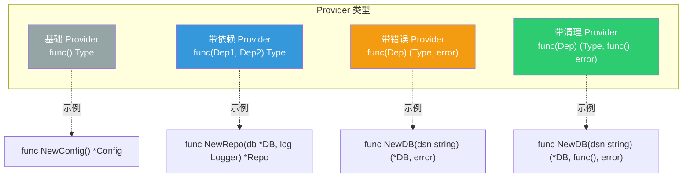

---

### 2.2 Injector（注入器）

**Injector** 是 Wire 生成代码的入口函数。

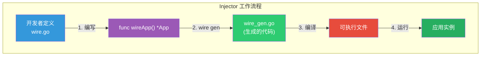

**示例**：

```go
// cmd/grpc/wire.go
//go:build wireinject
// +build wireinject

func wireApp(ctx context.Context, params configloader.Params) (*kratos.App, func(), error) {
    // Wire 会分析这个 Build 调用，生成完整的构造代码
    panic(wire.Build(
        configloader.ProviderSet,
        database.ProviderSet,
        repositories.ProviderSet,
        services.ProviderSet,
        controllers.ProviderSet,
        newApp,
    ))
}
```

**生成的代码**（`wire_gen.go`）：

```go
// Code generated by Wire. DO NOT EDIT.

func wireApp(ctx context.Context, params configloader.Params) (*kratos.App, func(), error) {
    // 1. 加载配置
    bundle := configloader.LoadConfig(params)

    // 2. 初始化数据库
    pool, cleanup1, err := database.NewPgxPool(bundle.Bootstrap.Data)
    if err != nil {
        return nil, nil, err
    }

    // 3. 创建 Repository
    videoRepository := repositories.NewVideoRepository(pool, logger)

    // 4. 创建 Service
    videoUsecase := services.NewVideoUsecase(videoRepository, logger)

    // 5. 创建 Controller
    videoHandler := controllers.NewVideoHandler(videoUsecase)

    // 6. 创建应用
    app := newApp(videoHandler, ...)

    return app, func() {
        cleanup1()
        // ... 其他清理函数
    }, nil
}
```

---

### 2.3 wire.Build（构建指令）

**wire.Build** 告诉 Wire 如何构建对象图。

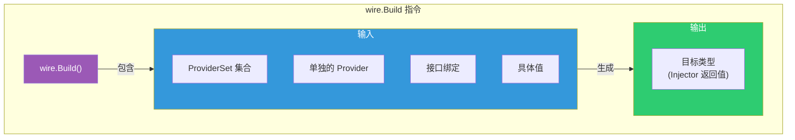

**示例**：

```go
wire.Build(
    // ProviderSet（提供者集合）
    database.ProviderSet,      // 提供 *pgxpool.Pool
    repositories.ProviderSet,  // 提供 *VideoRepository
    services.ProviderSet,      // 提供 *VideoUsecase

    // 接口绑定
    wire.Bind(new(services.VideoRepo), new(*repositories.VideoRepository)),

    // 单独的 Provider
    newApp,  // 提供 *kratos.App

    // 具体值（不常用）
    wire.Value(port, 8080),
)
```

---

### 2.4 wire.Bind（接口绑定）

**wire.Bind** 将具体类型绑定到接口。

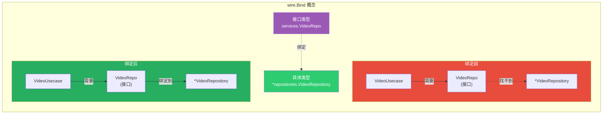

**代码示例**：

```go
// services/video.go（定义接口）
type VideoRepo interface {
    FindByID(ctx context.Context, id uuid.UUID) (*po.Video, error)
}

type VideoUsecase struct {
    repo VideoRepo  // ← 依赖接口
}

func NewVideoUsecase(repo VideoRepo, logger log.Logger) *VideoUsecase {
    return &VideoUsecase{repo: repo, ...}
}

// repositories/video_repo.go（实现接口）
type VideoRepository struct { ... }

func (r *VideoRepository) FindByID(...) (*po.Video, error) { ... }

func NewVideoRepository(...) *VideoRepository { ... }

// wire.go（绑定接口到实现）
wire.Build(
    repositories.ProviderSet,  // 提供 *VideoRepository
    services.ProviderSet,      // 需要 VideoRepo

    // 关键：告诉 Wire "*VideoRepository 实现了 VideoRepo"
    wire.Bind(new(services.VideoRepo), new(*repositories.VideoRepository)),
    //        ↑ 接口                      ↑ 具体实现
)
```

**绑定的本质**：

```go
// Wire 生成的代码（等价于）
videoRepository := repositories.NewVideoRepository(...)

var videoRepo services.VideoRepo = videoRepository  // ← 接口赋值
videoUsecase := services.NewVideoUsecase(videoRepo, ...)
```

---

### 2.5 wire.NewSet（提供者集合）

**wire.NewSet** 将多个 Provider 打包成集合。

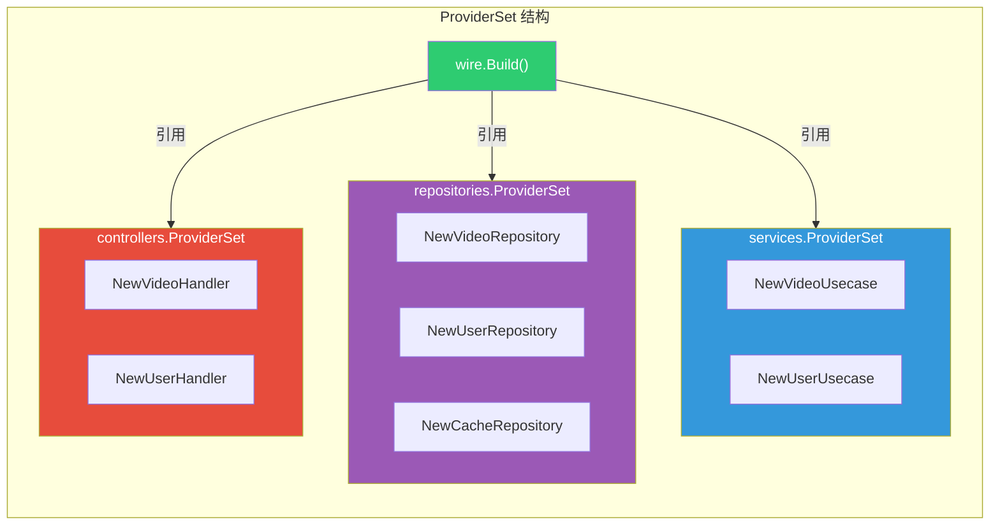

**代码示例**：

```go
// repositories/init.go
var ProviderSet = wire.NewSet(
    NewVideoRepository,
    NewUserRepository,
    NewCacheRepository,
)

// services/init.go
var ProviderSet = wire.NewSet(
    NewVideoUsecase,
    NewUserUsecase,
)

// controllers/init.go
var ProviderSet = wire.NewSet(
    NewVideoHandler,
    NewUserHandler,
)

// wire.go
wire.Build(
    repositories.ProviderSet,  // 展开为 3 个 Provider
    services.ProviderSet,      // 展开为 2 个 Provider
    controllers.ProviderSet,   // 展开为 2 个 Provider
    newApp,
)
```

---

## 三、项目中的 Wire 配置

### 3.1 完整依赖图

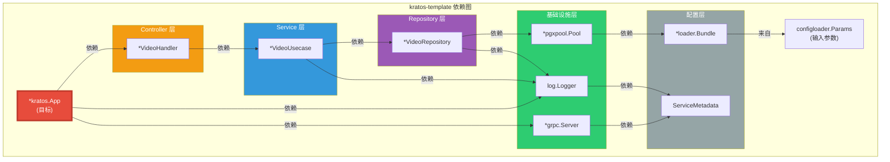

---

### 3.2 ProviderSet 组织

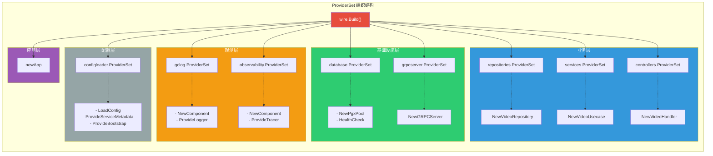

---

### 3.3 接口绑定关系

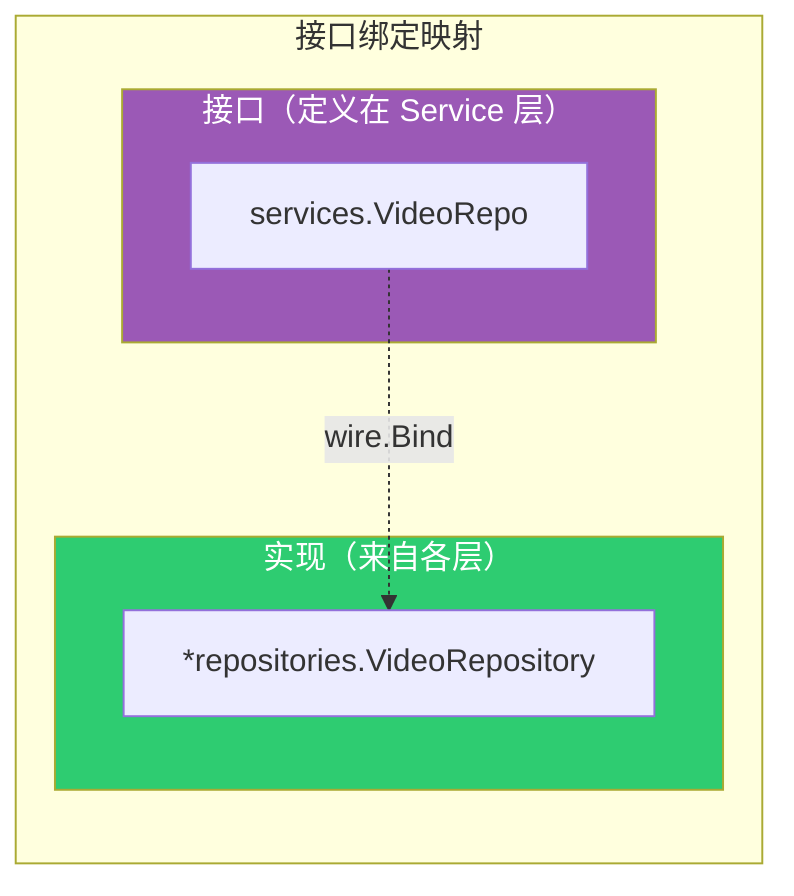

**代码对应**：

```go
wire.Build(
    // ...

    // 绑定：Repository 接口
    wire.Bind(
        new(services.VideoRepo),           // ← Service 层定义的接口
        new(*repositories.VideoRepository), // ← Repository 层的实现
    ),

    // ...
)
```

---

## 四、依赖注入流程

### 4.1 Wire 工作流程

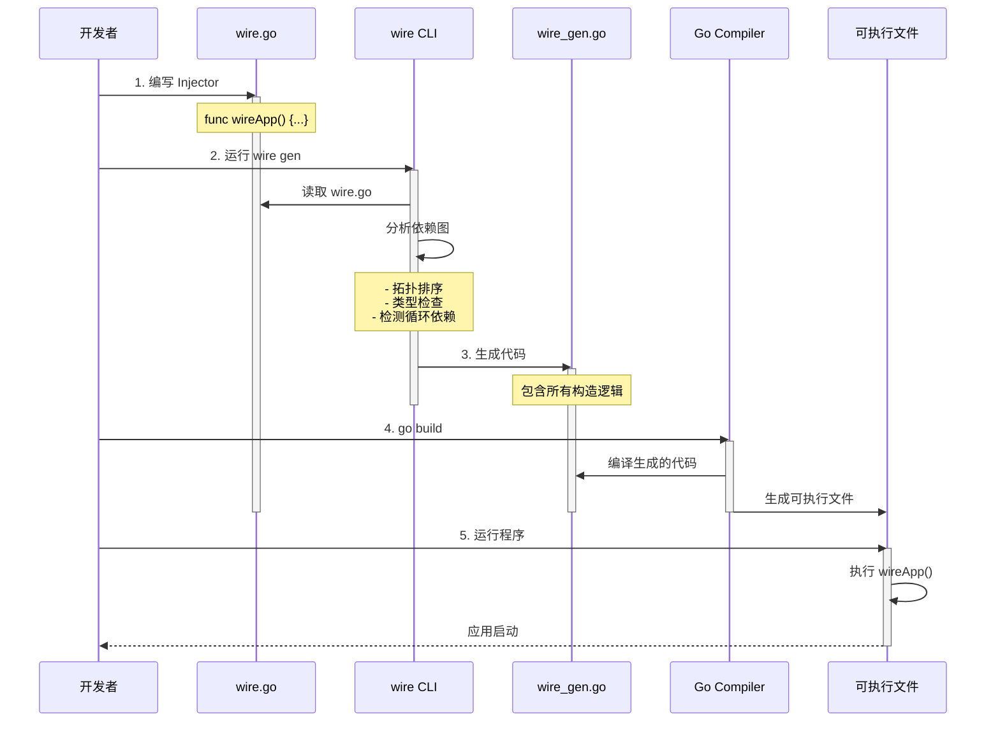

---

### 4.2 依赖解析过程

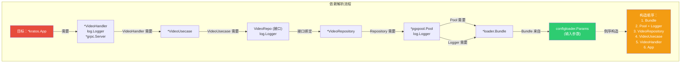

---

### 4.3 生成代码结构

```mermaid
graph TB
    subgraph Generated_Code["生成的 wire_gen.go 结构"]
        Entry["func wireApp(ctx, params) (*App, func(), error)"]

        subgraph Phase1["阶段 1：配置加载"]
            C1["bundle := configloader.LoadConfig(params)"]
            C2["metadata := configloader.ProvideServiceMetadata(bundle)"]
            C3["bootstrap := configloader.ProvideBootstrap(bundle)"]
        end

        subgraph Phase2["阶段 2：基础设施初始化"]
            I1["logger := gclog.ProvideLogger(...)"]
            I2["pool, cleanup1 := database.NewPgxPool(...)"]
            I3["server := grpcserver.NewGRPCServer(...)"]
        end

        subgraph Phase3["阶段 3：业务层构造"]
            B1["videoRepo := repositories.NewVideoRepository(pool, logger)"]
            B3["videoUsecase := services.NewVideoUsecase(videoRepo, logger)"]
        end

        subgraph Phase4["阶段 4：表示层构造"]
            P1["videoHandler := controllers.NewVideoHandler(videoUsecase)"]
        end

        subgraph Phase5["阶段 5：应用创建"]
            A1["app := newApp(videoHandler, server, logger)"]
        end

        subgraph Cleanup["清理函数"]
            CL1["cleanup := func() { cleanup1(); ... }"]
        end

        Entry --> Phase1
        Phase1 --> Phase2
        Phase2 --> Phase3
        Phase3 --> Phase4
        Phase4 --> Phase5
        Phase5 --> Cleanup
        Cleanup --> Return["return app, cleanup, nil"]
    end

    style Entry fill:#e74c3c,color:#fff
    style Phase1 fill:#95a5a6,color:#fff
    style Phase2 fill:#2ecc71,color:#fff
    style Phase3 fill:#3498db,color:#fff
    style Phase4 fill:#f39c12,color:#fff
    style Phase5 fill:#9b59b6,color:#fff
    style Cleanup fill:#e67e22,color:#fff
```

---

## 五、高级用法

### 5.1 Cleanup Functions（清理函数）

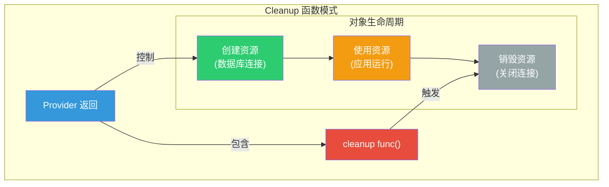

**代码示例**：

```go
// database/pgx.go
func NewPgxPool(cfg *configpb.Data) (*pgxpool.Pool, func(), error) {
    pool, err := pgxpool.New(context.Background(), cfg.Postgres.Dsn)
    if err != nil {
        return nil, nil, err
    }

    // Cleanup 函数：关闭连接池
    cleanup := func() {
        pool.Close()
    }

    return pool, cleanup, nil
    //     ↑     ↑       ↑
    //   对象  清理函数  错误
}

// Wire 生成的代码
func wireApp(...) (*kratos.App, func(), error) {
    pool, cleanup1, err := database.NewPgxPool(cfg)
    if err != nil {
        return nil, nil, err
    }

    // ... 其他初始化

    // 聚合所有清理函数
    cleanup := func() {
        cleanup1()  // ← 调用 pool.Close()
        cleanup2()
        cleanup3()
    }

    return app, cleanup, nil
}

// main.go
func main() {
    app, cleanup, err := wireApp(...)
    if err != nil {
        panic(err)
    }
    defer cleanup()  // ← 程序退出时自动清理

    app.Run()
}
```

---

### 5.2 Struct Providers（结构体提供者）

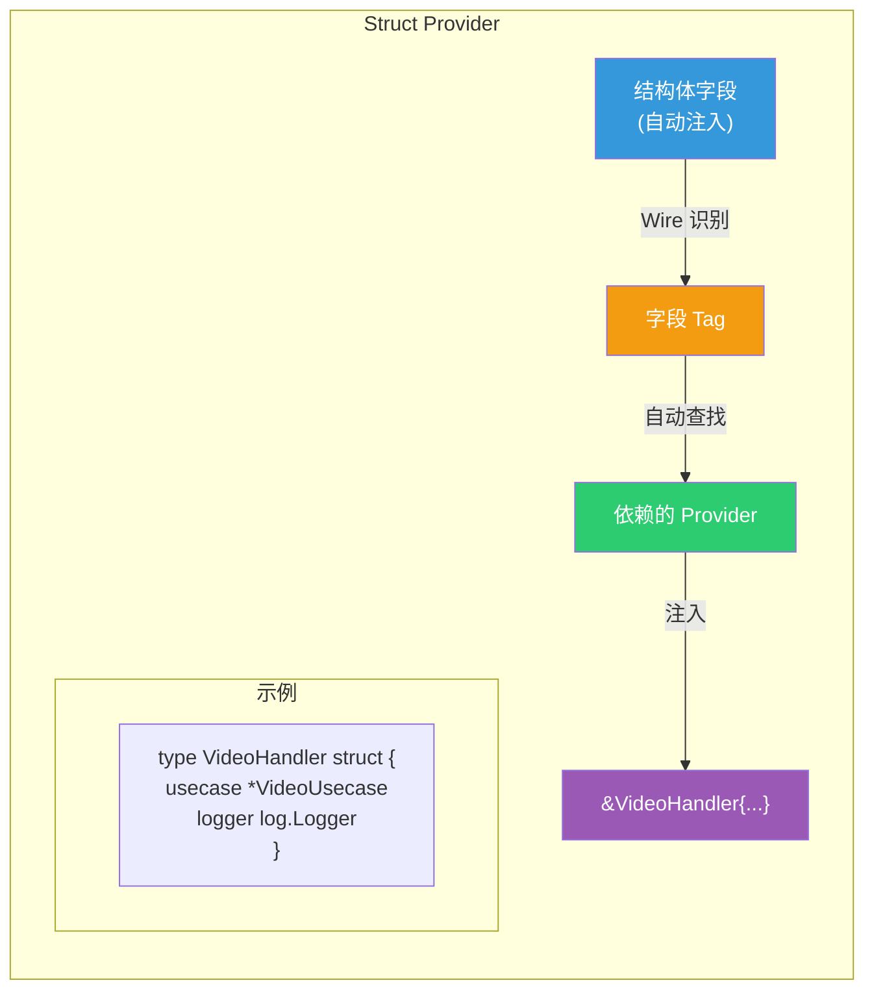

**代码示例**：

```go
// 方式 1：函数 Provider（推荐）
func NewVideoHandler(usecase *VideoUsecase, logger log.Logger) *VideoHandler {
    return &VideoHandler{
        usecase: usecase,
        logger:  logger,
    }
}

// 方式 2：Struct Provider（Wire 自动注入）
type VideoHandler struct {
    Usecase *VideoUsecase  // ← Wire 自动查找 *VideoUsecase 的 Provider
    Logger  log.Logger     // ← Wire 自动查找 log.Logger 的 Provider
}

// wire.go
wire.Build(
    wire.Struct(new(VideoHandler), "*"),  // ← 告诉 Wire 注入所有字段
    // 或
    wire.Struct(new(VideoHandler), "Usecase"),  // ← 只注入 Usecase 字段
)
```

---

### 5.3 Binding Groups（绑定组）

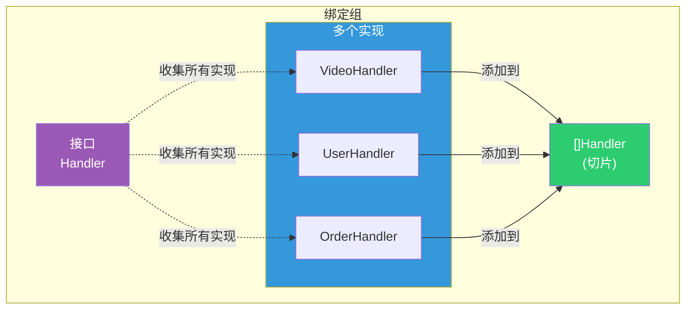

**代码示例**：

```go
// wire.go
wire.Build(
    // 使用 wire.InterfaceValue 收集所有实现到切片
    wire.Bind(new(Handler), new(*VideoHandler)),
    wire.Bind(new(Handler), new(*UserHandler)),
    wire.Bind(new(Handler), new(*OrderHandler)),

    // 创建切片
    wire.Value([]Handler{}),
)

// 或者使用 ProviderSet
var HandlerSet = wire.NewSet(
    NewVideoHandler,
    NewUserHandler,
    NewOrderHandler,
    wire.Bind(new(Handler), new(*VideoHandler)),
    wire.Bind(new(Handler), new(*UserHandler)),
    wire.Bind(new(Handler), new(*OrderHandler)),
)
```

---

### 5.4 Conditional Providers（条件提供者）

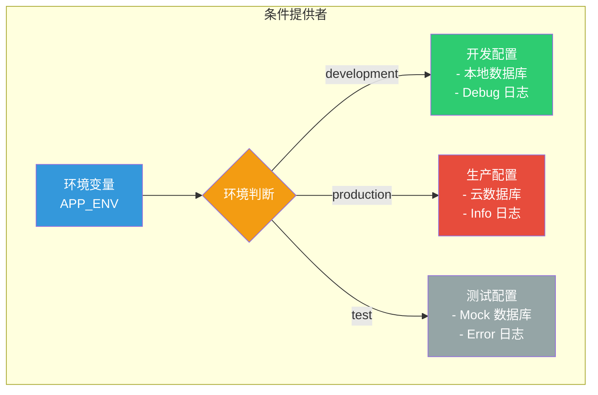

**代码示例**：

```go
// 方式 1：在 Provider 内部判断
func NewDatabase(env string) (*DB, error) {
    if env == "production" {
        return newProductionDB()
    }
    return newDevelopmentDB()
}

// 方式 2：使用不同的 wire.go 文件
// wire_dev.go
//go:build wireinject && dev

func wireApp() *App {
    wire.Build(
        NewDevelopmentDB,
        // ...
    )
}

// wire_prod.go
//go:build wireinject && prod

func wireApp() *App {
    wire.Build(
        NewProductionDB,
        // ...
    )
}
```

---

## 六、最佳实践

### 6.1 Provider 设计原则

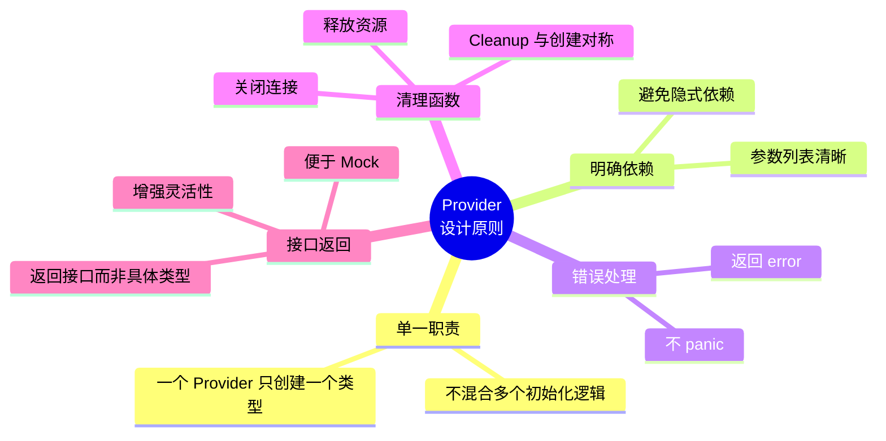

**示例**：

```go
// ✅ 好的 Provider
func NewVideoRepository(
    db *pgxpool.Pool,      // ← 明确依赖
    logger log.Logger,     // ← 明确依赖
) (*VideoRepository, error) {  // ← 返回错误
    if db == nil {
        return nil, errors.New("db is required")
    }

    return &VideoRepository{
        db:      db,
        queries: catalogsql.New(db),
        log:     log.NewHelper(logger),
    }, nil
}

// ❌ 坏的 Provider
func NewVideoRepository() *VideoRepository {
    db := getGlobalDB()  // ← 隐式依赖全局变量
    if db == nil {
        panic("db not initialized")  // ← panic 而不是返回错误
    }

    return &VideoRepository{db: db}
}
```

---

### 6.2 ProviderSet 组织

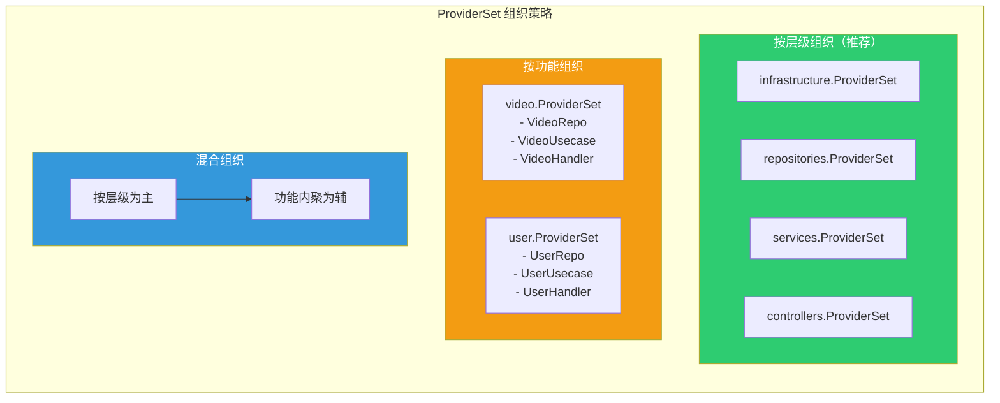

**推荐结构**：

```
internal/
├── infrastructure/
│   └── init.go          → infrastructure.ProviderSet
├── repositories/
│   └── init.go          → repositories.ProviderSet
├── services/
│   └── init.go          → services.ProviderSet
└── controllers/
    └── init.go          → controllers.ProviderSet
```

**代码示例**：

```go
// repositories/init.go
var ProviderSet = wire.NewSet(
    NewVideoRepository,
    NewUserRepository,
    NewCacheRepository,
)

// services/init.go
var ProviderSet = wire.NewSet(
    NewVideoUsecase,
    NewUserUsecase,
)
```

---

### 6.3 接口绑定策略

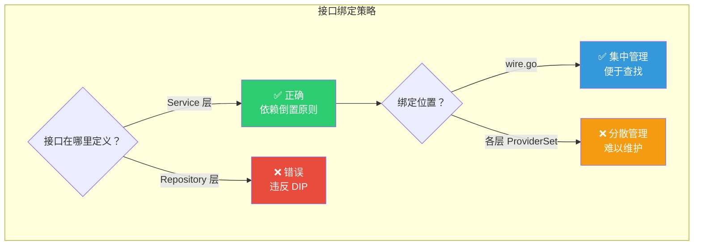

**推荐做法**：

```go
// ✅ 接口在 Service 层定义
// services/video.go
type VideoRepo interface {
    FindByID(ctx context.Context, id uuid.UUID) (*po.Video, error)
}

// ✅ 绑定在 wire.go 集中管理
// cmd/grpc/wire.go
wire.Build(
    repositories.ProviderSet,
    services.ProviderSet,

    // 所有接口绑定集中在这里
    wire.Bind(new(services.VideoRepo), new(*repositories.VideoRepository)),
)
```

---

### 6.4 常见错误与解决

```mermaid
graph TB
    subgraph Common_Errors["常见错误与解决"]
        subgraph Error1["错误 1：循环依赖"]
            E1_Problem["A 依赖 B<br/>B 依赖 A"]
            E1_Solution["解决：重新设计<br/>提取第三方接口"]
        end

        subgraph Error2["错误 2：未绑定接口"]
            E2_Problem["Provider 返回 *Impl<br/>Injector 需要 Interface"]
            E2_Solution["解决：添加 wire.Bind"]
        end

        subgraph Error3["错误 3：类型不匹配"]
            E3_Problem["Provider 返回 A<br/>Injector 需要 B"]
            E3_Solution["解决：检查类型<br/>或添加转换 Provider"]
        end

        subgraph Error4["错误 4：缺少 Provider"]
            E4_Problem["依赖类型 X<br/>但没有 Provider 提供 X"]
            E4_Solution["解决：添加 Provider<br/>或使用 wire.Value"]
        end
    end

    style Error1 fill:#e74c3c,color:#fff
    style Error2 fill:#f39c12,color:#fff
    style Error3 fill:#3498db,color:#fff
    style Error4 fill:#9b59b6,color:#fff
```

---

### 6.5 测试中的 Wire

```mermaid
graph TB
    subgraph Wire_Testing["测试中的 Wire 使用"]
        subgraph Production["生产环境"]
            P_Wire["wire.go"]
            P_Providers["真实 Providers"]
            P_App["生产应用"]

            P_Wire --> P_Providers
            P_Providers --> P_App
        end

        subgraph Testing["测试环境"]
            T_Wire["wire_test.go"]
            T_Mock["Mock Providers"]
            T_App["测试应用"]

            T_Wire --> T_Mock
            T_Mock --> T_App
        end
    end

    style Production fill:#2ecc71,color:#fff
    style Testing fill:#3498db,color:#fff
```

**测试中使用 Wire**：

```go
// wire_test.go
//go:build wireinject

func wireTestApp() (*TestApp, error) {
    wire.Build(
        // 使用 Mock Providers
        NewMockDatabase,
        NewMockRepository,

        // 真实的 Service 层（要测试的部分）
        services.ProviderSet,

        newTestApp,
    )
    return nil, nil
}

// test helpers
func NewMockDatabase() *MockDB {
    return &MockDB{
        data: make(map[string]interface{}),
    }
}

func NewMockRepository(db *MockDB) *MockRepository {
    return &MockRepository{db: db}
}
```

---

## 七、总结

### 7.1 Wire 核心价值

```mermaid
mindmap
  root((Wire 价值))
    编译时安全
      类型检查
      依赖图验证
      循环依赖检测
    零运行时开销
      生成纯 Go 代码
      无反射
      性能等同手写
    可维护性
      依赖关系清晰
      集中管理
      易于重构
    开发体验
      自动解析依赖
      减少样板代码
      IDE 友好
```

---

### 7.2 Wire vs 手动注入对比

| 特性 | Wire | 手动注入 |
|------|------|---------|
| **代码量** | 少（自动生成） | 多（手动编写） |
| **类型安全** | ✅ 编译时检查 | ⚠️ 运行时错误 |
| **依赖排序** | ✅ 自动拓扑排序 | ❌ 手动排序易错 |
| **循环依赖检测** | ✅ 自动检测 | ❌ 难以发现 |
| **重构友好** | ✅ 修改 Provider 自动传播 | ❌ 需要手动更新所有调用 |
| **性能** | ✅ 零开销 | ✅ 零开销 |
| **学习曲线** | ⚠️ 需要学习 Wire 概念 | ✅ 简单直接 |

---

### 7.3 何时使用 Wire？

```mermaid
graph TB
    subgraph Decision["Wire 使用决策"]
        Start([项目开始])

        Q1{项目规模？}
        Q2{依赖复杂度？}
        Q3{团队熟悉度？}

        Small["小型项目<br/>< 5 个组件"]
        Medium["中型项目<br/>5-20 个组件"]
        Large["大型项目<br/>> 20 个组件"]

        Simple["简单依赖<br/>线性关系"]
        Complex["复杂依赖<br/>交叉引用"]

        Familiar["团队熟悉 DI"]
        Learning["需要学习"]

        Start --> Q1
        Q1 -->|小| Small
        Q1 -->|中| Medium
        Q1 -->|大| Large

        Small --> Q2
        Q2 -->|简单| Manual["❌ 不推荐 Wire<br/>手动注入即可"]
        Q2 -->|复杂| Q3

        Medium --> UseWire["✅ 推荐 Wire"]
        Large --> UseWire

        Q3 -->|熟悉| UseWire
        Q3 -->|学习中| Consider["⚠️ 考虑使用<br/>学习曲线可接受"]
    end

    style Manual fill:#95a5a6,color:#fff
    style UseWire fill:#2ecc71,color:#fff
    style Consider fill:#f39c12,color:#fff
```

---

### 7.4 项目中的 Wire 配置总结

**kratos-template 使用 Wire 的优势**：

1. ✅ **依赖关系清晰**
   - 10+ 个 ProviderSet
   - 自动解析依赖顺序

2. ✅ **依赖倒置实现**
   - 接口在 Service 层定义
   - wire.Bind 绑定接口到实现

3. ✅ **资源管理**
   - Cleanup 函数自动聚合
   - 确保资源正确释放

4. ✅ **可测试性**
   - 易于替换 Mock 实现
   - 隔离测试各层

---

**相关命令**：

```bash
# 安装 Wire
go install github.com/google/wire/cmd/wire@latest

# 生成依赖注入代码
cd cmd/grpc
wire gen

# 查看生成的代码
cat wire_gen.go

# 验证依赖图（不生成代码）
wire check
```

---

**参考资料**：
- [Wire 官方文档](https://github.com/google/wire)
- [Wire 用户指南](https://github.com/google/wire/blob/main/docs/guide.md)
- [Wire 最佳实践](https://github.com/google/wire/blob/main/docs/best-practices.md)
