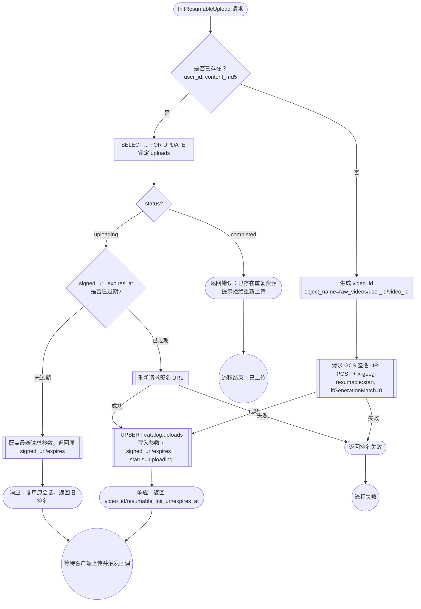
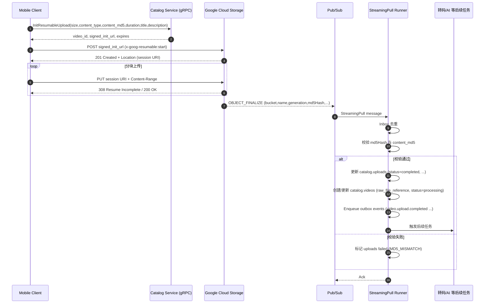

下面是**可直接替换仓库文档的最终版**《**Upload System（GCS/移动端）**》设计稿。已按你当前约束落地：

- **仅移动端直传 GCS**（无浏览器，无需 CORS）。
- **同一用户 + 同一文件只允许 1 条视频**（用 (user_id, content_md5) **强唯一**达成；不做幂等键）。
- **网关**已完成 HTTP→gRPC 转发与 JWT 鉴权并在 Metadata 注入 user_id 等（本文仅**说明使用**，不再展开方案）。
- 视频时长 **≤ 5 分钟**（用于接口校验与异常分支）。

文中给出：**端到端流程、数据模型与迁移、对象命名、gRPC 契约、服务端与移动端步骤、GCS 配置（Resumable + Signed URL + 前置条件）、回调去重与幂等、权限与安全、观测与上线清单**。对关键 GCS 细节附官方参考文献。

---

# **Upload System（GCS / Mobile-only）**

**状态**：Accepted（本稿为最终版，取代历史 upload-system.md）

**所属服务**：services-catalog（Catalog 微服务）

**目标**：Catalog 作为**控制面**统一编排上传：发起会话（签名）、强约束唯一性（user_id+content_md5）、接收回调核验、推进领域状态、发布领域事件。数据面（字节流）**仅在移动端 ↔ GCS**之间流动。

**非目标**：

- 服务端**不代理字节流**（避免高带宽/高成本）。
- 本文不定义转码/AI 处理细节，仅触发其前置事件。
- 网关 JWT 方案与用户身份注入**已就绪**，本文仅说明其使用。

---

## **1. 术语与外部事实（关键行为来自 GCS 官方）**

- **Resumable Upload**：先发起会话拿到 **Session URI**，之后用 PUT 携带 Content-Range 分块上传；未完成时返回 **308 Resume Incomplete** 与已持久化区间（Range 头）。会话**约 1 周**有效，成功后返回 **200/201**。
- **XML API 发起会话**：用 POST Object 且带 **x-goog-resumable: start**，响应里的 **Location** 为 Session URI。可通过 **V4 Signed URL** 为该 POST 进行签名。
- **分块大小**：推荐**块大小为 256 KiB 的整数倍**（最后一块可不满足），建议**≥ 8 MiB**以兼顾性能与内存。
- **前置条件**：通过**请求前置条件**避免覆盖既有对象，例如 **ifGenerationMatch=0** 仅在对象不存在时允许写入。
- **对象元数据**：对象包含 **md5Hash\*\***（Base64）\*\* 字段（非复合对象），可用于与客户端 MD5 对账。
- **通知回调**：启用 “**Cloud Storage → Pub/Sub**” 的 **OBJECT_FINALIZE** 事件；Catalog 以 StreamingPull + Inbox Runner 消费，实现事务性幂等处理。

---

## **2. 上传会话处理流程**



**关键规则**

- `(user_id, content_md5)` 作为强唯一键；所有重试都会指向同一会话。
- 上传中的会话仅返回已有 `signed_url`/`video_id`；签名过期时由服务端重新签发并覆盖。
- 已完成会话直接返回错误（重复资源），禁止重新上传。
- 整个流程依赖 `ifGenerationMatch=0`，确保只有第一个成功会话写入目标对象。


对于同一个路径raw_videos/user_id/video_id，就算生成了多个 Signed URL、各自建立了多个 Session URI，最终也只会有第一个真正完成写入的会话成功：

  - 成功者：对象生成；回调触发；业务推进。
  - 其余会话：在最终 PUT 提交阶段遭到 412 Precondition Failed，因为对象已存在并不满足 generation=0。

---

## **3. 端到端流程（移动端直传）**


> 本系统对“同一用户 + 同一内容（content_md5）”**强唯一**：并发/重试全部收敛到**同一条**上传记录与**同一个对象名**；通过 **ifGenerationMatch=0** 保障对象不被覆盖。

---

**数据写入/更新流程**

| 时机 | 操作 | 目标表/字段 | 备注 |
| ---- | ---- | ------------ | ---- |
| InitResumableUpload 成功 | UPSERT 会话记录 | catalog.uploads：video_id、user_id、bucket、object_name、content_type、expected_size、content_md5、title、description、signed_url、signed_url_expires_at、status='uploading' | 若 `(user_id, content_md5)` 已存在且状态为 `uploading`：复用原会话/VideoID（签名未过期直接返回原 signed_url/expires，过期则按首次创建流程重新签发并覆盖）；`completed` → 返回错误（重复资源），拒绝继续上传；依赖 `ifGenerationMatch=0` 保证只有一个会话最终写入 GCS |
| 客户端拿到响应 | （无额外写入） | —— | 响应仅携带 video_id、signed_url（resumable_init_url）及过期时间 |
| GCS 分块上传 | —— | —— | 仅 GCS 对象写入，无本地记录 |
| OBJECT_FINALIZE 回调（校验通过） | 更新上传记录 | catalog.uploads：status='completed'、size_bytes、md5_hash、crc32c、gcs_generation、gcs_etag、content_type、updated_at | 若校验失败则写入 status='failed'、error_code、error_message |
| 回调同事务 | 创建主表记录 | catalog.videos：INSERT（user_id、title、description、raw_file_reference、status='processing'、visibility_status、publish_at 等） | 当前策略仅首次创建；如主键冲突则回滚事务，保持 uploads 状态未变并记录错误 |
| 回调同事务 | 写出领域事件 | catalog.outbox_events：video.upload.completed 等 payload | 供 Outbox Runner 发布；若生成失败同样回滚事务 |
| 回调失败（校验失败/插入失败） | 标记上传失败 | catalog.uploads：status='failed'、error_code、error_message | 记录具体原因（如 MD5_MISMATCH、video_insert_conflict），不写主表/事件 |
| Outbox Runner 成功发布 | 标记已发布 | catalog.outbox_events：published_at | 通用 Outbox 流程处理 |

---


## **4. 数据模型与迁移**

> 你仓库已有 catalog.videos（含 raw_file_reference 与状态机）与 Outbox/Inbox 机制；此处在其上新增/强化“上传聚合”。

### **4.1 表：**

### **catalog.uploads**

```
-- 005_create_catalog_uploads.sql
create table if not exists catalog.uploads (
  video_id          uuid primary key,    -- 预留的视频 ID；回调成功后用于创建/更新 catalog.videos
  user_id           uuid not null,       -- 发起上传的用户 ID（来自认证 metadata）
  bucket            text not null,       -- 目标 GCS 存储桶名称（支持多桶策略）
  object_name       text not null,       -- 对象路径，例如 "raw_videos/{user_id}/{video_id}"
  content_type      text,                -- MIME 类型（如 video/mp4），用于白名单校验
  expected_size     bigint not null default 0,  -- 客户端预估的字节数（0 表示未知）
  size_bytes        bigint not null default 0,  -- 实际大小，由回调写入
  content_md5       char(32) not null,         -- 客户端上报的 MD5（hex，驱动强唯一）
  title             text not null,       -- 用户输入的视频标题
  description       text not null,       -- 用户输入的视频描述
  signed_url        text,                -- 会话签名 URL（需安全存储，仅供审计/手动恢复）
  signed_url_expires_at timestamptz,     -- 签名 URL 的过期时间，便于清理和权限管控
  status            text not null check (status in ('uploading','completed','failed')), -- 会话状态机：uploading=会话已创建等待完成，completed=回调已落主表，failed=校验或回调失败
  gcs_generation    text,                -- GCS generation，便于幂等/版本控制
  gcs_etag          text,                -- GCS ETag（回调写入）
  md5_hash          text,                -- 回调中返回的 md5Hash（统一转为 hex）
  crc32c            text,                -- 回调中返回的 crc32c（Base64 → 字符串）
  error_code        text,                -- 失败时的错误代码（如 MD5_MISMATCH）
  error_message     text,                -- 失败时的详细描述
  created_at        timestamptz not null default now(), -- 记录创建时间
  updated_at        timestamptz not null default now()  -- 记录最后更新时间
);

-- 唯一性：同一用户同一内容 永远 只有 1 条上传记录
create unique index if not exists uploads_unique_user_md5
  on catalog.uploads (user_id, content_md5);

-- 同一对象路径唯一（防止命名冲突）
create unique index if not exists uploads_object_unique_idx
  on catalog.uploads (bucket, object_name);

-- updated_at 触发器（略，同仓库风格）
```

> uploads 表中的 `video_id` 仅在回调成功时才会在 `catalog.videos` 创建对应记录；保留独立唯一索引可确保同一用户同一内容只会预留一次 video_id。无需在 videos 表额外添加 `(user_id, content_md5)` 约束。

### **4.2**

### **videos**

### **侧约定（无需迁移）**

- raw_file_reference 回调后写 **gs://{bucket}/{object_name}**；
- 状态由 pending_upload → processing，随后由媒体管线推进到 ready/published。

---

## **5. 对象命名与前置条件**

- **对象路径**：object_name = "raw_videos/{user_id}/{video_id}"（与用户本地文件名解耦，确保幂等与隔离）。
- **前置条件**：签名时强制 **ifGenerationMatch=0**，表示**仅当对象不存在**时允许创建，避免并发/重试覆盖。

---

## **6. gRPC 契约**

> 网关已将 HTTP→gRPC 代理与 JWT 校验完成，并将 user_id 等放入 metadata。服务端从 context 取用户身份执行业务即可（不在本文展开）。

```
syntax = "proto3";
package video.v1;

service UploadService {
  // 创建或复用上传会话（以 user_id + content_md5 为强唯一），并预留 video_id。
  rpc InitResumableUpload(InitResumableUploadRequest) returns (InitResumableUploadResponse);
}

message InitResumableUploadRequest {
  int64  size_bytes       = 1;    // 可为 0（未知）
  string content_type     = 2;    // e.g. video/mp4
  string content_md5_hex  = 3;    // 必填：移动端先算好 MD5 (hex 32)
  int32  duration_seconds = 4;    // 必填：上传前预处理端产出（要求 ≤ 300）
  string title            = 5;    // 必填：用户输入的视频标题
  string description      = 6;    // 必填：用户输入的视频描述
}

message InitResumableUploadResponse {
  string video_id           = 1; // 预留的视频 ID，上传成功后据此创建主表记录
  string resumable_init_url = 2; // V4 Signed URL (POST + x-goog-resumable:start)
  int64  expires_at_unixms  = 3; // 默认 15 分钟
}
```

---

## **7. 服务端实现**

### **7.1 初始化（无幂等键，靠 MD5 强唯一 + 前置条件）**

**步骤**

1. 从 metadata 读取 user_id。

2. 校验：duration_seconds ≤ 300、content_type 白名单、size_bytes 上限。

3. **预留 video_id 并写入 uploads**：
   - 服务端始终生成新的 UUID 作为 video_id（主表此时尚未创建记录）。
   - 以 (user_id, content_md5) 为强唯一，在 `catalog.uploads` upsert：若冲突（并发/重试），复用既有 video_id；否则插入状态 `uploading` 的新记录，并持久化 `title`、`description` 等元数据。

4. 生成 **V4 Signed URL**（XML API 的 POST），签名包含：

   - x-goog-resumable:start；
   - x-goog-if-generation-match: 0（避免覆盖）；
   - x-upload-content-type: <content_type>；
   - 过期时间（建议 15 分钟）。

5. 返回：video_id/resumable_init_url/exp；若记录已处于 completed，则直接返回错误（重复资源），提醒用户不要重复上传。

> 发起会话：移动端对 **Signed URL 做 POST**，成功后从响应头 **Location** 取 **Session URI**。

### **7.2 移动端分块上传规范（摘要，详见 §8）**

- 使用 Session URI 进行 **PUT**；分块按 **256 KiB 的整数倍**（推荐 **≥ 8 MiB**）；最后一块可不满足。
- 未完成时返回 **308 Resume Incomplete**，并携带 **Range**；断线后可发送 **0 字节 PUT +** **Content-Range: bytes \*/TOTAL** 查询偏移。

### **7.3 回调处理（StreamingPull + Inbox Runner）**

**入口**：后台任务通过 `gcpubsub.Subscriber.Receive` 消费 `OBJECT_FINALIZE` 事件，所有逻辑在单事务内完成。

**处理流程（单事务 + 幂等）**

1. 解析消息：仅当 `attributes.eventType == OBJECT_FINALIZE` 时处理；Base64 解码 `message.data` 为对象 JSON。

2. **Inbox 去重**：使用 `source='gcs'`、`dedup_key="{bucket}/{name}#{generation}"` 写入 `catalog.inbox_events`；若记录已存在且 `processed_at` 非空，立即返回成功（Ack）。

3. 读取对象元数据：bucket/name/size/contentType/generation/etag/md5Hash/crc32c。

4. **校验 MD5**：将 md5Hash（Base64）转为 hex 并与 uploads.content_md5 对比：

   - 一致 → 继续；
   - 不一致 → uploads.status='failed'，error_code='MD5_MISMATCH'，记录告警，事务提交后 Ack（不推进视频状态）。

5. 幂等更新：

   - uploads：若当前状态非 completed，则更新为 completed，回填 size/hash/etag/generation。
   - videos：若 `catalog.videos` 中无该 video_id，则创建基础记录（user_id、默认标题/描述、`status='processing'`）；若已存在，则更新 `raw_file_reference` 并按需推进状态。
   - 写 **Outbox**：`video.upload.completed` 等事件，用于触发转码、AI 等后续流程。

6. 标记 Inbox 事件已处理并提交事务；若任一步骤出错则记录 `last_error` 并返回错误，由 Pub/Sub 进行重投（至少一次交付）。

---

## **8. 移动端集成规范（iOS/Android）**

> 移动端**不需要任何 GCP 凭据**：凭借 Catalog 签发的**短时 V4 Signed URL**（POST 发起会话）+ **Session URI** 完成上传。

**步骤**

1. **本地计算 MD5（hex 32）与视频时长**：建议流式/分片计算（后台线程），同时通过本地解码获取 `duration_seconds`（限制 ≤ 300 秒）。

2. 调 gRPC：InitResumableUpload(size_bytes, content_type, content_md5_hex, duration_seconds, title, description) → 返回 resumable_init_url。

3. POST resumable_init_url，**必须**带：

   - x-goog-resumable: start

   - x-upload-content-type: <content_type>

   - （已签名）x-goog-if-generation-match: 0（在签名中体现）

     成功后从**响应头** **Location** 读取 **Session URI**。

4. **分块上传**：

   - 设定 CHUNK = 8 MiB（或其他 256 KiB 整倍数）；
   - 逐块 PUT <session-URI>，Content-Range: bytes {start}-{end}/{total}；
   - 若返回 **308**，读取 Range 继续；
   - 断点恢复：PUT 0 字节 + Content-Range: bytes \*/{total} 查询偏移。

**字段同步注意事项**

- 在 GCS 回调成功后，以 payload 中的 `contentType` 覆盖/校验 `content_type`，确保保存的是最终实际 MIME。
- `md5Hash` 和 `crc32c` 从回调取值时注意格式：将 `md5Hash` 由 Base64 转为 32 字符 hex，再写入 `md5_hash`；`crc32c` 可保留 Base64 字符串或按需求转换。
- 若将来需要版本并发控制，可在表中追加 `metageneration`（对应 JSON API）字段；当前场景暂不需要。
- 持久化 `signed_url` 时务必使用加密字段或 KMS 保护，并结合 `signed_url_expires_at` 定期清理/轮换，避免长期暴露上传权限。

---

## **9. 权限与安全**

- **客户端（移动端）零 GCP 凭据**：凭借 **V4 Signed URL** 的时间/路径受限能力，直接对目标对象发起会话（POST），随后使用 Session URI 上传；**任何持有者**在有效期内可用，因此要**缩短有效期**并通过 HTTPS 传输，避免日志泄漏。
- **前置条件**：强制 ifGenerationMatch=0，避免并发/重试覆盖已存在对象。
- **桶访问**：开启 UBLA（统一桶级访问）；Catalog 使用最小权限服务账号（若仅签名，使用 IAM signBlob 能力即可；不需要为客户端授予任何 GCS 角色）。
- **回调**：StreamingPull 任务使用受控服务账号（`roles/pubsub.subscriber`），凭据仅在后台进程内加载。
- **输入校验**：时长 ≤ 300 秒、大小上限、防止异常类型与滥用。

---

## **10. 并发控制、去重与幂等**

- **强唯一（设计基石）**：(user_id, content_md5) 全状态唯一索引 → 「同一用户同一内容仅 1 条上传记录」。
- **会话合并**：并发初始化时，只有一个事务插入成功；冲突方 SELECT 既有记录并返回**同一对象名**与签名 URL。
- **对象不覆盖**：签名中加入 x-goog-if-generation-match: 0，即便出现两个会话，第二个会在最终提交阶段收到**前置条件失败**，不会破坏对象。
- **回调去重**：以 **{bucket}/{name}#{generation}** 为自然去重键写 Inbox，重复回调无副作用。
- **业务幂等**：更新 uploads/videos 使用**条件更新**（如 “仅当 status!=completed 时置为 completed”），重复执行不改变最终状态；Outbox 与业务更新**同事务**提交，实现“几乎一次投递”。

---

## **11. 观测与告警**

**指标（建议以 OpenTelemetry / Prometheus 暴露）**

- upload.init.count/latency
- upload.chunk.resume.count（收到 308 次数）与 upload.offset.mismatch.count
- upload.session.expired.count（一周过期未完成）
- 回调处理时延（OBJECT_FINALIZE → outbox 事件延迟）、回调重试次数
- md5.mismatch.count、if_generation_match.violation.count

**日志关联键**：video_id、user_id、object_name、pubsub_message_id、gcs_generation。

---

## **12. 上线与运维**

### **12.1 迁移**

- 执行 005_create_catalog_uploads.sql（创建表与索引）。
- 升级 Catalog 以暴露 UploadService，并部署 StreamingPull Runner（如 `cmd/tasks/uploads`）。
- 不需要配置 CORS（**移动端-only**）。

### **12.2 GCS 与 Pub/Sub**

1. **创建 Topic**：`video-uploads`。

2. **桶通知 → Pub/Sub**：启用 `OBJECT_FINALIZE`，建议限定 `prefix=videos/`。

3. **创建 StreamingPull 订阅**：

   ```sh
   gcloud pubsub subscriptions create video-uploads-catalog \
     --topic=video-uploads \
     --ack-deadline=30 \
     --message-retention-duration=1209600s \
     --enable-message-ordering \
     --enable-exactly-once-delivery
   ```

   为订阅绑定最小权限服务账号（`roles/pubsub.subscriber`），可按需配置 dead-letter topic 兜底异常消息。

### **12.3 配置清单（**

### **configs/config.yaml**

### **摘要）**

```
gcs:
  project_id: your-project
  bucket: your-bucket
  signer_service_account: upload-signer@your-project.iam.gserviceaccount.com
  signed_url_ttl_seconds: 900

pubsub:
  project_id: your-project
  notification_topic: video-uploads
  subscription_id: video-uploads-catalog
  receive:
    numGoroutines: 4
    maxOutstandingMessages: 500
    maxOutstandingBytes: 67108864
```

---

## **13. 失败与清理**

- **会话过期**：GCS 会话约一周有效，后台 Reaper 定期将超期未完成的 uploading 会话标记为 failed 并告警。
- **MD5 不一致**：标记 failed (MD5_MISMATCH)，不推进视频状态；必要时提示用户重传。
- **重复上传**：初始化阶段即命中 (user_id, content_md5) 唯一约束，直接复用已存在记录；若对象已存在，ifGenerationMatch=0 会阻止覆盖。

---

## **14. 安全基线**

- Signed URL 有效期**尽量短**（默认 15 分钟），Session URI 不持久化到日志。
- 桶启用 **Uniform bucket-level access**，Catalog 的服务账号仅授予必要权限。
- 回调消费仅运行在受控 StreamingPull 任务中；为其服务账号授予最小权限，错误自动重投但幂等保证最终一致。

---

## **15. 验收用例（建议脚本化）**

1. **并发初始化**：同一用户 + 相同 MD5 并发 10 次 → 仅 1 条 uploads，其余复用；对象名一致。
2. **覆盖防护**：开启两个会话同时上传 → 仅第一个成功，第二个在最终提交阶段因 ifGenerationMatch=0 失败。
3. **断点续传**：上传到 60%，终止进程 → 重新以 Session URI + Content-Range: bytes \*/total 查询并续传至完成；观察 308/Range。
4. **回调幂等**：模拟重复推送同一 generation 的 OBJECT_FINALIZE → 仅首次推进，重复无副作用。
5. **MD5 对账**：构造错误 MD5 请求 → 回调时触发 MD5_MISMATCH。
6. **会话过期**：超过 7 天未完成 → Reaper 标记失败并告警。

---

## **16. 附：实现要点片段**

### **16.1 签名（V4 / XML API / Resumable-init）**

> 在使用 GCS 客户端库生成 V4 Signed URL 时，显式包含需要签名的**请求头**：

- x-goog-resumable:start
- x-goog-if-generation-match: 0
- x-upload-content-type: <content_type>

> 该 URL 仅用于**发起会话的 POST**；移动端随后使用响应头 Location 中的 **Session URI** 进行 PUT 分块。

### **16.2 分块建议**

- chunk = 8 MiB 起步（或网络状况更优时增大）；
- 每块必须是 **256 KiB 的整数倍**（最后一块除外）；处理 **308 + Range**。

### **16.3 回调幂等伪码**

```
-- 事务内
insert into catalog.inbox_events(source, dedup_key, first_msg_id, payload)
values ('gcs', :bucket||'/'||:name||'#'||:generation, :msg_id, :payload)
on conflict do nothing;

-- 若受影响行=0，则已处理过，直接 204 返回
-- 否则：做 uploads/videos 的条件更新 + 写 outbox，最后标记 processed_at
```

---

## **17. 未来演进（不影响现有接口）**

- **请求级幂等键**：未来如需“网关重放零副作用”，可增设 idempotency_keys 表；流程：先查幂等键 → 未命中再走 MD5 强唯一分支（**与本稿完全兼容**）。
- **更强校验**：在移动端计算 **SHA-256** 并存为 content_sha256，将 md5 仅用于与 GCS md5Hash 对账。
- **资产复用**：若日后允许“一份文件多条视频”，将 (user_id, content_md5) 唯一约束迁移到 raw_assets 表，并让 videos 引用 asset_id。

---

## **18. 参考**

- **Resumable 上传步骤 / 308 / Range / 一周有效期**（官方）：发起/执行/状态码说明。
- **V4 Signed URL 概念**（时效性与最小暴露原则）。
- **分块大小要求与推荐**（256 KiB 整倍数、建议 ≥8 MiB）。
- **请求前置条件**（ifGenerationMatch=0 防覆盖）。
- **对象元数据中的** **md5Hash\*\***（Base64）\*\*。
- **Cloud Storage → Pub/Sub 通知与 StreamingPull 消费**。

---

> **总结**：本方案以 **MD5 强唯一 + V4 Signed URL + Resumable + 前置条件**搭建“移动端直传、服务端编排”的可靠闭环；在你“不允许同一内容产生两条视频”的业务约束下，**并发可收敛、覆盖有防护、回调可核验、失败可恢复**，并为后续“请求级幂等键/资产复用/更强校验”预留升级路径。
